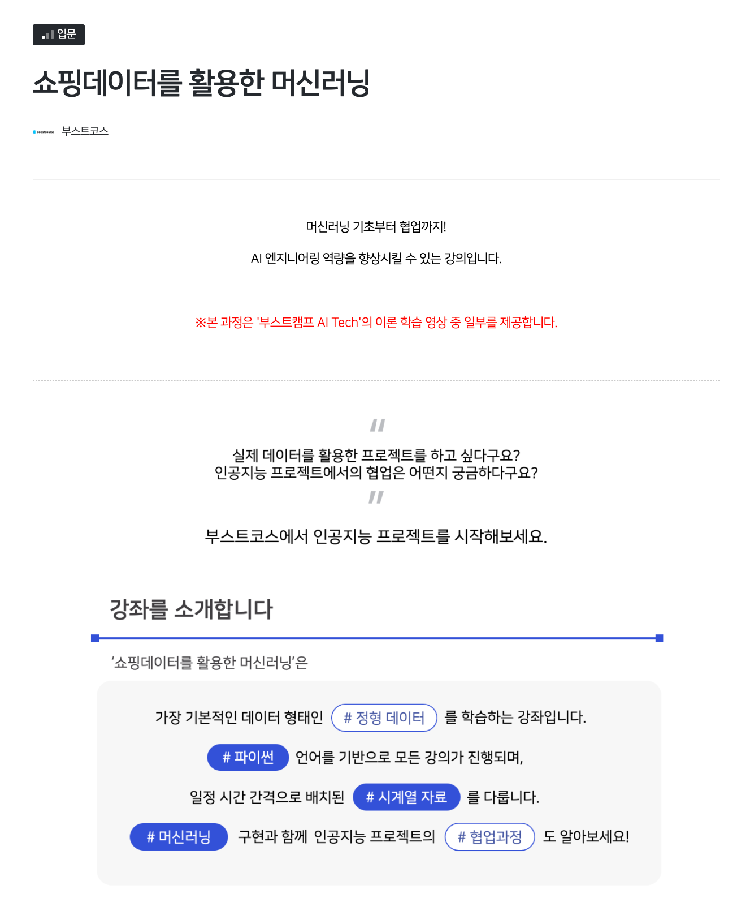

## 포스팅 방향 소개

- [네이버 부스트코스](https://www.boostcourse.org/)에서 운영하는 [쇼핑데이터를 활용한 머신러닝](www.boostcourse.org/ai224) 강좌를 들으며 작성하는 포스팅입니다.

다음은 강좌 소개글

---
부스트코스 '쇼핑데이터를 활용한 머신러닝' 과정에 오신 것을 환영합니다.

- '쇼핑데이터를 활용한 머신러닝' 강의는 아래 분들께 적합합니다.

파이썬에 대한 기본적인 이해가 있으신 분.
머신러닝과 딥러닝의 기초지식이 있으신 분.
정형데이터를 활용한 문제해결에 관심이 있으신 분.

- 이 과정을 통해 여러분은

시계열 데이터의 특성을 이해하고, 데이터 전처리를 할 수 있습니다.
모델 설계 및 학습, 성능 평가까지 실무 프로젝트의 전체적인 흐름을 경험할 수 있습니다.
머신러닝 모델의 기본적인 활용에서 더 나아가 모델을 개선하고 발전시킬 수 있습니다.

인공지능 프로젝트의 협업과정을 이해하고 적용할 수 있습니다.

---

중간 중간 필요한 부분 부터 듣겠지만 일단 완강을 목표로...!