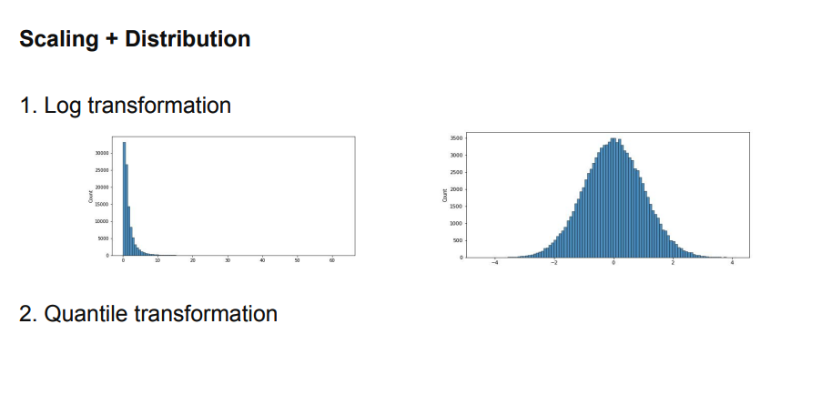
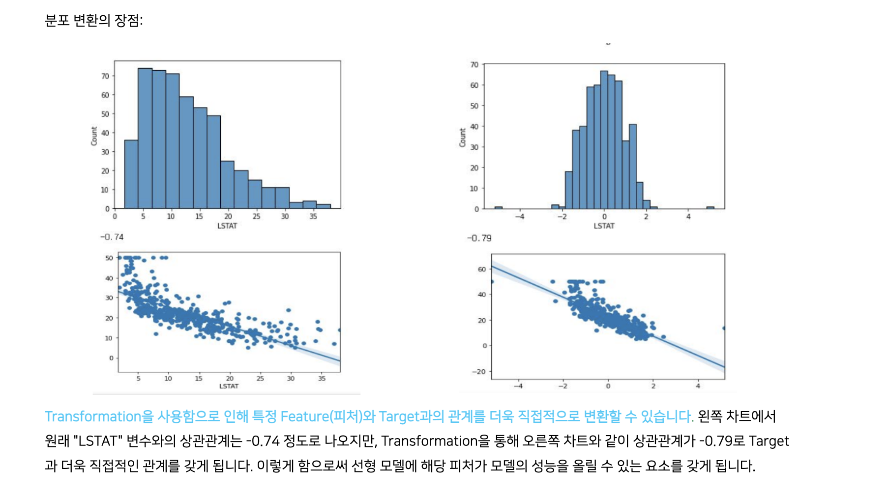
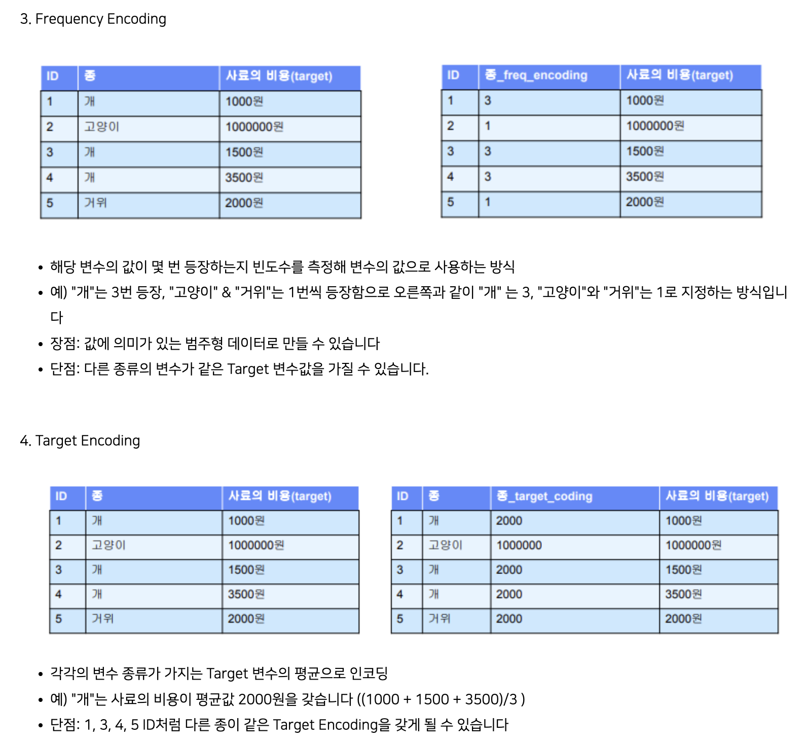

## Overview

1. 연속형, 범주형 처리
    - continuous type
    - categorical type

2. 결측치 처리
    - pattern
    - univariate
    - multinariate

3. 이상치 처리
    - outlier 정의
    - 정성적인 측면
    - 성능적인 측면

## 데이터 전처리란

- **<u>머신러닝 모델에 데이터를 입력하기 위해 데이터를 처리하는 과정</u>**
- EDA를 위해서 데이터를 적절히 가공하는 과정

1. EDA에서 어떤 부분을 찾는지에 따라서 달라짐
2. 수행하려는 task, 사용하려는 모델에 따라 달라짐 
    - 선형 모델
    - 트리 모델
    - 딥러닝 모델 등등

## 일반적인 순서

핵심은 데이터를 모델에 맞도록 잘 가공하는 것!

- 연속형, 범주형 처리
- 결측치 처리
- 이상치 처리

### 1. 연속형 변수 처리

### 1-1. Scaling

- 데이터의 단위 혹은 분포를 변경

> 선형 기반의 모델(선형 회귀, 딥러닝 등)은 변수들 간의 스케일을 맞추는 것이 필수적!

#### (1) Scaling의 종류

#### (2) Scaling의 효과

- 값의 스케일링 -> 분포의 변화

#### (3-1) Scale + Distribution

1. Log transformation
	- 분포가 왼쪽에 많이 치우친 데이터 -> 정규분포화 가능
2. Quantile transformation
	- 값을 uniform하게 변환 시킴 / 정규분포로 변환
	- 어떠한 값이 들어와도 위와 같이 변환 가능!
		- 중위수를 가지고 위 변환을 수행하기 때문

#### (3-2) Binning

- 연속형 변수 -> 범주형 변수로 바꾸는 방법

- 예시
	- 봉우리가 여러개인 분포
		- 데이터가 구분되는 구간은 유의미하지 않은 정보 가능성
		- Tree model -> 과적합 발생 가능성
		- 연속형 변수를 묶어 범주형화 하면 좋음!

### 2. 범주형 변수 처리

### 2-1. Encoding

- 머신러닝 모델에 넣기 위해 범주형 -> 수치형으로 바꾸는 작업
	- ex. 식물 종류 : "setosa", '"versa"' -> 0, 1

#### (1) One hot Encoding

- 장점
	- 모델이 변수의 의미를 명확히 파악하게 됨

- 단점
	- 변수의 종류가 많으면 지나치게 sparse한 행렬이 만들어짐
		- 차원의 저주 문제... 성능 하락 이슈
	- 변수간의 관계가 있을 경우 관계를 나타내기에 부적합

#### (2) Label Encoding

- 장점
	- 변수의 종류가 많아도 적용 가능
- 단점
	- 모델이 `숫자의 순서`를 특징으로 인식할 수 있음

#### (3) Frequency Encoding

- 변수 값의 빈도수로 인코딩

#### (4) Target Encoding

-  타겟 변수의 평균으로 인코딩

2개의 방법 합쳐서

- 장점
	- 하나의 column에 모든 값을 표현할 수 있는 장점 보존
	- 순서에 영향을 받지 않는다
- 단점
	- 서로 다른 변수의 값이 같은 숫자로 인코딩 되는 문제
	- 미래 새로 등장하는 값에 대해서 인코딩 수행 불가

#### One hot + Label  <->  Frequency + Target

- **<u>의미 있는 값을 모델에 줄 수 있는지 여부</u>**
	- 좌측 불가
		- 의미 없는 숫자 대체
	- 우측 가능
		- 범주형 변수의 빈도수가 얼마나 되는지
		- 값의 의미가 타겟 변수와 얼마나 연관되어 있는지
	
- 주의점
	- Target Encoding의 경우 오버피팅 발생 가능성
		- 적절한 처리 필요

#### (5) Embedding (= Entity Embedding)

- Word2Vec
	- Text 데이터를 더 낮은 차원으로 임베딩 함
