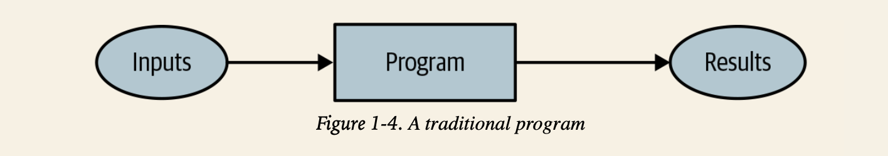
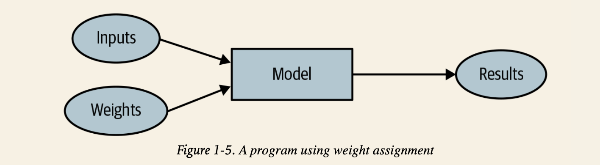
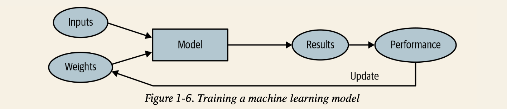
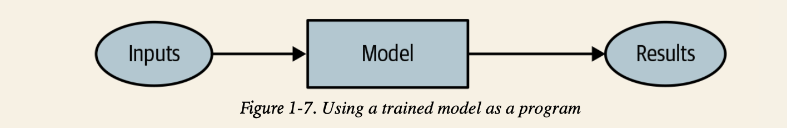
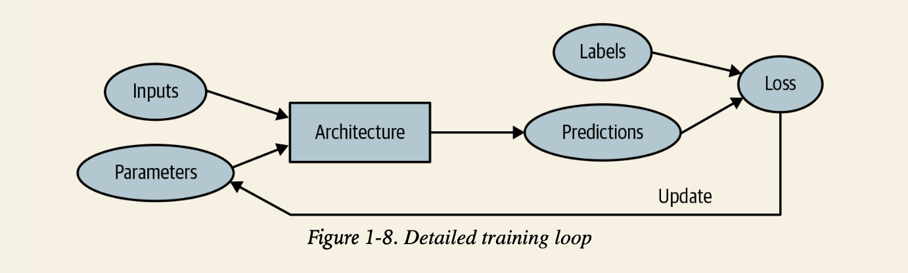

## Your First Model

### 1. GPU 사용가능한 딥러닝 서버 얻기

- GPU?
    - 한 가지일을 동시에 처리할 수 있는 processor : 병렬 처리에 최적화된 processor
    - neural network 학습시 CPU보다 수백배 이상 빠른 처리 가능
    - DL에 맞는 GPU는 소수(NVIDIA GPU 등)

- Cloud환경 GPU 서버 목록
  - ['GPU Servers' 탭](https://course.fast.ai/Lessons/lesson9.html#links-from-the-lesson)


### 2. 첫번째 노트북 실행해보기

```python
from fastai.vision.all import *

path = untar_data(URLs.PETS)/'images'

def is_cat(x): return x[0].isupper()

dls = ImageDataLoaders.from_name_func(
    path, get_image_files(path), valid_pct=0.2, seed=42,
    label_func=is_cat, item_tfms=Resize(224))

learn = vision_learner(dls, resnet34, metrics=error_rate)
learn.fine_tune(1)
```

1. Dataset은 'Oxford-IIIT Pet Dataset' 활용 (fast.ai 데이터베이스에서 다운로드)
2. pretrained model은 'resnet34'를 사용 (1.3M 이미지들로 학습된 모델)
3. 전이학습(transfer learning)하기 위해 fine-tuning해서 개-고양이 분류 모델 생성


### 3. 머신러닝 이란? Machine Learning

전동적 프로그래밍(연역적 방법) vs. 머신러닝 프로그래밍(귀납적 방법)



"Artificial Intelligence: A Frontier of Automation" - 'Arthur Samuel' at IBM

- 문제를 풀기 위해 모든 단계를 정확하게 알려주지 말고
  - 풀어야 하는 문제의 예시를 모여준다
    - 그것을 어떻게 풀어야 할지 스스로 찾도록 한다

1. "weight assignment 가중치 할당" 아이디어
2. 모든 가중치 할당은 "실제 수행 능력"를 가짐
3. 결과를 테스트 하기위해 "automatic means 자동화된 방법"이 요구됨
4. 가중치 할당을 바꿔가면서 결과를 향상시키기 위한 "mechanism 방법론"이 필요함



- weight
  - 가중치도 `변수`
  - 가중치 할당이란 input 변수 외에 프로그램이 어떻게 작동하는지를 정의하는 결국 **또다른 변수**
  - 가중치는 'parameter'라고도 불림
    - 가중치란 model의 특정한 parameter 종류 중 하나

- model
  - 많은 일을 할 수 있는 특별한 종류의 프로그램
  - 가중치에 의존함

- actual performance
  - 얼마나 해당 task를 잘 수행했는지

- mechanism
  - 가중치에 대한 최적화를 자동적으로 하게 하는 방법론
  - 실제 수행능력에 근거해 자동화된 방법으로 최적화 반복 = Learning 학습



- 결과(result)와 모델의 수행능력(performance)의 차이
- 모델이 학습 되었다면 weight 가중치는 모델의 일부로써 취급 가능
    - 가중치 할당이 완벽하게 최적화가 된 경우
    - 더이상 가중치 변경 없을 경우

결론적으로...
  - **<u>학습된 모델은 마치 전통적 프로그램과 똑같이 취급될 수 있다!</u>**




### 4. 신경망이란? Neural Network

> 매우 유연해서 가중치만 변경할 경우 어떤 문제에도 적용할 수 있는 `함수`가 없을까?

- 이것이 바로 신경망!
  - neural network = 하나의 수학적 함수
  - 가중치에 따라서 아주 유연하게 적용할 수 있는 함수
  - `universal approximation theorem`
    - 이론적으로 모든 수준의 정확도인 어떤 문제도 모두 다 풀 수 있음이 증명됨
  - 우리는 좋은 '가중치 할당'을 찾기만 하면 어떤 모델에도 맞출 수 있다!

- 어떤 과정으로 가중치를 찾지?
  - `stochastic gradient descent (SGD)`
    - 신경망의 가중치를 업데이트하기 위한 가장 일반적인 방법
    - **Chapter 4**에서 자세히 다룰 예정

- 신경망 -> 머신러닝 모델의 일종
  - 매우 유연하다는 점에서 특별함
  - 올바른 가중치만 찾는다면 엄청나게 넓은 범위의 문제에 적용될 수 있다!
  - feat. SGD로 가중치를 찾는 과정을 자동화


---

결론!

**개-고양이 분류기 == 머신러닝 모델**

- 구조
  - input = 이미지들
  - weight = 신경망의 가중치
  - model = resnet34
  - result = predict 결과값

- 평가
  - "actual performance"를 결정한다?
    - 모델의 수행 능력을 `정의`하면 된다
      - ex. 올바르게 답을 예측한 비율 = 정확도(accuracy)
  
- 자동화
  - 가중치 할당을 자동 업데이트하는 mechanism = SGD

### 5. 딥러닝 전문용어 맛보기

- 'model'의 함수적 형태 = 아키텍쳐 architecture
- 'weight' = 'parameter'
- 에측값(prediction) = labels가 없는 데이터인 독립적인 변수들(independent variable)로부터 계산되는 값
- labels = targets
- 모델의 결과(result) = 예측값
- 성능(performance)의 측정 = 손실(loss)
- 손실은 '예측값'과 '올바른 labels'에 둘다 영향을 받음



### 6. 머신 러닝의 한계

- 데이터가 항상 필요하다
- 학습에 사용된 데이터에서 발견할 수 있는 패턴만 배울 수 있다
- 머신러닝은 오닉 예측(predictions)만 할 수 있을뿐, 추천된 행동(recommended actions)을 할 수 없다
  - 추천시스템은 사용자가 관심을 가질만한 **새로운 상품** 보다는 써봤거나 알고 있는 상품은 추천해주게 된다
- 단순히 데이터가 아닌 labeled 데이터가 필요하다
  - labeling approach가 실제적으로 매우 중요한 이슈이다
- `feedback loops`문제
  - 모델이 더 사용될수록 더 편향된 데이터가 생성되고 이것에 의해 더 편향된 모델이 만들어지는 과정을 반복하게 됨

### 7.이미지 분류기의 작동 원리

#### Classification vs. Regression
- 분류: 클래스나 카테고리를 예측하기 위한 모델
  - 숫자나 이산적인 수치를 예상하기 위한 것
  - ex. 개?고양이?
- 회귀: 수치적인 양을 예측하기 위한 모델
  - ex. 기온/위치

#### Overfitting 과적합
- 머신 러닝 학습에서 항상 고려해야하는 중요한 이슈
- 학습된 데이터에서 잘 예측하는 것보다, **새로운 데이터**에서 잘 예측하는 것이 훨씬 어렵고 또 중요!
- The data will matter in practice
  - ex. MNIST dataset
  - 어떤 데이터도 같은게 없음(조금씩 다름)

> BUT, 과적합이 일어났을 때 과적합을 방지하기!

- validation 정확도가 학습에 따라 떨어짐 -> 과적합
- 모델이 도달할 수 있는 높은 정확도 수준에 못미치게 학습을 마치는 경우 -> underfitting

#### metrics 평가 지표
- validation set을 이용해 모델이 예측한 값의 품질을 측정하는 함수
  - 매 epoch가 끝날때마다 출력됨

loss 손실 함수 vs. metrics 평가 지표
- loss = 학습 시스템이 가중치를 자동으로 갱신하는데 사용되는 "수행 능력의 측정"을 정의하는 목적
  - 좋은 손실 함수란 SGD를 적용하기 좋은 선택이어야 함
- metric = 사람이 이해하기 위한 목적
  - 좋은 평가 지표는 이해하기 쉬운 선택지
  - 내가 모델에게 기대하는 task를 최대한 잘 반영해야 함

#### pretrained model 사전 학습 모델
- 이미 다른 데이터셋에서 학습된 가중치를 가진 모델
  - ex. 1.3M 이미지로 천개의 다를 카테고리를 인식하는 학습된 모델 
- pretrained = 모델의 가중치를 이미 사전 훈련된 모델의 가중치로 맞추는 것
- 대부분의 경우 이런 모델을 사용
  - 이미 성능이 훌륭함

#### head
- pretrained model의 마지막 부분
- 사전 학습 모델을 사용할 경우 마지막 layer를 삭제함
  - 기존의 학습 task에 맞춰져 있기 때문
- 1개 이상의 랜덤 가중치를 가진 새로운 layer로 대체함
  - 작업하려는 데이터셋의 사이즈에 맞춤

- 사전 학습 모델을 사용하는 것은 매우 매우 중요
  - 더 빠르고, 적은 시간과 돈을 들려 더 정확한 모델은 만들 수 있음
- **<u>사전 학습 모델을 활용하면 적은 자원을 가지고서도 Deep Learning을 이용한 많은 작업을 할 수 있음</u>**
  - [Hugging Face](https://huggingface.co/models)
  - [timm](https://github.com/rwightman/timm)
  - [LAION](https://laion.ai/projects/)

#### transfer learning 전이 학습
- 처음 학습시킨 task와 다른 일을 하도록 pretrained model을 활용하는 것
- 아직 많이 연구되지 못한 분야...
  - 사용가능한 prtrained model이 있는 domain이 한정적
  - 시계열 분석에서 transfer learning이 어떻게 솽용되어야 하는지 아직 잘 모르고 있는 상황

#### fine tuning 파인 튜닝
- pretrained model을 새로운 데이터셋에 적용하기 위한 중요한 'trick' 중 하나
- 사전 학습과 다른 task를 추가적인 epochs만큼 학습하여 pretrained model의 파라미터값을 갱신하는 전이 학습 방법론(transfer learning technique)

#### Jargon : 몇가지 용어
- 모델의 head : 새로운 데이터셋에 맞춰져서 새롭게 추가된 부분
- epoch : 데이터셋 전체를 완전히 한번 훑는 것
(fit이 수행된 이후에)
- training set losses & validation set losses = 각 데이터셋 별 수행 능력의 측정

#### Image Recognizer가 학습한 것
- 머신 러닝 모델은 이해가 불가능한 'black box'가 아니다
  - 학습된 데이터와 다른 데이터가 들어 갔을 때 어떤 모습을 보이는지 예측하는 것을 어렵긴 함

- ‘Visualizing and Understanding Convolutional Networks’
  - [논문 PDF](https://arxiv.org/pdf/1311.2901.pdf)
  - 모델의 매 layer에서 학습된 신경망 가중치를 시각화해서 보여줌


1. layer에서 회색 배경 그림은 재구조화된 가중치(reconstructed weights)를 나타냄
2. 다른 그림은 각각의 가중치 설정값(set of weights)에서 가장 매치가 잘되는 학습 이미지의 일부분을 보여줌


- For layer 1
  - 모델은 대각선, 수평선, 수직선, 다양한 경사도 들을 나타내는 가중치를 발견함
  - 이 요소들은 Computer Vision의 기본 구성 요소가 됨
    - 사람의 눈의 시각 매커니즘과 매우 동일
    - 손으로 작성된 컴퓨터 비전 프로그램 특징과도 유사


- For layer 2
  - 모델은 모서리 부분, 반복되는 선, 원형 모양, 간단한 패턴등을 탐지하도록 학습됨
  - 위 요소들은 첫번째 layer의 구성 요소로부터 만들어졌음
    - For each of these, the righthand side of the picture shows small patches from actual images that these features most closely match.
    - For instance, the particular pattern in row 2, column 1 matches the gradients and textures associated with sunsets.


- For layer 3
  - 오른쪽의 사진에서, 모델이 학습한 특징들은 고수준의 구조적인 구성요소(자동차, 글자, 꽃잎 등)들과 매치됨을 알 수 있음
  - 이 요소들을 활용하여 layers 4, 5는 더욱 고수준의 개념들을 탐지하고 학습할 수 있음


- 위 연구는 5개의 Layer로 이루어진 `AlexNet`이라는 오래된 모델을 사용
- 수백개의 layer로 이루어진 Neural Network의 경우 **훨씬 더 풍성한 특징**들을 모델들이 구성할 수 있을 것임

- pretrained model을 fine-tuning하면 마지막 layer가 포커싱하는 특징들을 채택할 수 있음 (꽃, 사람, 동물 등)
  - 여기에 개와 고양이 분류 문제를 특화시킴

- 일반적으로, pretrained model은 다른 여러가지 작업들에도 특화될 수 있음

### 8. 이미지가 '아닌' 작업도 수행할 수 있는 Image Recognizer

- 많은 것들을 image 형식으로 표현한다면 image recognizer를 적용할 수 있다

- 소리 탐지 모델
  - [Audio Classification with fastai library](https://etown.medium.com/great-results-on-audio-classification-with-fastai-library-ccaf906c5f52)
- 시계열 자료를 이미지로 변환하여 모델에 학습
  - Gramian Angular Difference Field(GADF) 방식 활용
- 부정행위 탐지 모델
  - [Catching the Fraudster with Behavior Biometrics](https://www.splunk.com/en_us/blog/security/deep-learning-with-splunk-and-tensorflow-for-security-catching-the-fraudster-in-neural-networks-with-behavioral-biometrics.html)
- 악성소프트웨어 탐지 모델
  - [Malware Classification with Deep Convolutional Neural Networks](https://ieeexplore.ieee.org/abstract/document/8328749)

> 1. 데이터를 이미지로 표현해 보는 것은 좋은 insight를 제공한다!
> 2. 사람의 눈으로 이미지의 특징을 포착할 수 있다면, DL 모델도 그 특징을 찾을 수 있다!

### 9. 전문 용어 모아보기

- Label : 예측하려고 하는 데이터
- Architecture : 적합(fit)하려고 하는 모델의 탬플릿(template) / 입력 데이터와 파라미터를 전달해주려고 하는 실제적인 수학적 함수
- Model : 특정 파라미터의 설정값과 아키텍쳐의 조합
- Parameters : 모델이 할 수 있는 task를 변경하는 모델 내부의 값들, 모델이 학습하는 동안 계속 갱신됨
- Fit : 입력 데이터를 target label과 맞는 지 확인하면서 모델의 파라미터를 갱신하는 것
- Train : (Fit의 동의어)
- Pretrained model : 대규모 데이터셋을 이용해 이미 학습된 모델, 파인 튜닝이 필요함
- Fine-tune : 다른 task 수행을 위해 pretrained model을 갱신하는 것
- Epoch : 입력 데이터를 완전히 한 번 훑는 것
- Loss : 학습 과정에서 모델이 얼마나 좋은지 측정하는 것, SGD를 통해 학습되는 과정에서 채택됨
- Metric : 학습된 모델이 Validation set을 사용했을 때 얼마나 좋은지 측정하는 것, 사람에게 정보제공을 위해 채택됨
- Validation set : 학습 데이터에서 채택된 일부분의 데이터셋, 오직 모델의 성능 측정을 위해서만 사용
- Training set : 모델을 적합시키는데 사용되는 데이터셋, validation dataset을 전혀 포함하고 있지 않아야 함
- Overfitting : 학습되지 않은 데티어에도 잘 적용되는 일반화된 특징이 아닌, 입력 데이터의 지나치게 구체적인 특징까지 기억하도록 모델을 학습시키는 것
- CNN : CV task를 수행하는데 좋은 성능을 보이는 신경망의 한 종류. Convolutional Neural Network
