이 포스팅과 앞으로 이어질 내용은 Udacity의 'Human-Computer Interaction' 강의를 정리한 것입니다.

[강의 링크](https://www.udacity.com/course/human-computer-interaction--ud400)

강좌는 [Georgia Institute of Technology](https://namu.wiki/w/%EC%A1%B0%EC%A7%80%EC%95%84%20%EA%B3%B5%EA%B3%BC%EB%8C%80%ED%95%99%EA%B5%90) 의 [cs6750](https://omscs6750.gatech.edu/) 수업을 Mooc로 제공하는 겁니다:)

교수님은 [David Joyner](https://www.cc.gatech.edu/people/david-joyner)

## 1. HCI의 의미

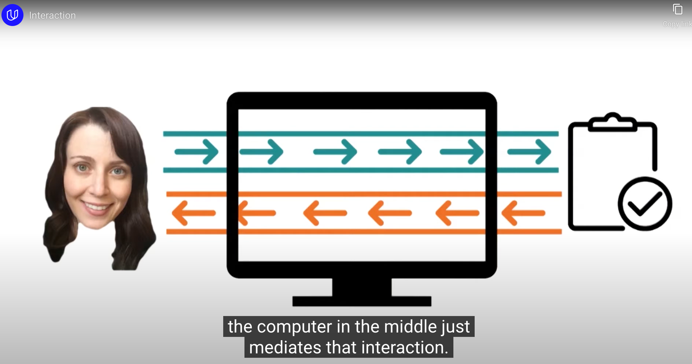

- Human이 Computer를 통해 'task'를 수행할 때 Interaction이 잘 이루어지도록 하는 모든 요소를 연구

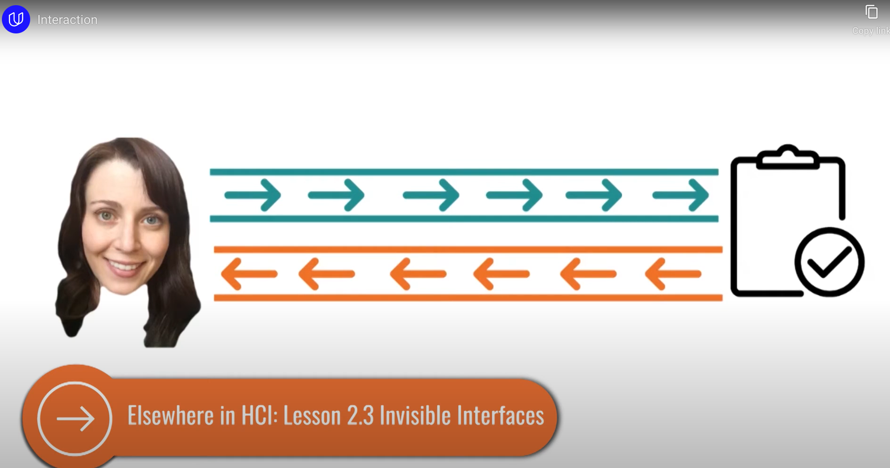

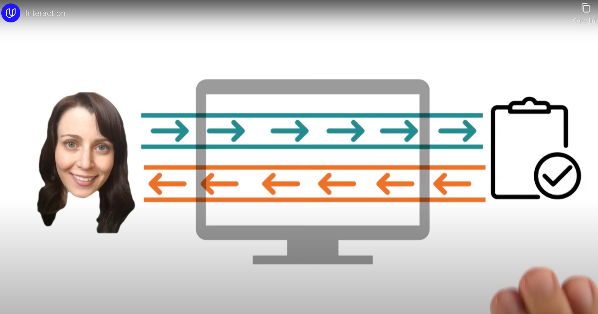

- 궁극적인 목표는 **<u>Computer의 존재를 느끼지 못할 정도</u>**로 자연스럽게 task를 수행할 수 있도록 Interaction 시스템을 설계하는 것

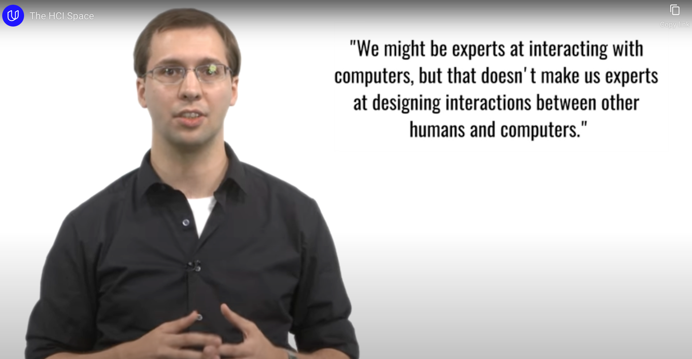

- 우리는 사용자(다른 사람들)와 컴퓨터가 잘 상호작용할 수 있는 시스템을 설계하는 전문가가 되어야 한다
	- '내가 컴퓨터와 잘 상호작용한다' 와는 다른 관점!

## 2. HCI의 범위

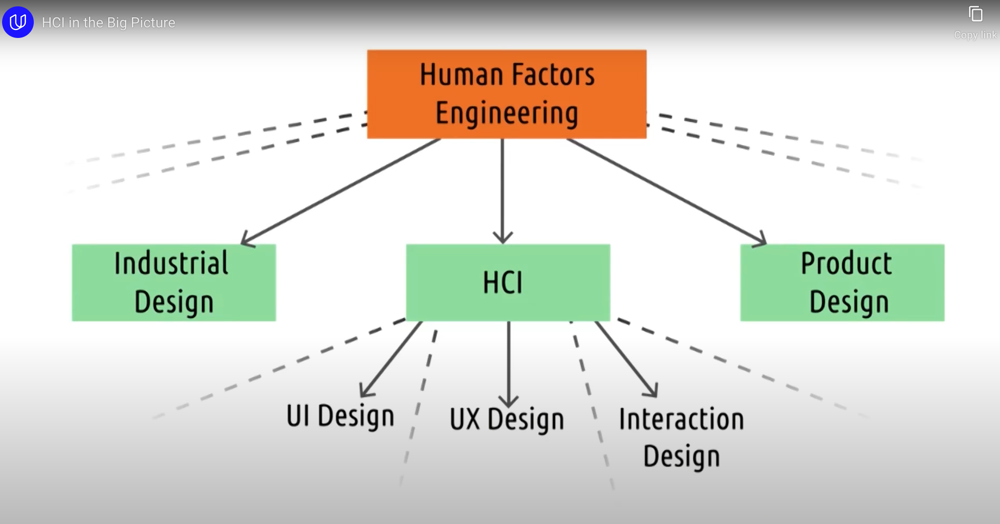

- 가장 대범주로 'Human Factors Engineering' 분야가 존재
	- 중범주로 'HCI'
		- 소범주로 'UI Design', 'UX Design', 'Interaction Design'

### Human Factors Engineering

- Desigining interactions between people and products, systems, or devices
- 전기차를 예시로 들어보면
	- 의자, 백미러, 핸들 위치 등등 모든 것 -> HFE 영역
	- 그 중에 차량 내부 계기판, 터치 패널 -> HCI 영역
- 다만 요즘에는 모든 것이 컴퓨터화 되가는 추세... 즉 HFE와 HCI 사이의 간극이 좁아지고 있다

### UI Design

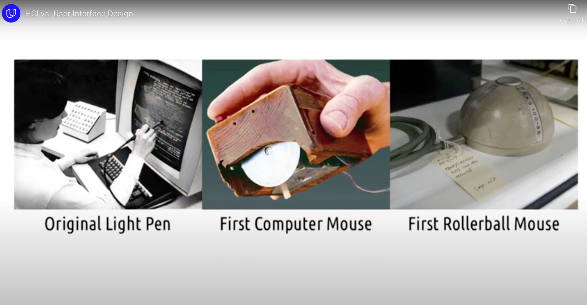

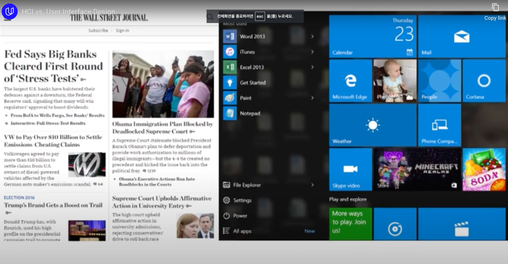

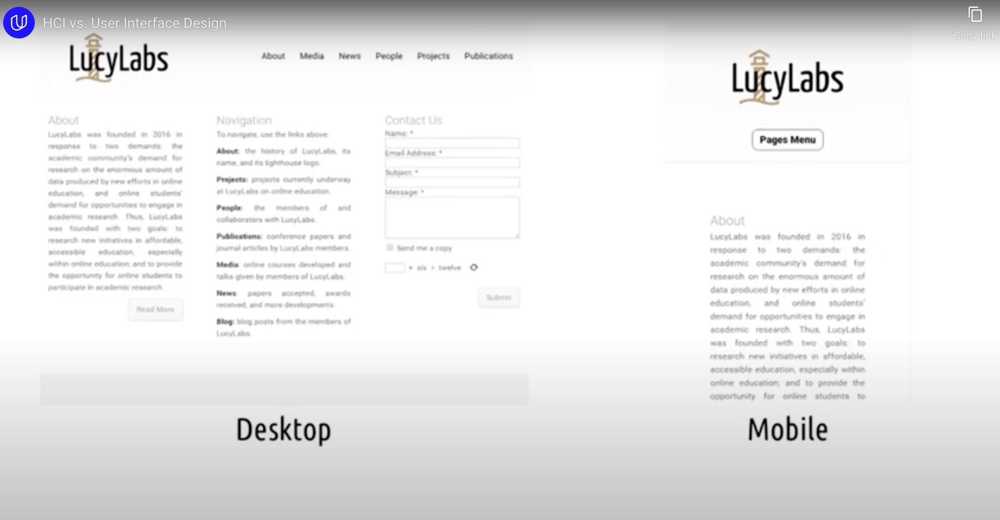

- 초창기에는 HW의 영역도 UI Design의 일부였음
- 요즘 추세는 "화면"에 좀 더 초점이 있음
	- 어떻게 Interaction하기 좋은 Screen을 만들까의 관점

### UX Design

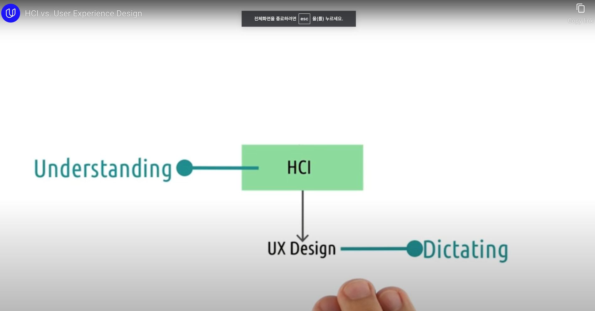

- HCI가 컴퓨터와의 상호작용을 이해(Understanding)하는 것이라면,
	- UX Design은 그렇게 상호작용 하도록 만드는(Dictating) 것

- 사실 위 두가지는 **같이 가는 것**
	- 올바른 이해가 선행되어야, 올바른 사용자 경험을 설계할 수 있다
	- UX를 통해 HCI가 올바른지 평가할 수 있다

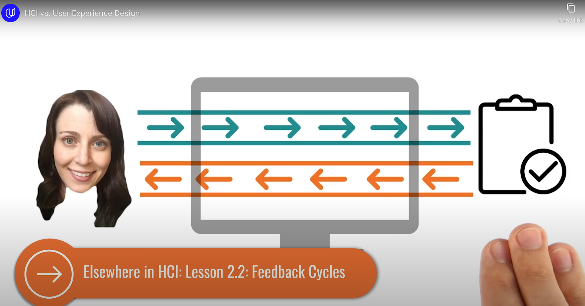

## 3. HCI의 두 축

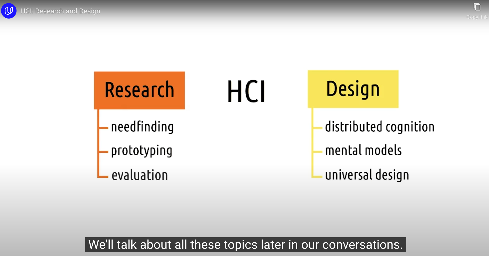

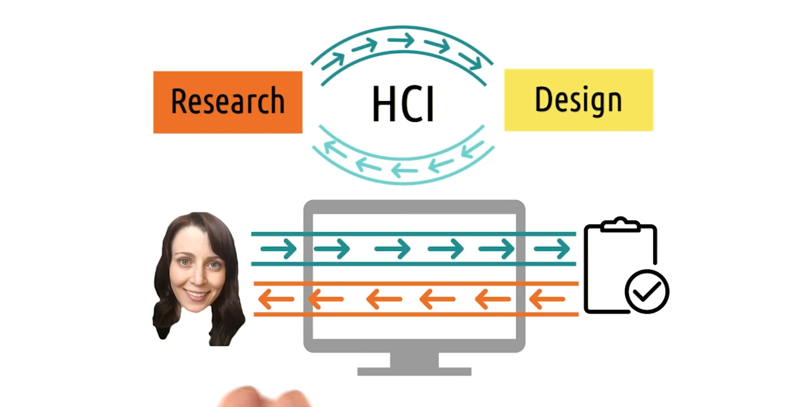

- **<u>Research와 Design은 개별적인 작업이 아니다!</u>**
	- 하나의 Feedback Cycles를 형성

- 미시적 관점
	- 사용자들은 task에 참여하기 위해 그들이 알고 있는 것을 활용함
	- 사용자들로부터의 피드백을 활용해 그들이 무엇을 알고 있는지 알려줌

- 거시적 관점
	- 좋은 인터페이스 디자인(Design)을 위해 우리가 알고 있는 연구(Research)를 활용
	- 상호작용의 결과를 통해 다음의 연구의 시사점을 도출함

HCI의 큰 그림을 그릴 수 있었던 강의. 오랜만에 정말 흥미로운 것을 배울 때의 설렘을 느낄 수 있었다.

앞으로의 강의가 정말 기대된다.

---

All right reserved at [강의 링크](https://www.udacity.com/course/human-computer-interaction--ud400)
