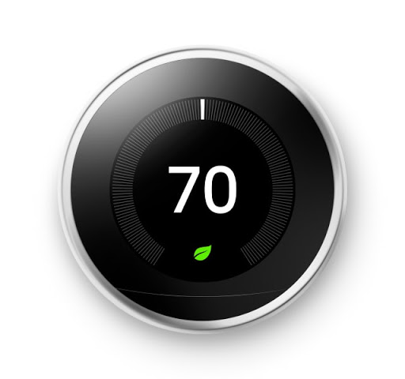
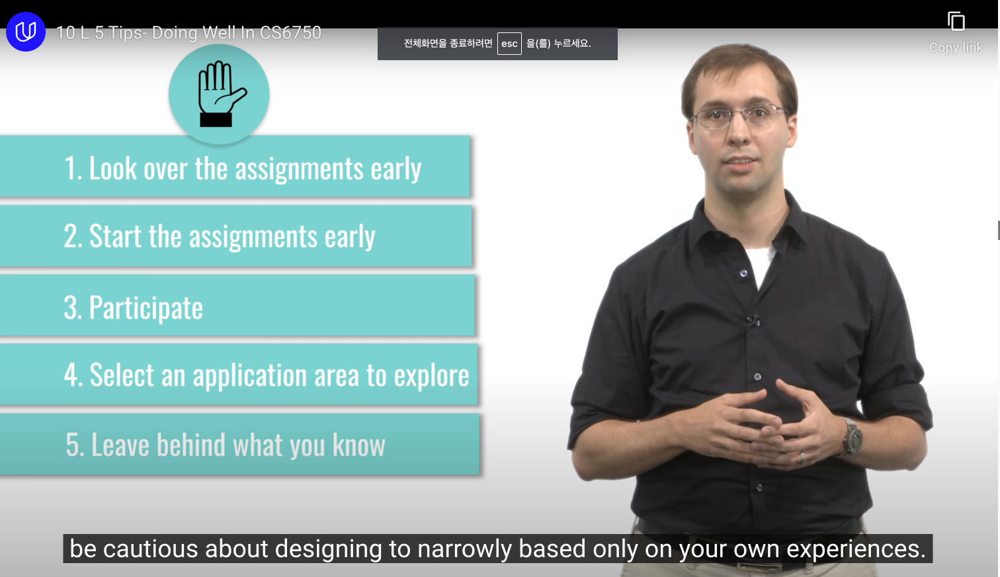

## Learning Goals

- 수업을 통해 알아야 할 것

1. to understand the common principles in HCI
2. to understand the design life cycle
	- interfaces go from 'conception' -> 'prototypes' -> 'evaluation'
	- iteration in above process
3. to understand current applications of HCI

## Learning Outcomes

-  수업을 통해 할 수 있어야 하는 것

> "To design effective interactions between humans and computers"

### 1. Design

- applying known principles to a new problem

- an iterative process of needfinding, prototyping, evaluating and revising

   **<u>-> 좋은 디자인은 2가지 측면을 모두 고려한 것!</u>**

### 2. Effective Interactions

- 우리의 'goal'에 따라 달라짐 (with 온도계 예시)
	- Goal : Usability
		- 최대한 사용자가 쉽게 온도를 잴 수 있게 만들기
	- Goal : Research
		- 사용자가 읽기 어려운 온도계에 어떤 인식을 갖는지 확인
	- Goal : Change
		- 탄소 발자국 줄이기 -> 최대한 온도계 덜 사용하도록 디자인

### 3. Between Humans and Computers

> "We design interactions not interfaces"

- task를 디자인하고, 어떻게 사람들이 그들의 목적을 달성할지 디자인한다
  - '목적을 달성할 때 쓸 interface를 디자인 하는 것' 과 다른 차원!
- 온도계
  - 온도를 재는 방식을 디자인한다? - 사용하기 쉽게, 온도를 읽기 쉽게
  - 온도를 왜 재는가? - 집안의 온도를 일정하게 유지하기 위해 - 온도를 '조절'하는 방식을 디자인 한다
  	- [Nest](https://en.wikipedia.org/wiki/Nest_Thermostat)

## 5 Tips - Doing Well in CS6750

- [숙제 사이트](https://omscs6750.gatech.edu/summer-2023/)

	- **<u>실제 수업을 듣는다 생각하고 모든 숙제 같이 해보기!</u>**

	

+ 약간의 내 생각을 첨가한 정리...

1. 숙제에 대해 오래 심사숙고 해보기
2. 계속 생각해야 실제로 프로젝트를 진행할 때 필요한 insight들을 모을 수 있다

3. Participate
	1. 친구들과 소통하기
	2. Forum에 글 올리기
	3. 다른 사람 글 읽기
4. 나는 무조건 Education!
5. 내가 다 안다는 착각에서 벗어나기
	- User exprerience design은 컴퓨터를 잘 아는 것과 전혀 다른 분야
	- 위의 모든 것은 유저의 'need'에 대한 grounded understanding 바탕에서 이루어저야
	- 내 경험에만 국한하지 말기. 결국 우리가 만드는 것은 '다른 사용자'를 위한 것

