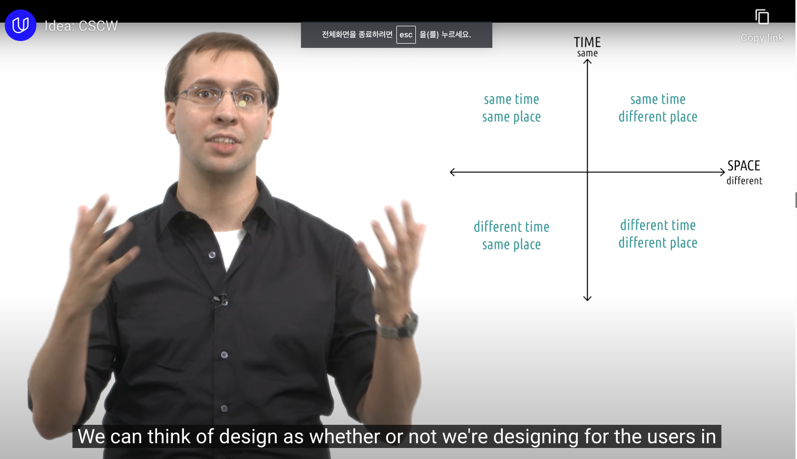
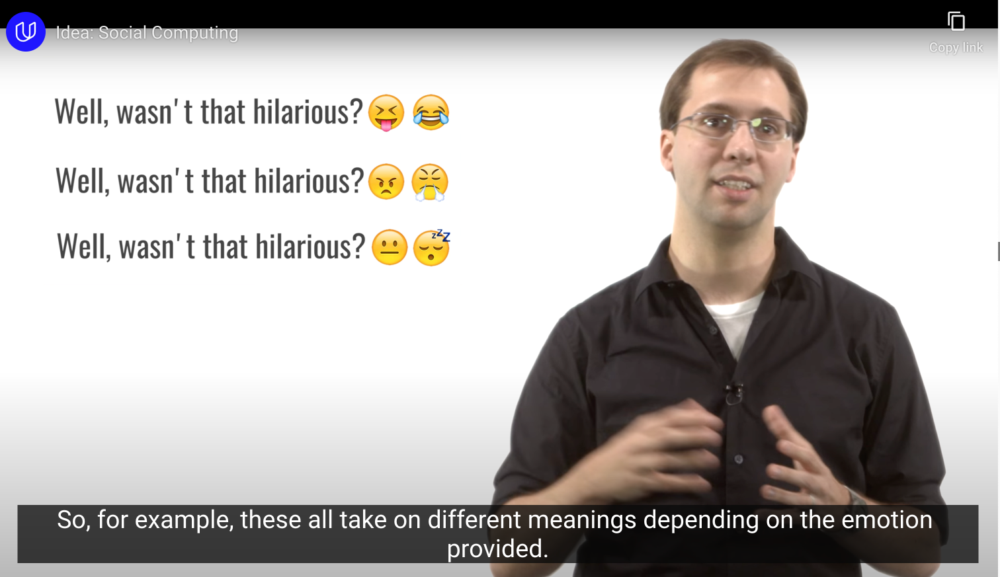
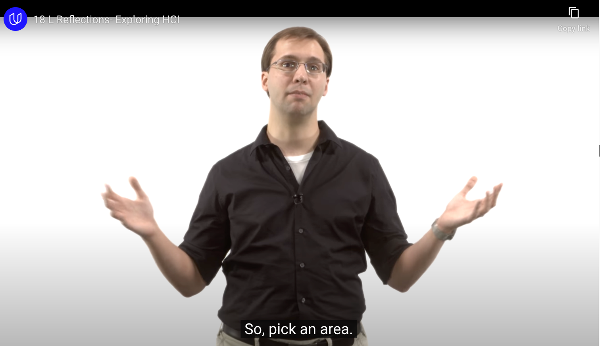
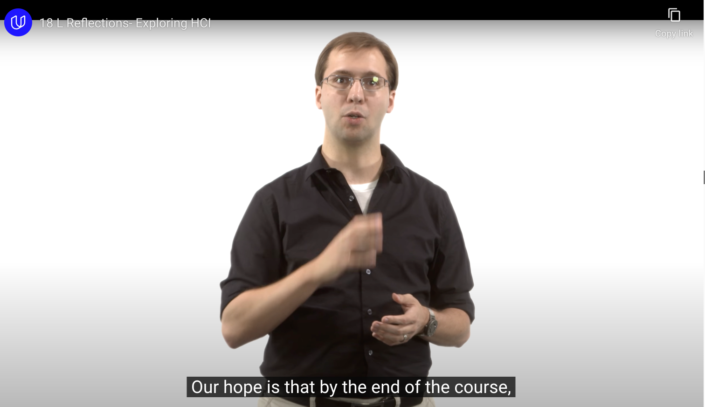
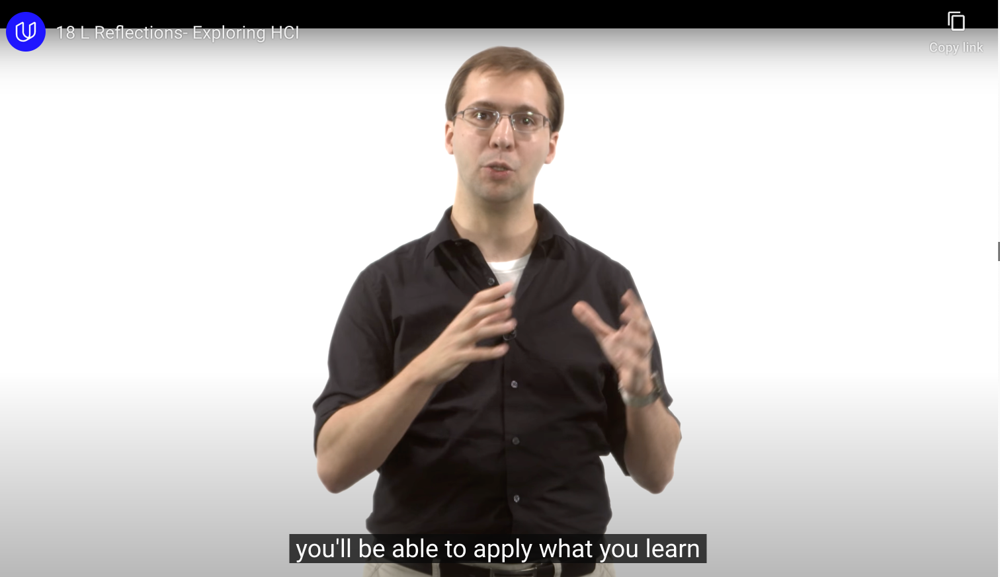
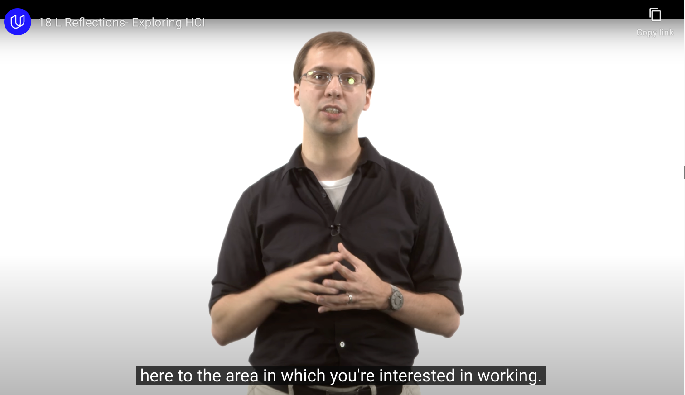

## 1. Technology

### Virtual Reality

- tourist
- commerce
- art
- education
- medical
	- VR Therapy and Counseling Center, Grand Rapids, Michigan
		- treat phobia

### Augmented Reality

### UbiComp and Wearble

- Ubiquitous Computing : computing power anytime, anywhere ~= IoT (Internet of Thing)

### Robotics

- Human Robot Interaction : new field!

### Mobile

- Mobile : portable computing devices built to be used easily on the go

## 2. Idea

### Context-Sensitive Computing

- Equipping user interfaces with historical, geographical, or other forms of contextual knowledge.

- context는 인간 사이의 상호작용에서 가장 중요한 부분
	- Q. 몇시에요? / A. 이제 점심먹으러 가도 돼요
- ex) 차안에서 google map 자동으로 켜주기 / 소파에서 쉴 때 노래를 틀어주기

### Gesture-Based Interaction

- Interacting with interfaces using hand or body gestures
- ex) invisible keyboard - recoginze movement of the muscle in wrist

### Pen- and Touch-Base Interaction

### Information Visualization

- Representing abstract data visually to help humans understand it

- ex)
	- [emperature of the World since 1850](https://i.redd.it/t7vo7ixobf3x.png), also in [animated form](http://www.climate-lab-book.ac.uk/files/2016/05/spiral_optimized.gif)
	- [Visualization of the distribution of PIN usage for debit cards](http://datagenetics.com/blog/september32012/index.html)
	- [The Age Distribution of the United States from 1933 to 2100 (Projected)](https://i.imgur.com/XQWQ57j.gif)

### CSCW (Computer-Supported Cooperative Work)

- using computers to support people working together

### Social Computing

- re-creating social norms within computational systems

## 3. Domain

### Special Needs

- ex) Bruce Walker, Sonification Lab in Georgia Tech
	- How to communicate data to a blind person?
		- Data visualization -> **"communicating data using sound"**

### Education

- education is area where you might not want to make things as easy as possible
	- You might use HCI to introduce some desirable difficulties, some learning experiences for students
- cognitive load students experienced during a learning task is based on the material itself not based on trying to figure out our interfaces.
	- In WORST case, HCI for education is raise the students's cognitive load because they're too busy thinking about interfaces instead of the subject matter itself 

-> 중요한 시사점을 주는 대목...!

> lots of novel efforts in designing technology for education have failed due to poor HCI

- 교수님의 [Education Technology](https://omscs6460.gatech.edu/spring-2023/) 강의 링크

### Healthcare

### Security

- For security to be useful it has to be usable
	- If it isn't usable people just won't use it
- HCI can increase the usability of security
	- CAPTCHAs
	- password selection like a game
		-  ranked against others for how difficult your password would be to guess
		- incentivise password selections...!

### Games

- there's a tight connection between the task and the interface
	- 즉, task 수행의 불편함을 통해 interface 문제를 빠르게 파악할 수 있다!

## Conclusion

- 위의 내용을 명심하고 내가 관심있는 Domain과 HCI를 연관시켜 나가며 공부할 것!

