## Focusing on the task

### Interface Design

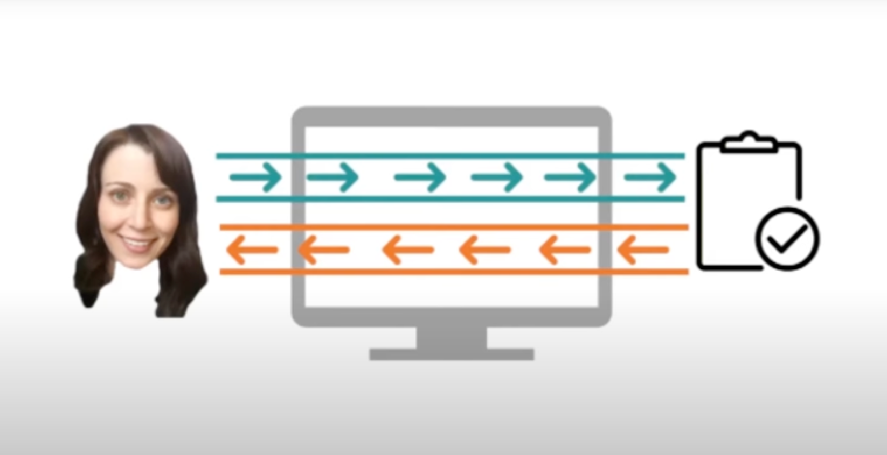

- Interaction between 'user' and 'task' through 'interface'

- GOOD interface 디자인이란?

	- interface 그 자체보다 다음의 2가지를 잘 이해해야 한다!

		- users의 목표(goal)

		- 그들이 달성하려고 하는 task

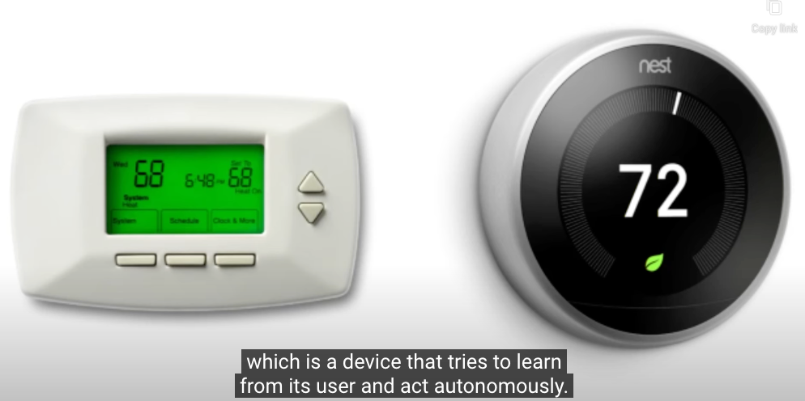

- Thermostat vs. Nest
	- Interface에만 집중하면 iterative improvement에 그칠 수 있다
		- 온도를 측정한다
	- task에 집중하면 revolutionary design이 나올 수 있다
		- 온도를 측정한다 -> Why? -> 온도를 유지한다

- What is 'Nest'?
	- [IoT 업계의 애플, 네스트](https://bahns.net/5673513)

### 5 Tips: Identify a Task

1. Watch real users

	- instead of just speculating or brainstorming, watch real users performing

2. Talk to them!

	- while performing the task, talk to them
	- Find out what they're thinking, what their goals, what their motives are

3. Start small

	- Start by looking at the individual little interactions
	- Be careful to interpret everything in terms of what you already believe.

4. Abstract up

	- small observation -> abstract up to understanding of the tasks they're trying to complete

	- Ask Why they're performing these actions until you get beyond the scope of your design

5. You are not your user

	- You're not designing for you but designing for everyone that performs that tasks

## The role of the user: Processor? Predictor? Participant?

### 1. Processor

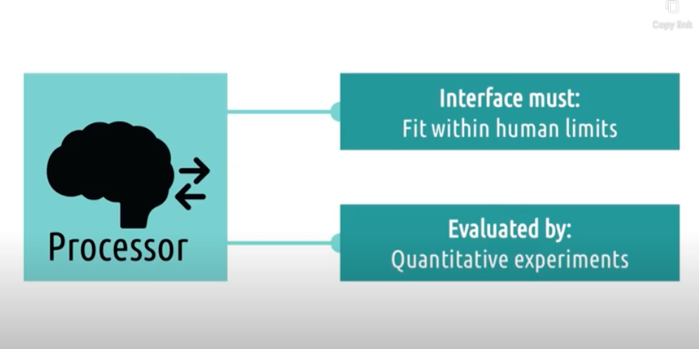

### 2. Predictor

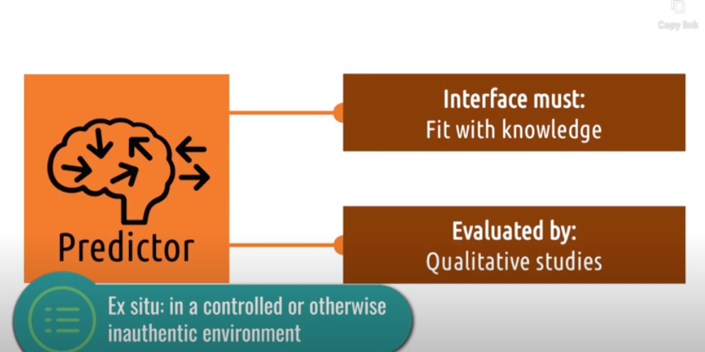

### 3. Participant

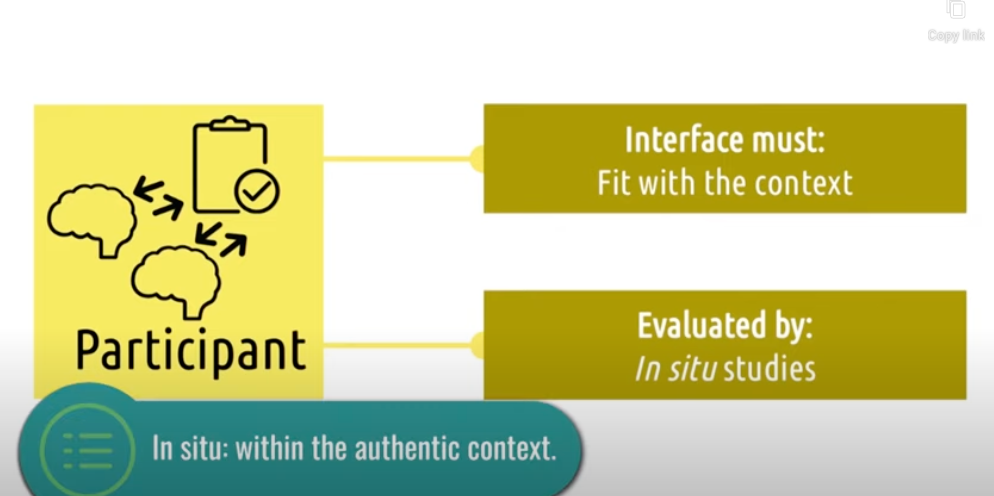

### Views of the User and Psychological Schools of Thought

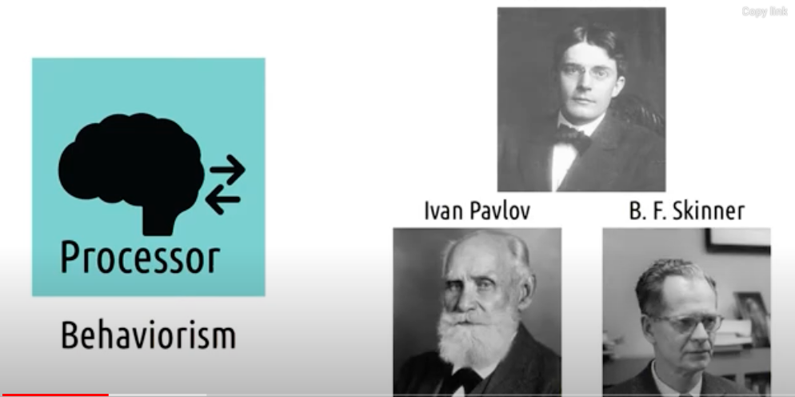

- Focus only on **<u>observable behaviors and outcomes</u>**
	- not at the cognition that underlies behavior
- "What design create the right behavior without paying a whole lot of attention as to why"
	- Design Process = focus on testing observable behaviors

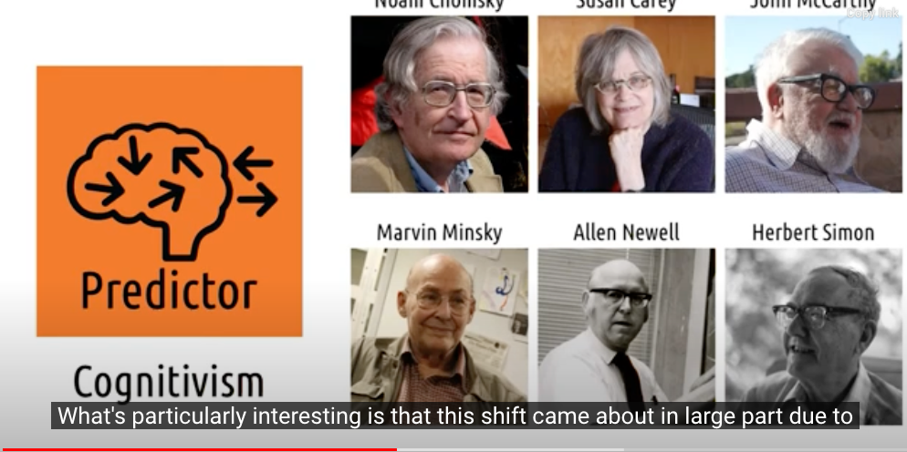

- Linguistics / Psychology / Computer Science 와 관련됨
- AI = computers that could think like humans
	- understand how a human thought
- Focus on **<u>what the user is thinking(predicting)</u>**
	- What do they predict the outcome of that action will be?
	- What do they predict is the right action to take?
- Design Process = get inside the user's head and understand how they predict the interface will behave

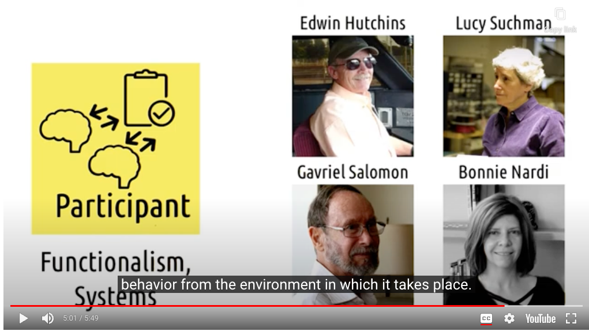

- interaction with some users and some interface
	- interaction of both within the context of a larger system
	- cares about the environment in which the user and the interface are situated
- { ( User + Interface ) = Participants } within larger complex cognitive system

- Distributed Cognitions

### Comparison for 3 Views of Users

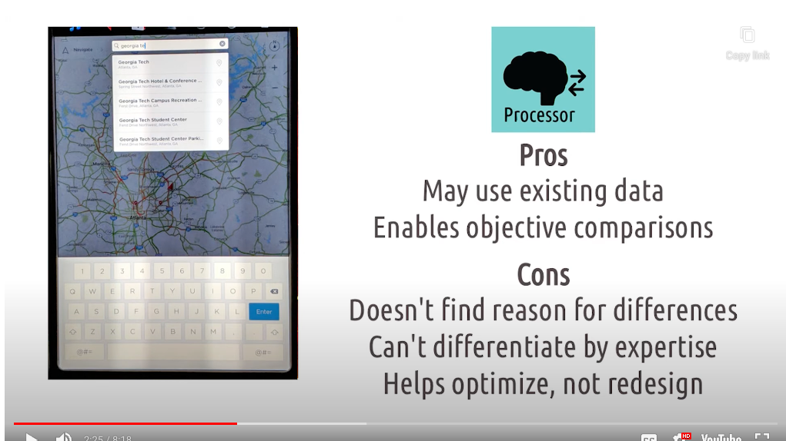

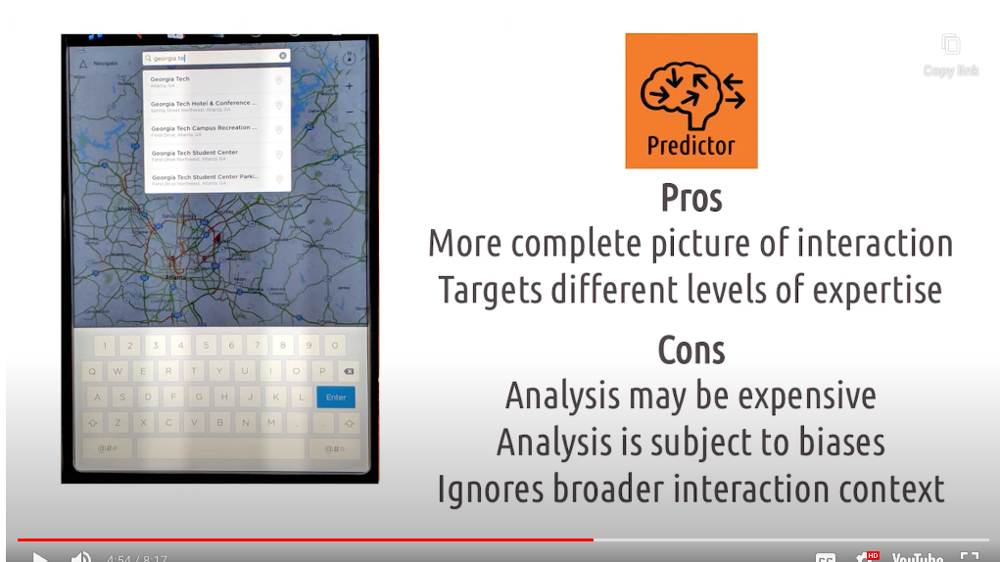

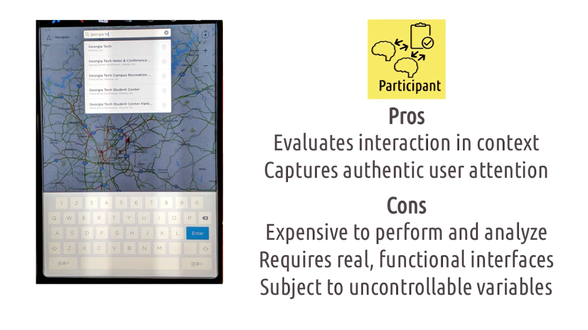

#### Recap

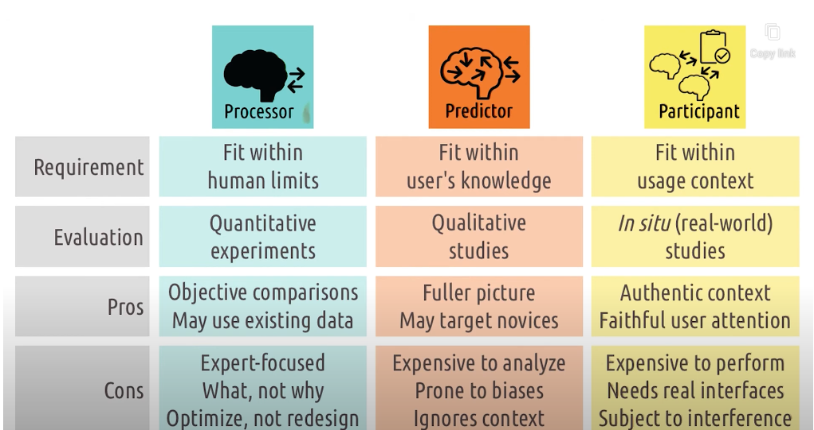

- 3가지 관점은 상호보완적
	- Processor Model : 초보 사용자가 어떤 생각을 하는지 별로 insight를 주지 못함 
	- Predictor Model : 초보 사용자를 타겟팅하는데 적합함
		- Predictor Model : 실제 객관적인 비교를 수행하기는 힘듦
		- Processor Model : 객관적인 비교에 유용
			- 둘 다, 해당 product가 사용되는 context를 고려하지 못함
	- Participant Model : 실제 사용되는 여러 상황의 context를 고려할 수 있음
		- Participant Model : Usability에 영향을 미치는 여러 요소를 고립시켜 확인할 수 없음
			- Processor Model : 여러 변수들을 통제하는데 매우 효과적

- 예시) nevigation system
	- Participant Model : 사용자들이 비슷한 몇개의 위치를 찾는데 많은 시간을 소비한다는 것을 발견
		- book-marking system을 redesign하기로 결정
	- Predictor Model : book-marking system에 대한 prototype을 사용해보게 하며 user들의 인터뷰를 수집
		- 긴 길이의 북마크 필요 없음을 발견. 집과 직장이면 충분
	- Processor Model : 해당 interface가 얼마나 효율적으로 user을 목적지까지 데려다주는지 실험

## User experience at multiple level

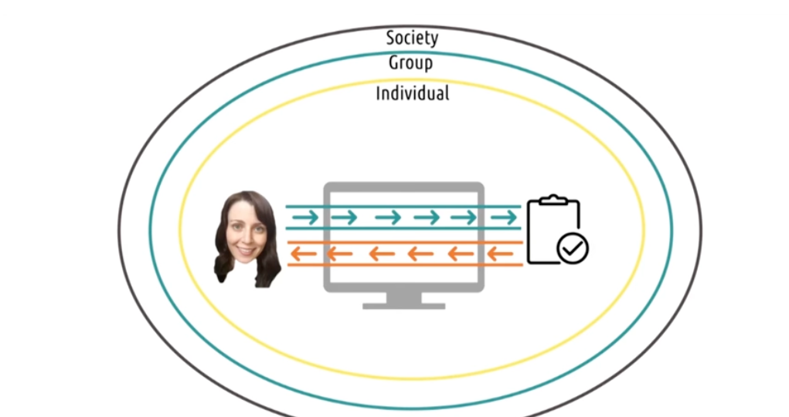

- UX는 개인 차원 -> 집단 차원 -> 사회 차원으로 확장하며 여러 경험을 제공한다
	- 개인 차원 : Health tracking App
	- 집단 차원 : Social Network Service
	- 사회 차원 : 인터넷 국민 신문