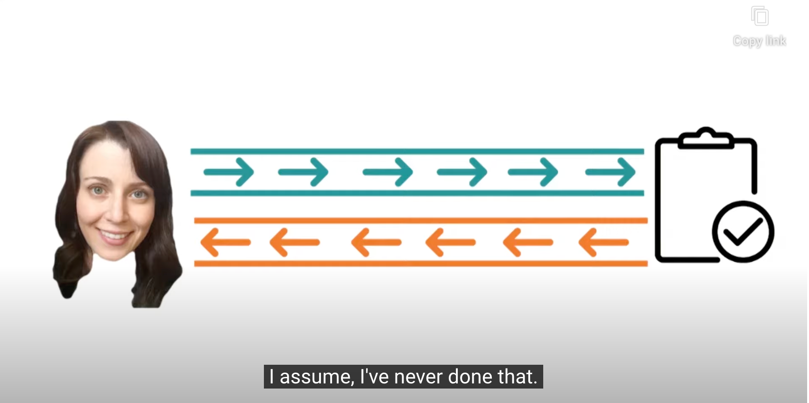
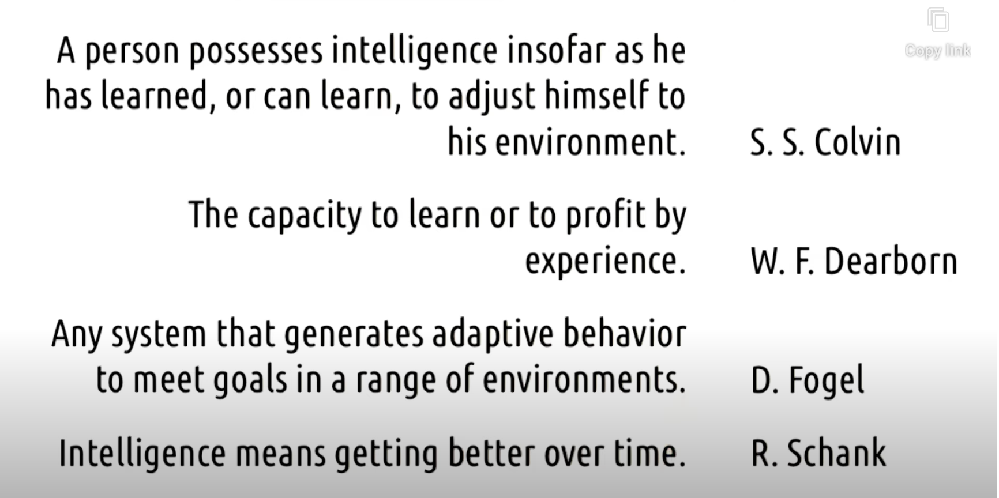
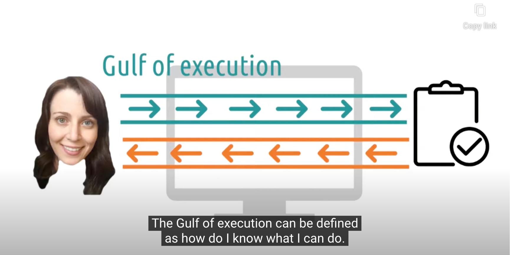
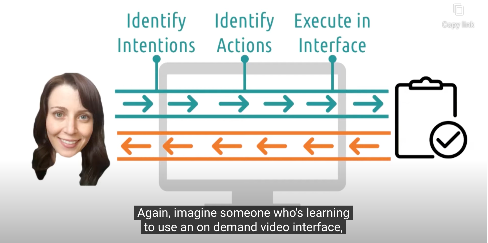
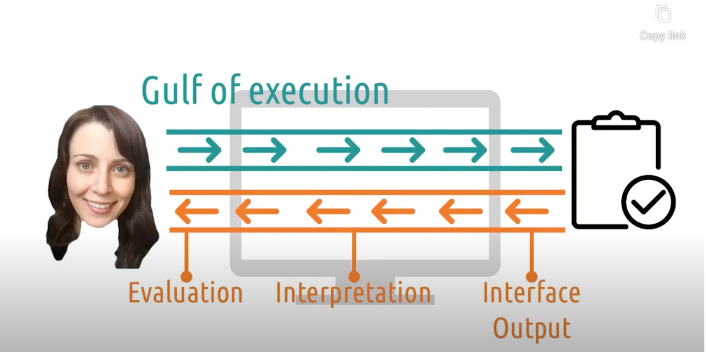
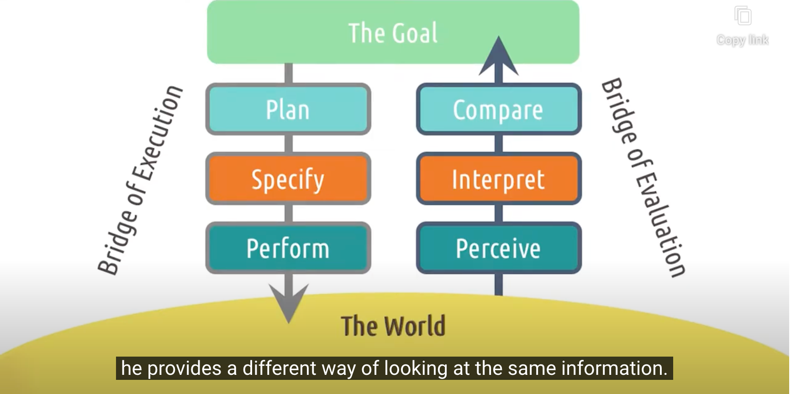
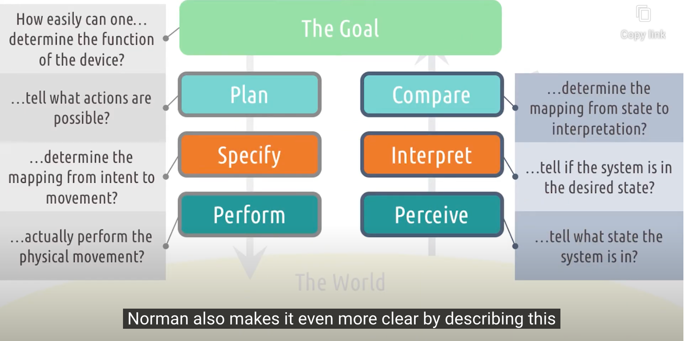
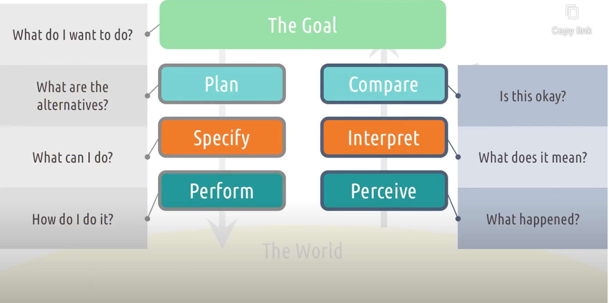
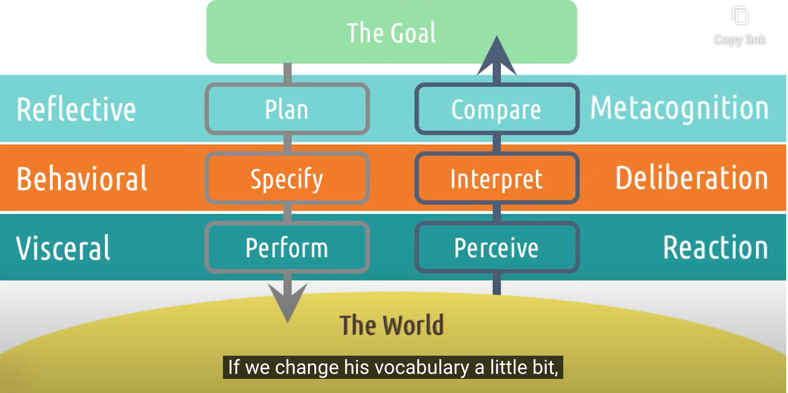
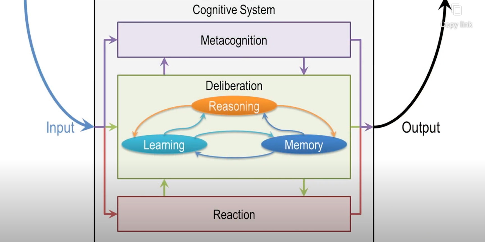

## Ubiquity of feedback cycles

- **<u>We do something, we see the result, and we adjust what we do the next time accordingly.</u>**

### Definitions of Intelligence

- feedback cycle을 지능의 중요한 요소로 파악
	- 지능 자체를 'feedback cycle을 통해서 얻어지는 것'으로 파악하기도 함
- 거의 모든 HCI는 'application of feedback cycles'로 해석될 수 있음!
	- person - task
	- person - interface
	- ( multi people - multi interfaces ) system

## Gulf of execution

- **<u>"How do I know what I can do"</u>**
- cognitive effort required for a user to figure out how to interact with a system to accomplish their goals
	- How hard is it to do in the interface what is necessary to accomplish the users' goals
	- What's the difference between <u>what the user thinks they have to do</u> and <u>what they actually have to do</u>

- Components
  - 1. Identify Intentions : identify what their goal is in the context of the system
  		- c.f. 사용자들이 이해한 바와 시스템의 구조 사이의 괴리가 있을 수도 있다
  		- e.g. VCR, DVR <-> on-demand streaming VOD
  	2. Identify Actions : identify the actions necessary to accomplish their goals
  		- 목표를 실제로 달성하기 위해서 어떤 행동을 취해야 하는지 확인하는 것
  	3. Execute in Interface : execute the actions within the interface
  		- 행동들을 인터페이스를 통해 수행하는 것
  - **<u>각각의 단계는 그에 해당하는 어려움이 있을 수 있다</u>**
- best bridge over the gulf of execurtion <- involve helping users reframe their intention
  - ex) 1분 동안 전자레인지 데우기 -> 먹기 좋은 온도가 될 때 까지 데운다(나머지는 전자레인지가 알아서 해줌)
    - manual system -> auto heat system

### 5 Tips: Gulf of Execution

1. Make fuctions discoverable
	- 사용자들이 처음부터 어떻게 사용될지 interface 안에서 쉽게 찾을 수 있도록 확실하게 labeling 하기
2. Let the user mess around
	- 되돌릴 수 없는 작업은 포함시키지 말아야 함
	- 사용자가 안전함을 느끼며 자유롭게 interface를 탐색해볼 수 있도록 하기
3. Be consistent with other tools
	- 다른 도구의 일반적인 표준에 맞춤으로서 bridge gulfs of execution을 더 원활하게 할 수 있음
	- ex) ctrl+c / ctrl+v / 플로피디스크(저장)
4. Know your user
	- 초기 사용자 : <u>의도 파악</u> 및 <u>행동 파악</u>이 무엇보다 중요 -> 명령을 쉽게 찾을 수 있도록 메뉴 인터페이스 구성
	- 전문 사용자 : <u>행동의 실행</u>이 중요 -> command-line 같은 효율적 방식 선호

5. Feedforward
	- 사용자가 무엇을 좋아할지 피드백을 하는 것 -> 사용자가 행동의 결과가 어떨지 더 쉽게 예측할 수 있게 해 줌
	- ex) Facebook - 담벼락 새로 고침 pull down 하기 전에 알려줌 (아래로 내리지 않으면 실행 안됨)
		- Information on what will happen if you keep doing what you're doing

## Gulf of evaluation

- Meaning

	- cognitive effort required for a user to interpret the feedback or output from a system and determine if their actions were successful

- Components

	1. Interface output : actions에 대한 실제 반응이 어떠한지
		- visual, sound, vibrate, ... 어떤 종류든 output
	2. Interpretation : 사용자가 output의 실제 의미를 올바르게 해석할 수 있을지
		- 핸드폰 진동 - 문자?카톡?알림?
	3. Evaluation : 사용자들의 목표가 달성되었는지
		- 시스템 안에서 output에 대해 interpretate하며 그들의 목표가 정말로 달성되었는지 evaluation 하는 것

	- **<u>각각의 단계는 그에 해당하는 어려움이 있을 수 있다</u>**

- Example
	- 보일러가 작동하는지 어떨게 알수있을까?
		- 소리로 알려준다 / 실제 온도 변화가 있는지 손을 데본다
			- 소리를 못듣는다면? / 온도 변화가 늦게 된다면? -> Large gulf of evaluation
		- '작동중' 설명을 띄운다
			- 보일러의 근본적인 기능은 아니다. BUT bridge over the gulf of evaluation 

### 5 Tips: Gulf of Evaluation

1. Give feedback constantly
	- 사용자가 무엇을 했을 때 피드백 없이 그냥 기다리지 말아라
	- input이 잘 처리됬다고 피드백을 주어라. 어떤 입력이 처리돼었는지도 알려 주어라.
2. Give feedback immediately
	- 사용자에게 전체 반응을 주기 전에라도 사용자에게 알려줘라
	- ex) app을 실행시켰을 때 app icon이 회색이 되는 것 = app이 구동중이고 입력이 잘 처리돼고 있음을 알려주는 것
3. Match the feedback to the action
	- Subtle actions should have subtle feedback
	- Significant actions should have significant feedback
4. Vary your feedback
	- 화면에만 띄우는 것은 visual feedback에만 의존 하는 것 + 화면은 interaction이 일어나는 곳이라 정보를 놓치기 쉬움
	- auditory, haptic 피드백도 같이 활용할 수 있음
5. Leverage direct manipulation
	- 사용자가 그들이 직접적으로 시스템에서 조작하고 있다고 느끼도록 하라
	- ex) drag할 수 있게, 작게 크게 손가락으로 키울 수 있게

## Norman's Feedback Cycle Stages

- 행동을 하는 것은 goal 과 world 사이의 간극(gulf)에 다리를 놓는 것(bridge)이기 때문
	- 실행은 world가 내 goal을 이루도록 만드는 과정
	- 평가는 바뀐 world가 내 goal에 부합하는지 확인하는 과정

### Seven questions for designing feedback cycles

1. The goal : How easily can one determine the function of the device?
2. Plan : How easily can one tell what actions are possible?
	- figure out 'What they can do'
3. Specify : How easily can the user determine the mapping from their intent to the actual movements or actions?
	- figure out 'What they shoud do'
4. Perform : How easily can the user actually perform the physical movements associated with that plan?
5. Perceive : How easily can the user tell what state the system is in?
6. Interpret : How easily can the user tell if the system is in the desired state?
7. Compare : How easily can the user determine the mapping from state to interpretation?
	-  How easily can the user compare <u>what the interpreted as happening</u> to <u>what they wanted to happen</u>?

>  What the USER is thinking?

1. The goal : What do I want to do?
2. Plan : What are the alternatives?
3. Specify : What can I do?
4. Perform : How do I do it?
5. Perceive : What happened?
6. Interpret : What does it mean?
7. Compare : It this okay?

### compared with Knowledge-based AI

## Everyday applications of feedback cycles

- 자동차 시동 버튼이 왜 운전대 오른쪽 아래 부분에 있을까?
	- gulf of execution
		- 자동차의 시동을 켠다(intention) <-> 내가 해야할 행동(action) <-> 시동 버튼을 누른다(execute) 사이의 간극을 줄여준다
			- constency
			- 쉽게 손이 닫지만 다른 버튼 들을 누를 때 영향 받지 않는 곳
	- gulf of evaluatioin
		- 시동 버튼을 누른다(execution) <-> 시동이 켜졌다 (output) 사이의 간극을 줄여준다
			- 전원 불이 들어온다
			- 소리 들린다
			- 엔진 진동이 울린다
- **<u>어떻게 더 UX를 향상시킬 수 있을까? = 어떻게 gulf of execution/evaluation을 좁힐(narrow) 수 있을까?</u>**

#### Example : Card Readers

- 초기 카드 리더기
	- 긁는 방식
	- 문제점
		- 제대로 인식이 됐는지 확인할 길이 없음
		- 너무 느린건지 빠른건지 긁는 적절한 속도를 알기 어려움
		- 카드를 어느 방향으로 긁어야 하는지 파악해야 하는 인지 부담
- 새로운 카드 리더기
	- 꽂는 방식
	- 나아진 점
		- execution : 결제한다 = 카드를 꽂는다 : 더 가까워진 intention-goal / 끝까지 꽂혔는지만 확인하면 됨
		- evaluation :  끝까지 꽂아졌는지만 확인하면 됨 : output-goal 확인이 쉬워짐
	- 새로운 문제점
		- 카드를 꽂아서 결제가 될때까지 기다려야 되다보니, 까먹고 카드를 놓고 가는 문제
			- **<u>어떻게 이런 문제를 해결할 수 있을까?</u>**
			- 내 생각:)
				- 카드를 뽑지 않으면 결제가 다음 단계로 진행이 안되도록 한다
				- 카드를 뽑으라는 가벼운 경고음이나 안내음성을 들려준다
- 새로운 생각!
	-  긁거나(sliding) 꽂거나(swiping) 하는 방식을 어떻게 하면 더 쉽게 바꿀지 고민했음 -> 이 고민 자체에는 문제가 없을까?
		- 내 생각:)
			- 카드를 찍는 방식으로 바꿀 수 있다 (tagging 방식)
			- gulf of execution
				- 카드를 찍는 방식이 더 consitency를 높일 수 있을것 같다 = 교통카드 태그
			- gulf of evaluation
				- +카드를 놓고갈 이유가 없어진다
				- -제대로 인식이 되지 않을 변수가 많아지는 단점... (딱 붙이지 않거나, 위치가 조금 엇나가서 인식이 잘 안되거나 등등)
