2 Applications of effective feedback cycles

- Direct Manipulation
- Invisible Interface

## Direct Manipulation

- Our goal = narrow the gulf of execution & gulf of evaluation as much as possible
	- 위 목표의 궁극적인 형태가 Direct Manipulation 

- The Desktop Methaphor

	- 파일을 옮기거나 폴더에 파일을 넣기 = goal

	- CLI (command line interface) -> GUI (graphic user interface) -> Touch-Screen
		- 점점 더 우리가 실제 물리적 세계에서 하는 행동과 닮아가도록 UX가 진화됨

- General Heuristic

	- How do we help the user interact most closely with the target of their task?

	- How do make it they're manipulating as directly as possible?

### Paper Spotlight : Direct Manipulation Interfaces

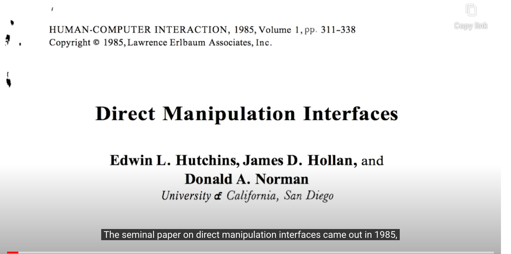

#### Two aspects of directness

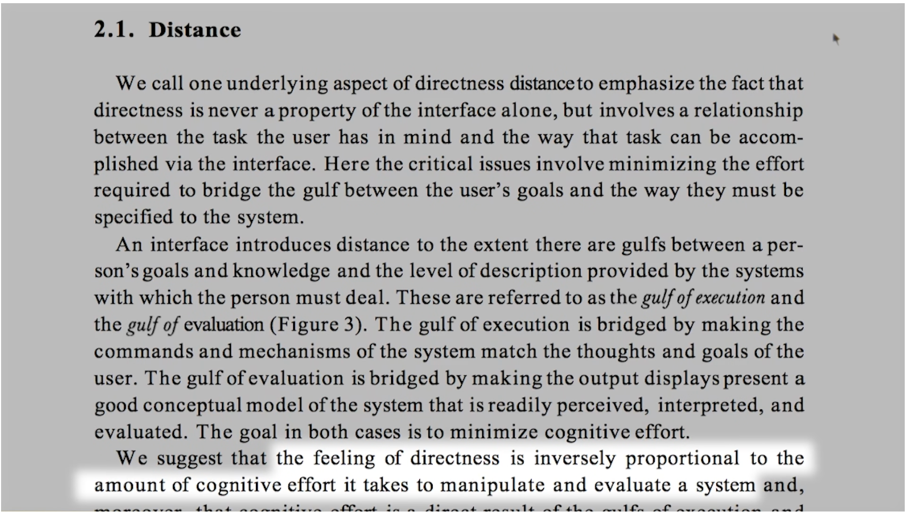

##### 1. Distance  

> the feeling of directness is inversely proportional to the amount of congnitive effort it takes to manipulate and evaluate systems

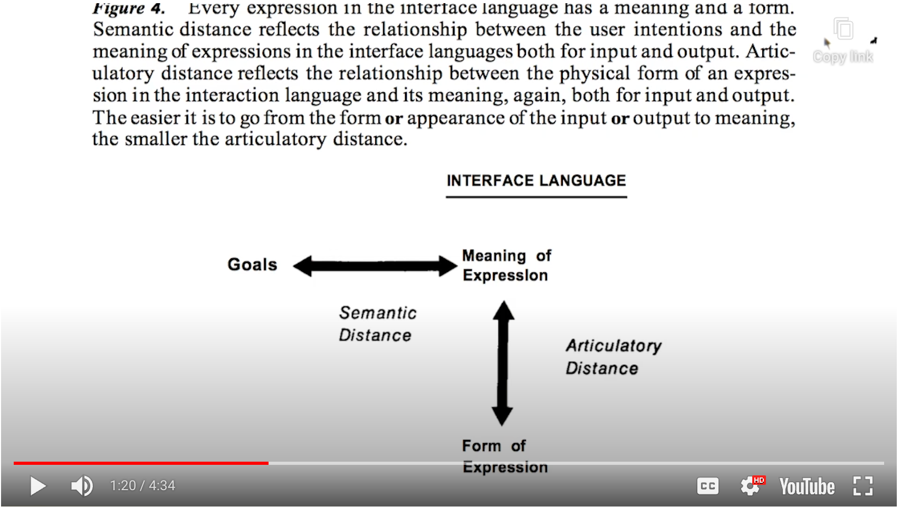

- Semantic Distance
	- between the user's goals and their expression in the system
		- How hard it is to know what to do
	- identify intentions <-> identify actions
- Articulatory Distance
	- between that expression and its execution
	  - How hard it is to actually do what you know to do
	- identify actions <-> execute in interface

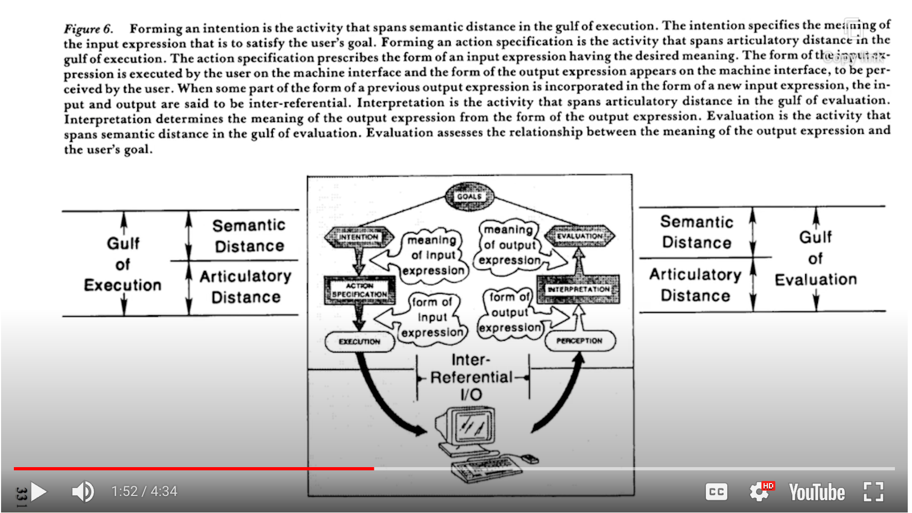

- Goals : 화면의 사진을 회전하고 싶다
  - (translate the goals into the context of the application)
- Intentions : 어디에 회전 기능이 숨겨져 있을 거야
- Action Specification : 회전 버튼이 있네. 눌러서 실행하면 되겠다.
	- (Execute) -> (output)

- Perception : 화면의 사진이 위아래가 바뀌어 있네? 회전이 아니고
- Interpretation : 화면 회전을 다른 방식으로 해야되나 보다
- Evaluation : 다른 방식으로 해보자
	- 위 과정을 Goal을 달성할 때 까지 반복함

##### 2. Direct Engagement

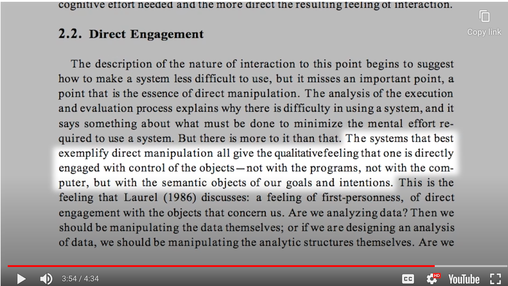

> The systems that best exemplify direct manipulation all give the qualitative feeling that one is directly engaged with control of the objects - not with the programs, not with the computer, but with the semantic objects of our goals and intentions.

- 예시
	- 물리적인 파일을 움직이듯이 파일 아이콘을 움직일 수 있어야 한다
	- 게임을 하면 캐릭터를 직접 움직일 수 있어야 한다

 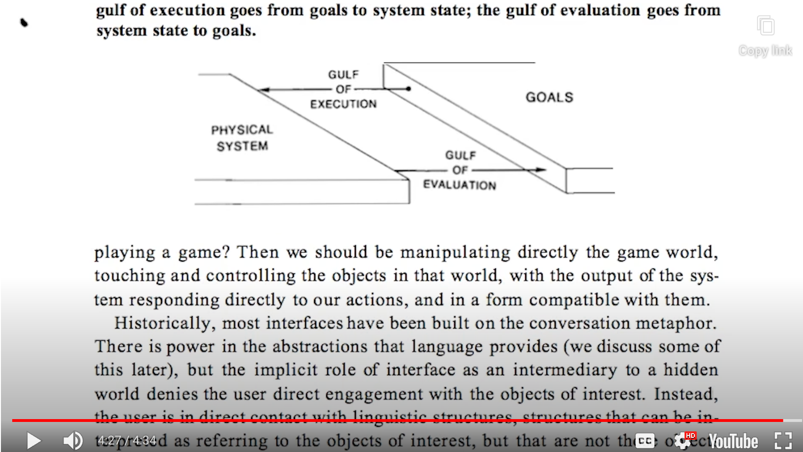

- 다양한 방법으로 gulf of execution과 gulf of evaluation 사이의 간격을 줄일 수 있다
	- <u>Direct Manipulation은 이를 가능하게 해주는 강력한 방법</u>

### Reflections Direct Manipulation

- What are some of the places where you don't interact through direct manipulation?
	- ex) Where technolgy is replacing things you used to do manually
		- physical interface was a bit more closer to the task than the new technical one.
	- How can the technical interface better leverage direct manipulation?

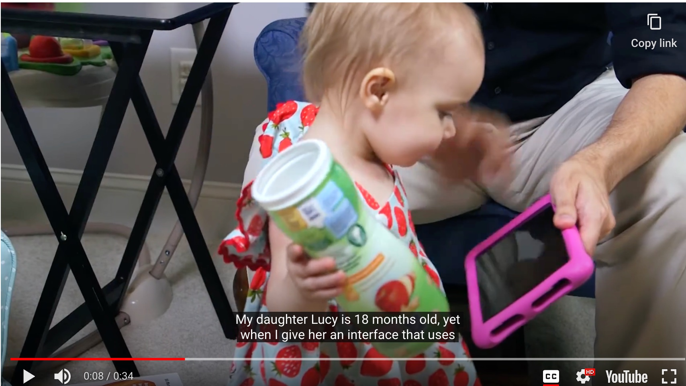

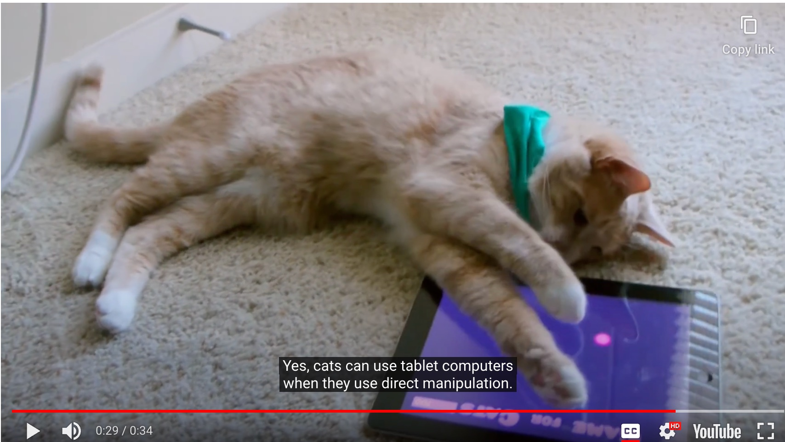

- 아기, 심지어 냥집사도 사용할 수 있는 인터페이스 디자인
	- GOOD Direct Manipulation

- 좋은 예시 : Apple TouchPad
	- 터치패드가 마치 화면의 작은 축소 버전처럼 느끼게 함
		- 사이드 툴바 : 오른쪽 두 손가락으로 툴바를 띄우면서 마치 직접 조작하는 것 같은 느낌
		- LaunchPad : 손가락을 모두 오므리면 전체 화면을 접는 것 같은 느낌
		- 확대 축소 : 애니메이션처럼 움직이는 것이 진짜 화면을 조작하는 경험을 강화해줌
- **<u>Designing interfaces that lend themselves to interactions that feel more direct</u>**
	- It isn't just about design interface that feel like directly manipulating

## Invisible Interfaces

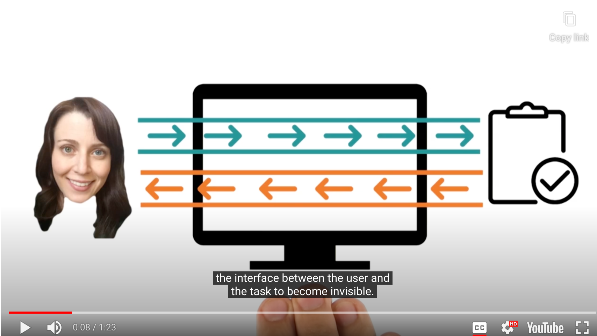

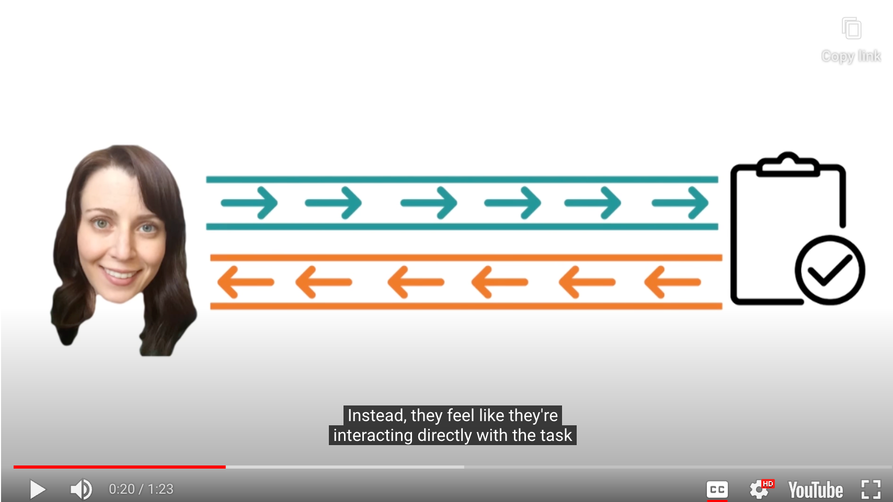

- Our ultimate goal
	- **<u>the interface between the user and the task to become invisible</u>**

- Example
	- 스타일러스 펜 vs. 마우스
		- 인터페이스를 느낄 수 있느냐 없느냐의 차이

### Invisibility by Learning

- '인터페이스가 보이지 않으면 디자인이 훌륭하다' -> 오류에 빠지지 말기!
	- 인터페이스는 좋은 디자인에 의해 마치 보이지 않는 것처럼 느껴지는 것이고
	- 인터페이스가 존재해야 사용자가 그것을 어떻게 사용하는지 배울 수 있다

- 자동차 핸들 예시
	- 운전을 배우기 위해 사람들은 많은 시간을 투자. 그만큼 그 interface에 익숙해지는 것이 중요하기 때문
	- 하지만 일반적인 경우 1분이나 그것을 배우는데 사용할까...?

- **<u>Our goal = To make our intefaces invisible by design</u>**

	- from the very first moment the user start using them

	- For this, we will learn LOTS of things
		- leveraging prior expectations
		- providing quick feedback
		- internal mental model matches the system

### 5 Tips: Invisible Interfaces

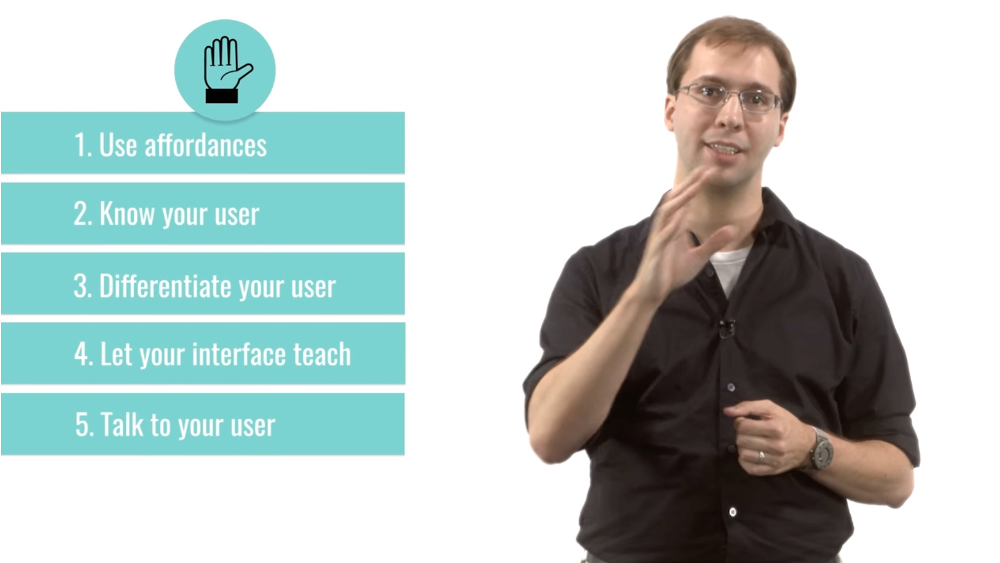

1. Use affordances

	- Affordance = the visual design the interface is just how it's supposed to be used
	- ex) 버튼 누르기, 다이얼 돌리기, 스위치 튕기기 등등

2. Know your user

	- invisiblilty in novice : interactions are all natural
	- invisiblilty in expert : maximizing efficiency

3. Differentiate your user

	- provide multiple ways of accomplishing tasks

4. Let your interface teach

	- 뭔갈 배우는게 아닌 동작을 수행하면서 자연스레 알아갈 수 있게 설계하기

	- ex) 만약 복사 버튼을 누를 때, hotkey를 보여주는 방식 

5. Talk to your user
	- Best thing you can do is talk to the user
		- Ask them what they're thinking while you use an interface
		- Note especially whether they're talking about the task or the interface
			- 만약 interface에 대해 이야기한다면? -> <u>아직 너무 visible 한 것</u>

## Design Challenge : The Universal Remote

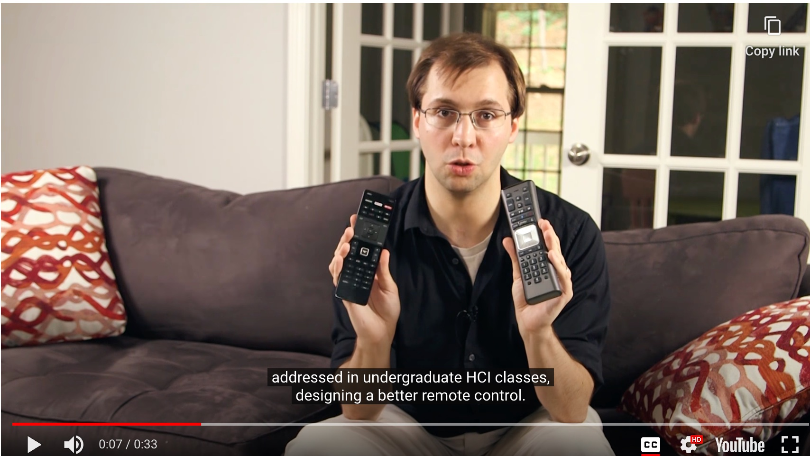

- 리모콘을 어떻게 더 잘 디자인할 수 있을까?
	- How would we design an <u>invisible interface</u> for <u>universal remote control</u>?
		- one that doesn't have the learning curves that these have

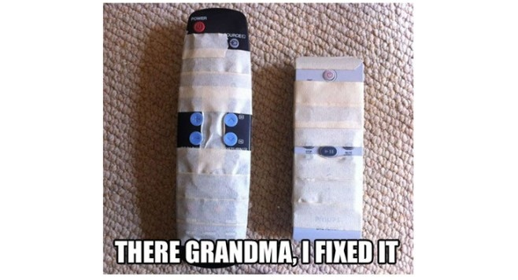

