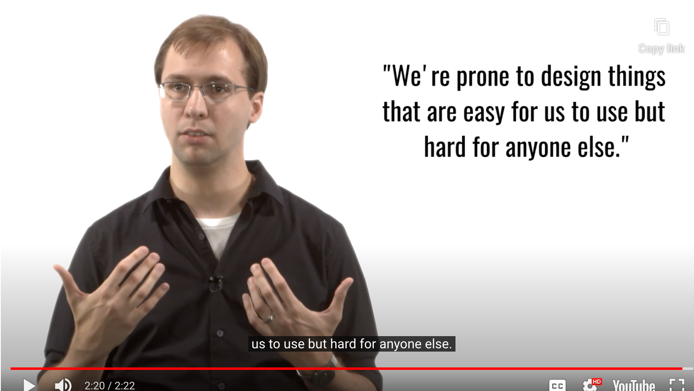

## If you want to learn more Psychology

- Recommended Courses:

[MIT's Sensation and Perception, on MIT Open Courseware](http://ocw.mit.edu/courses/brain-and-cognitive-sciences/9-35-sensation-and-perception-spring-2009/)

[The University of British Columbia's AP Psychology, on edX](https://www.edx.org/course/apr-psychology-course-1-what-psychology-ubcx-psyc-1x#!)

[Duke University's Visual Perception and the Brain, on Coursera](https://www.coursera.org/learn/visual-perception)

[San Jose State University's Introduction to Psychology, on Udacity](https://www.class-central.com/mooc/830/udacity-intro-to-psychology)

[The University of Toronto's Introduction to Psychology, on Coursera](https://www.coursera.org/learn/introduction-psych)

## Bit of psychology

- adopt 'processor' view of human
	- interested in 'What they can do?' (phsycially, cognitively, ...)

- Focusing
	- how the person makes sense of input
	- how they then act in the world

### Input : Sensation and Perception

- Visual
- Auditory
- Haptic

#### Design Challenge : Message Alerts

- Problem
	- 문자 메세지를 받았을 때 알려주는 기능을 어떻게 만들까?

- Constraint
	- 핸드폰이 주머니에 있을 때나 테이블에 있을 때나, 어디에 있던 알림을 해줘야 한다
		- 주변 사람들에게 방해가 되어서는 안된다 (너무 진동이 클 경우 방해됨)
	- 한 방법(modality)에 제한할 필요 없다
		- 단, 핸드폰에서 사용 가능한 sensor 기준으로만 제한해야 한다

### Memory

#### 1. Perceptual Store

- = 작업 기억(working memory)

- 1초 안쪽으로 지속되는 매우 짧은 기억
- 3가지 형태가 존재 = Central Executive
	- Visuospatial Sketchpad
	- Phonological Loop
	- Episodic Buffer

- Paper Reference:

	- Gobet, F., & Simon, H. A. (1998). [Expert chess memory: Revisiting the chunking hypothesis.](https://www.researchgate.net/profile/Fernand_Gobet/publication/13576754_Expert_Chess_Memory_Revisiting_the_Chunking_Hypothesis/links/0fcfd510780ca30a45000000.pdf) Memory, 6(3), 225-255.

	- Gobet, F., & Simon, H. A. (1996). [Recall of random and distorted chess positions: Implications for the theory of expertise](https://www.researchgate.net/profile/Fernand_Gobet/publication/225336454_Recall_of_random_and_distorted_chess_positions_Implications_for_the_theory_of_expertise/links/09e415102ec8792e59000000.pdf). Memory & cognition, 24(4), 493-503.

	- De Groot, A. D., Gobet, F., & Jongman, R. W. (1996). [Perception and memory in chess: Studies in the heuristics of the professional eye](https://scholar.google.com/citations?view_op=view_citation&hl=en&citation_for_view=jeJqwKsAAAAJ:UebtZRa9Y70C). Van Gorcum & Co.

#### 2. Short-term memory

- one of our biggest concerns
- 사용자가 한번에 너무 많은 short-term 메모리를 처리하지 않도록 디자인 하는 것이 매우 중요

- Research show...
	- User's can store **<u>"Four to five chunks at a time"</u>**
	- Idea of 'chunking'
		- 한 묶음으로 처리되는 정보의 일부분
	- By helping them chunk things -> increase effective short term memory capacity
		- 8 5 3 3 7 1 6 2 2 7 -> 85 3371 6227 
	- Menu bars, Tool strips 가 어디에나 보이는 이유(ubiquitous)
		- 사용자는 아이콘이나 명령어를 기억하지 못할 수 있다
		- 하지만 보면 알 수 있다

 

#### 3. Long-term memory

- 장기 기억에 저장하는 것은 쉽지 않다
	- 단기 기억에 저장하는 게 더 쉬움
- **<u>To load something into long-term memory</u>**
	- **<u>You need to put it into short-term memory several times</u>**

- Example
	- Lightner System

## Cognition

### Learning

- When design interfaces?
	- we hope the user has to learn as little as possible
		- to find the interface useful
	- ALSO, our interfaces should teach the user over time
		- how to use them most efficiently

1. Procedural Learning

- paste your clipboard here

2. Declarative Learning

- what's the hot-key for paste

- 선언적 지식 = 우리가 의사소통 하는 방법이라면
- 방법적 지식 = 우리가 HCI에서 하는 것
	- 강한 방법적 지식이 있으면 어떻게 하는지 잊고서 너무 자연스럽게 무엇을 할 수 있음
	- **<u>Unconsciously Competent</u>** what you're doing

- 무의식적인 방법적 지식을 명확한 선언적 지식으로 표현하는 것이 어렵다
	- **<u>We are prone to desing things that easy for us to use but hard for anysone else.</u>**
		- 설명은 결국 선언적 지식일 수 밖에 없으므로

### Cognitive Load

#### 2 applications to working design

1. Interface를 통해 Cognitive Load를 줄이는 것

- 사용자가 더 task에 집중할 수 있게!

2. Interface가 사용되는 상황 맥락을 이해하는 것

- 인터페이스 사용을 위해 사용자가 얼마나 Cognitive Resource를 사용할 수 있는지 확인!

### 5 Tips: Reducing Cognitive Load

#### 1. Use multiple modalities

- decribing things verbally and also present them visually

#### 2. Let the modalities complement each other

- Each modality support, illustrate, explain the other
	- Avoid user has to process 2 things at once (competing with the other)

#### 3. Give the user control of the pace

#### 4. Emphasize essential content and minimize clutter

- emphasize most common actions while still giving access to the full range of possible options

#### 5. Offload tasks

- minimize users have to do or remember at each stage onto the interface
	- 이전 화면을 기억해야 한다? -> 이전 화면 보여주기
	- 수작업으로 해야되는게 있다? -> 자동화로 초기 작업 대신해주기

## Moter System

- What they pysically do
- How precise or accurate they can... 
	- 어플리케이션이 사용되는 상황(context)을 잘 인지하고 잇어야 한다!

## Explore HCI

- REFLECT
	- **<u>What the limitations of the human ability are</u>**
		- **<u>in the domain of HCI we chose</u>**

- educational technology
	- Cognitive issues is important
		- surrounding design technology
- VR
	- main concern might be perception
		- how we physically interct with VR system
