## Overview

### Usability

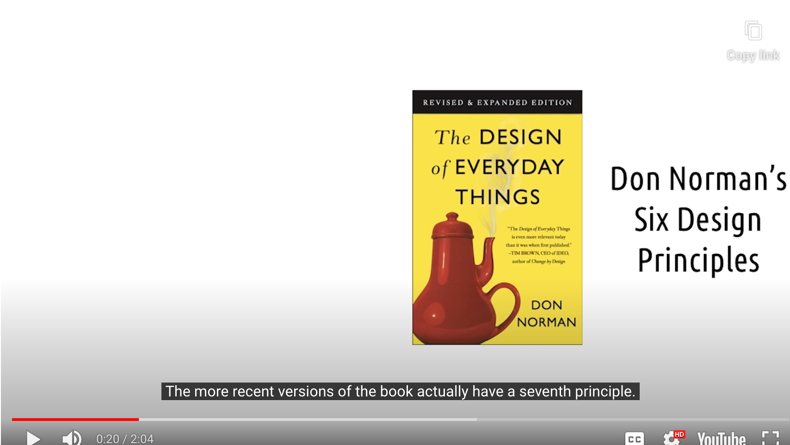

- Don Normans's Six Principles

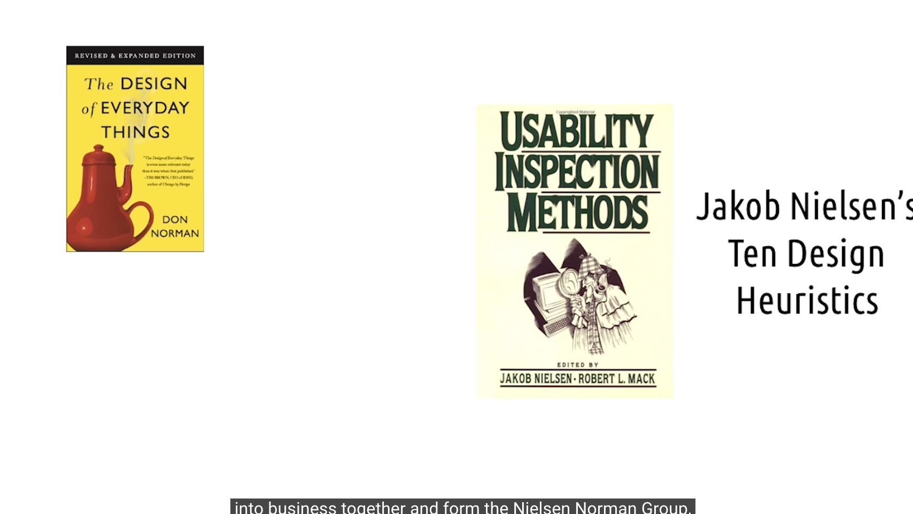

- Nielsen's Ten Heuristics

	

- Constantine's and Lockwood's Six Principles

-> most concerned with **<u>usability in general</u>**

### Universal Design

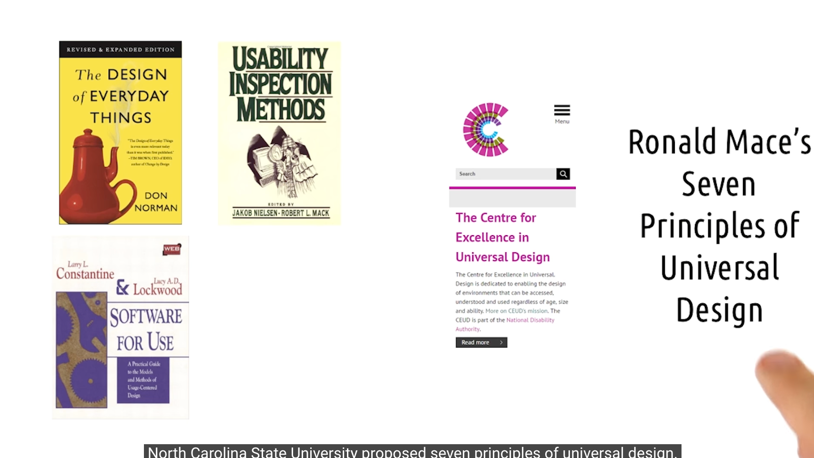

- Seven Principles of Universal Design

-> concerned with designing interfaces and devices that can be **<u>used by everyone regardless of age, disability, and so on</u>** 

### In this Lesson...

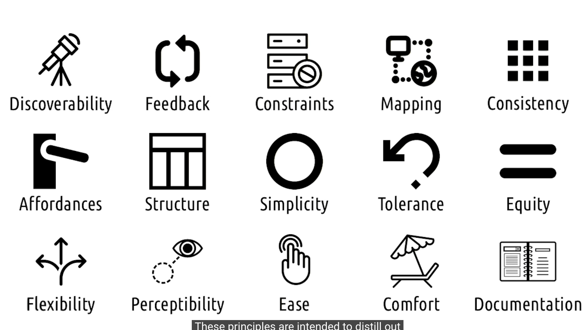

- 15 Design Principles

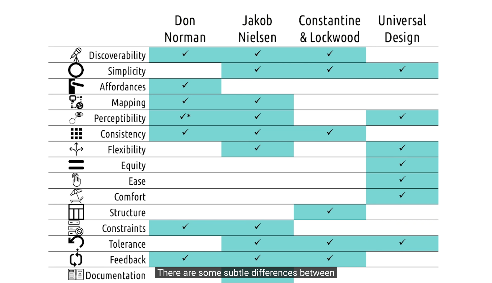

Links:

[Design of Everyday Things](https://smile.amazon.com/Design-Everyday-Things-Revised-Expanded/dp/0465050654/ref=sr_1_1?ie=UTF8&qid=1472587469&sr=8-1&keywords=design+of+everyday+things)

[Usability Inspection Methods](https://smile.amazon.com/Usability-Inspection-Methods-Jakob-Nielsen/dp/0471018775/ref=sr_1_1?ie=UTF8&qid=1472587535&sr=8-1&keywords=usability+inspection+methods)

[Software for Use](https://smile.amazon.com/Software-Use-Practical-Usage-Centered-paperback/dp/0321773721/ref=sr_1_1?ie=UTF8&qid=1472587567&sr=8-1&keywords=software+for+use)

[Center for Excellence in Universal Design](http://universaldesign.ie/)

## 15 Design Principles

### 1. Discoverability

> Is it possible to even figure out what actions are possible and where and how to perform them?
>
> - Don Norman

> Minimize the user's memory load by making objects, actions, and options visible.
>
> Instructions for use of the system should be visible or easily retrievable whenever appropriate.
>
> - Jakob Nielsen

> The Visibility Principle: the design should make all needed options and materials for a given task visible without distracting the user with extraneous or redundant information.
>
> - Larry Constantine & Lucy Lockwood

- Relevant functions should be visible
	- to read about them in some documentation
	- to learn them through some tutorial. etc... 

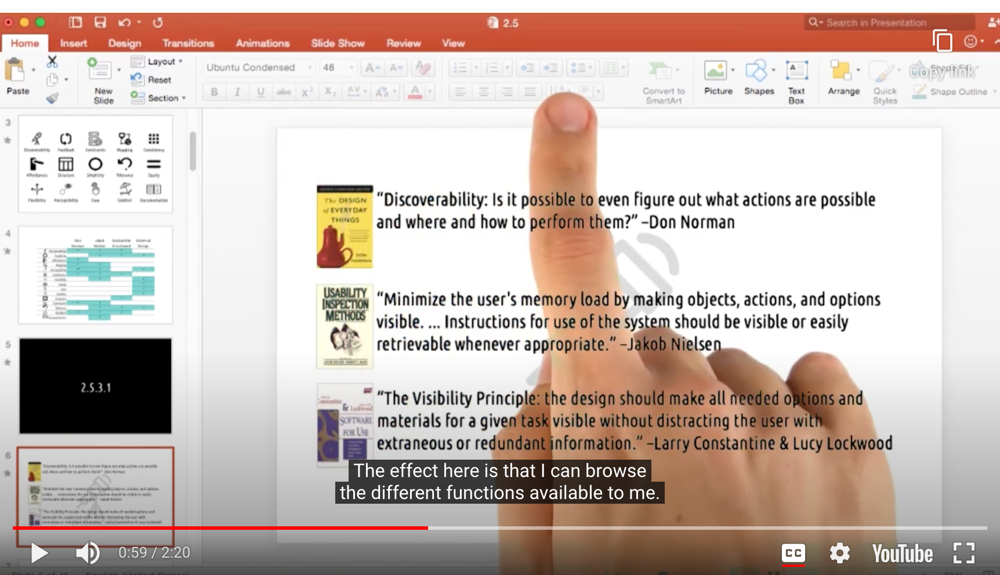

- PowerPoint
	- Discoverability를 위한 Tool-bar 제공
- Mac
	- 스크린샷 어떻게? -> 구글링해서 hot-key를 찾아야 알 수 있음
	- Discoverability 측면에서는 안좋음

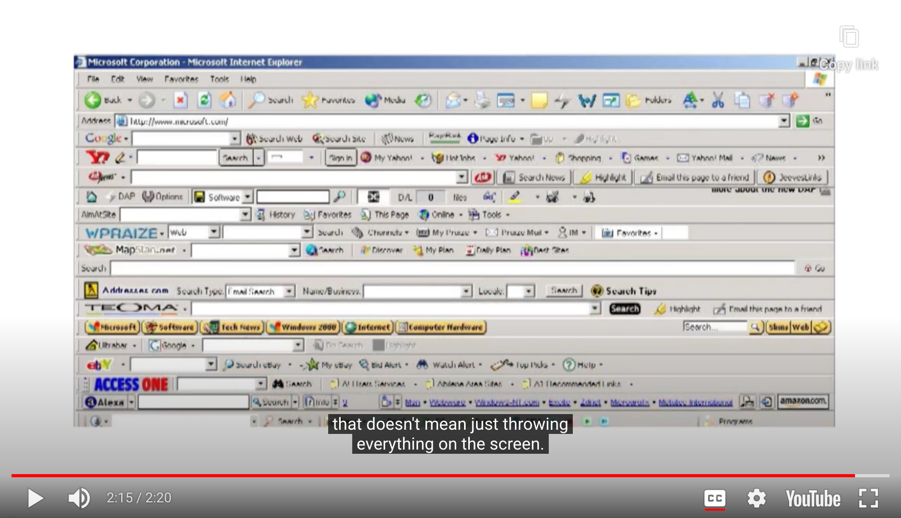

- But... 과유불급
	- <u>Simplicity</u> comes in...!

### 2. Simplicity

> Dialogues should not contain information which is irrelevant or rarely needed.
>
> Every extra unit of information ... competes with the relevant units of information and diminishes their relative visibility.
>
> - Jakob Nielsen

> The Simplicity Principle: The design should make simple, common tasks easy, communicating clearly and simply in the user's own language, and providing good shortcuts.
>
> - Larry Constantine & Lucy Lockwood

> Simplicity and Intuitive Use: Use of the design is easy to understand, regardless of the user's experience, knowledge, language skills, or current concentration level. 
>
> - Ronald Mace

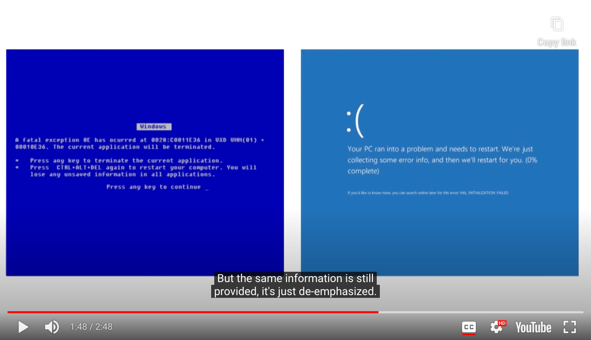

- Window 에러 화면
	- 더 단순해지고, 평상 언어로 오류 설명 -> general user
		- technical 설명은 아래 조그맣게 제시 -> expert user

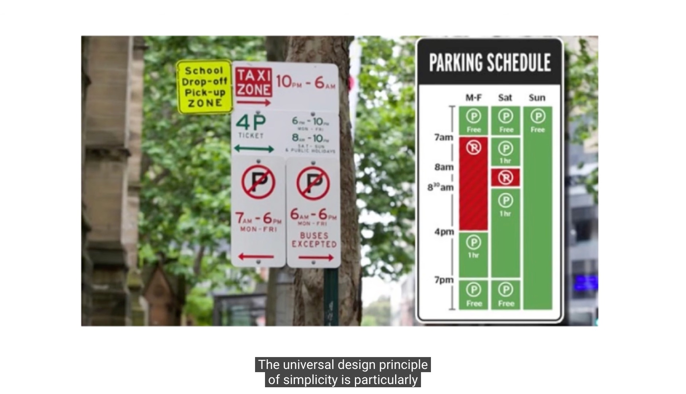

- Left
	- a lot of cognitive load
	- high language skill
- Right
	- need little affort

### 3. Affordances

> An affordance is a relationship between the properties of an object and the capabilities of the agent that determine just how the object could be possibly used.
>
> The presence of an affordance is jointly determined by the qualities of the object and the abilities of the agent that is interacting.
>
> - Don Norman

- 손잡이를 보면 어떻게 사용해야 될지 직관적으로 알 수 있음
	- 좋은 'Affordances'를 갖춘 디자인

- Affordances are defined by who the user is
	- 한 사람에게 affordance를 갖춘 디자인이 모든 사람에게 적용될 수 없다

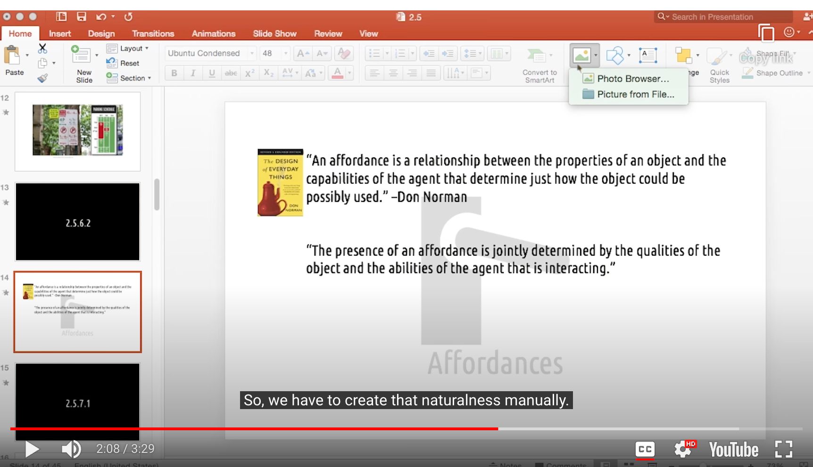

#### Jargon Recap

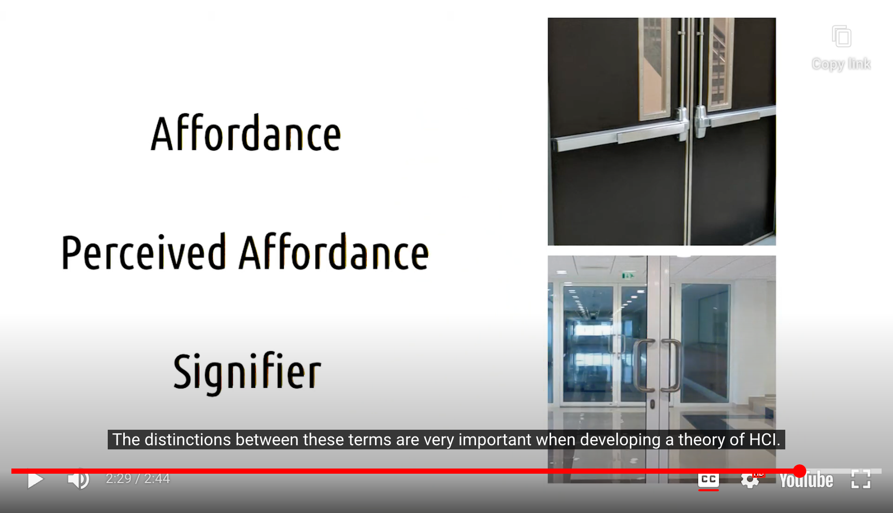

- Affordance
	- inherent property of the device
- Perceived Affordance
	- property attributed to the object by a human observer
- Signifier
	-  helps the perceived affordance match the actual affordance
- <u>We can add **signifier** that help the **perception of affordances** match the **actual affordances**</u>

### 4. Mapping

> Mapping is a technical term (comming from mathematics) ... meaning the relationship between the elements of two sets of things. 
>
> - Don Norman

> The system should speak the users' language, with words, phrases, and concepts familiar to the user, rather than system-oriented terms. Follow real-world conventions, making information appear in a natural and logical order.
>
> - Jakob Nielsen

-> Strong mapping help make information appear in natural and logical order

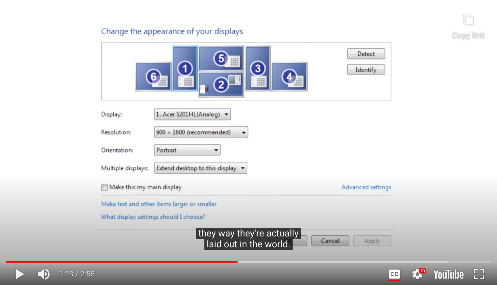

- 좋은 예시
	- 윈도우 디스플레이 배치 선택

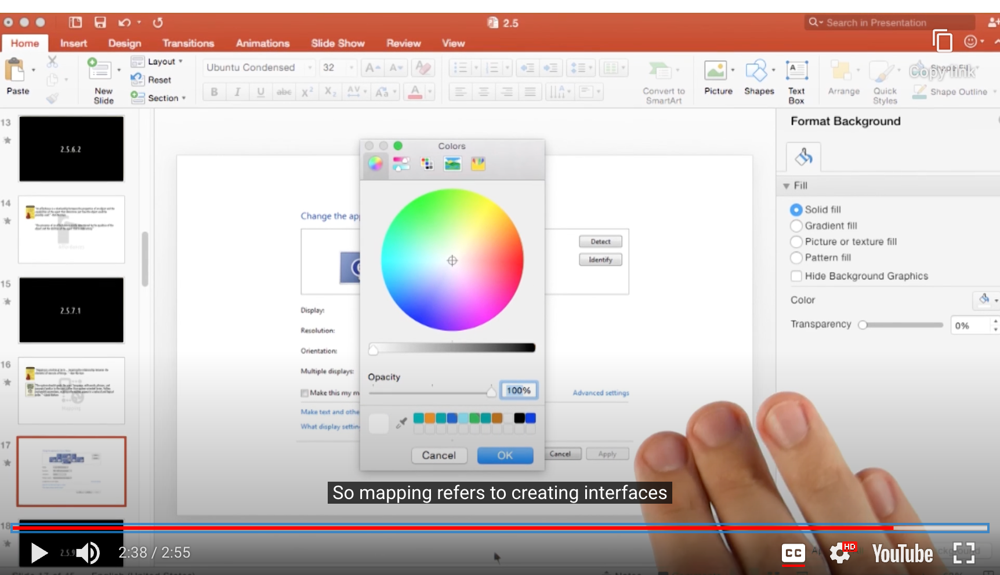

- Mapping = creating interfaces where the design makes it clear **<u>what the effect will be</u>** when using them
	- color meter : visualization underneath, makes it clear what will happen when I do it
- Affordance = creating interfaces where it's clear **<u>how you're supposed to use them</u>**
	- color meter : arrangement of the controls makes clear what to do

- Good Mapping :)

- Bad Mapping :(

### 5. Perceptibility

> The system should always keep users informed about what is going on, through appropriate feedback within reasonable time.
>
> - Jakob Neilson

> The design communicates necessary information effectively to the user, regardless of ambient conditions or the user's sensory abilities.
>
> - Ronald Mace

> Feedback must be immediate. ... Feedback must also be informative. ... Poor feedback can be worse than no feedback at all, because it is distracting, uninformative, and in many cases irritating and anxiety-provoking
>
> - Don Norman

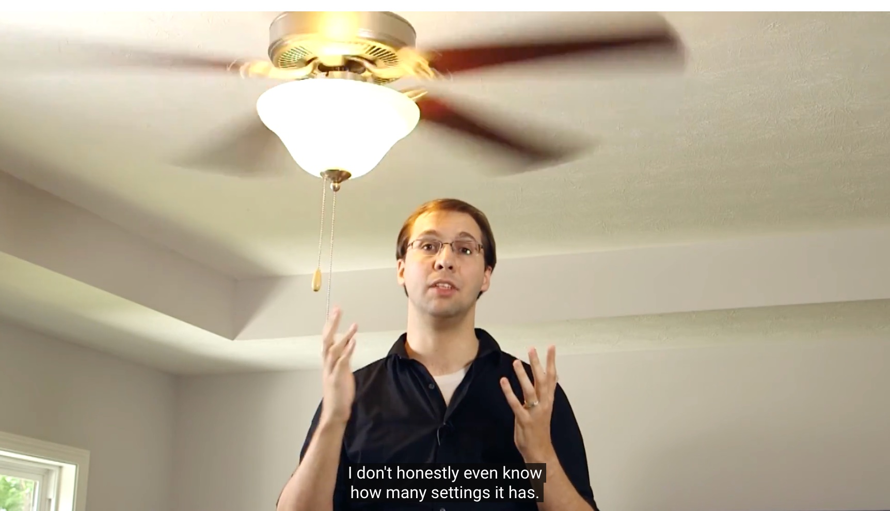

- Design that flagrantly violates 'Perceptibility' principle...

### 6. Consistency

> Consistency in design is 'virtuous'. It means that lessons learned with one system transfer readily to others. ... If a new way of doing things is only slightly better than the old, it is better to be consistent.
>
> - Don Norman

> Users should not have to wonder whether different words, situations, or actions mean the same thing. Follow platform conventions.
>
> - Jakob Nielsen

> The Reuse Principle : The design should reuse internal and external components and behaviors, maintaining consistency with purpose rather than merely arbitrary consistency, thus reducing the need for users to rethink and remember.
>
> - Larry Constantine & Lucy Lockwood

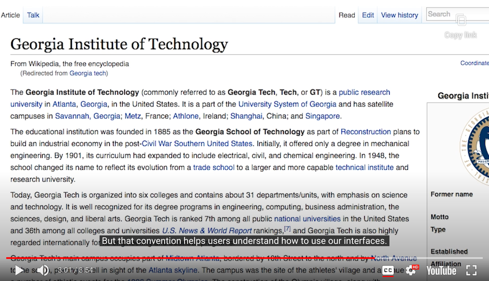

- 파란색 밑줄이 Link가 있다는 표시의 국룰
	- convention helps users understand how to use our interfaces

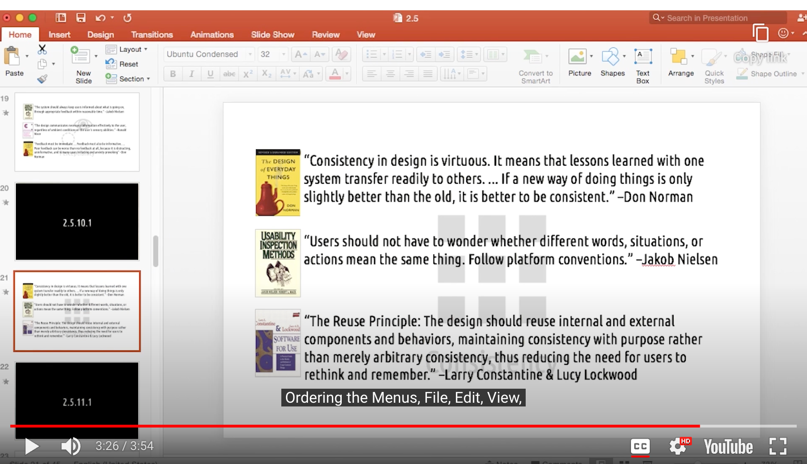

- Hot-key
	- copy, paste, select all
	- Ordering Menus, File, Edit, View, etc...

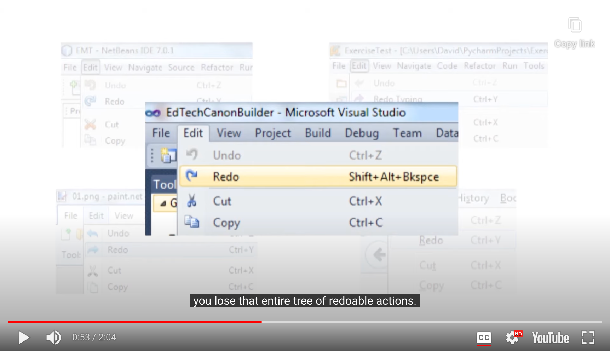

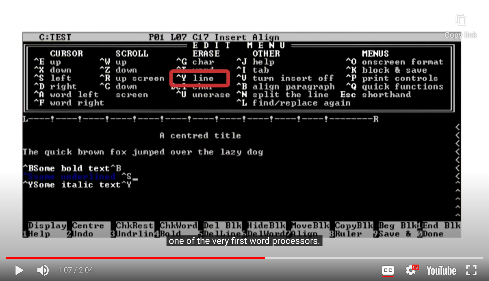

- Word Processor vs. Other program
	- 하나의 conventions를 지키는게 다른 부분의 conventions를 위배할 수도 있다...

### 7. Flexibility

> Accelerators(which are hotkeys) ... may often speed up the interaction for the expert user such that the system can cater to both inexperienced and experienced users. Allow users to tailor frequent actions.
>
> - Jakob Nielsen

> The design accommodates a wide range of individual preferences and abilities.
>
> - Ronald Mace

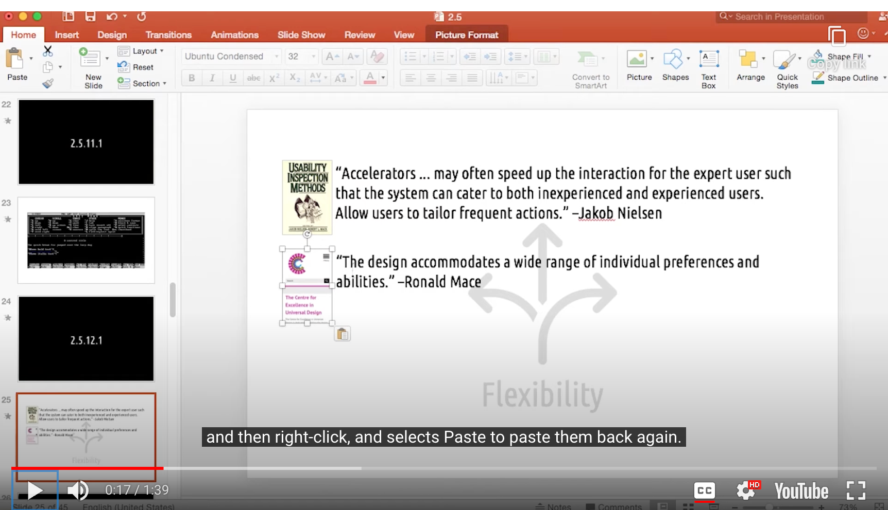

- Two ways
	- cut - paste
	- Ctrl + x & ctrl + v
- 모두 정답
	- 이걸 보장하는 것이 Flexibility

### 8. Equity

> The design accommodates a wide range of individual preferences and abilities
>
> - Ronald Mace

(Flexibility vs. Equity ...?)

> The design is useful and marketable to people with diverse abilities.
>
> ​	1a. Provide the same means of use for all users: identical whenever possible; equivalent when not.
>
> ​	1b. Avoid segregating or stigmatizing any users.
>
> - Ronald Mace

-> Equity is helping all users have the same User Experience

​    Flexibility might be a means to achieve that

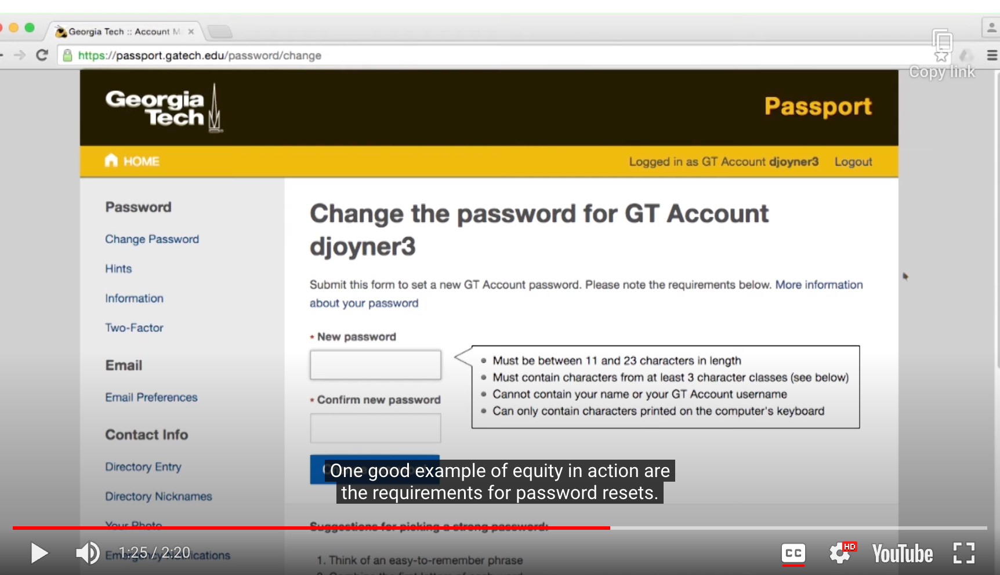

- Good Example : password requirements
	- Security is part of the UX
		- We want to design a system that both expert and novice users experience the same level of security

- 사용자의 'Flexibility'를 저해하는 것 아닌가?
	- 그것보다 사용자의 '보안'이라는 'Equity'를 우선해서 생각하는 것
- 가치의 충돌에서 어떤 Design Principle을 우선 할 것인가 결정해야 할 수 있다!

### 9-10. Ease and Comfort

#### Ease

> The design can be used efficiently and comfortably and with a minimum of fatigue.
>
> - Ronald Mace

#### Comfort

> Appropriate size and space is provided for approach, reach, manipulation, and use regardless of user's body size, posture, or mobility
>
> - Ronald Mace

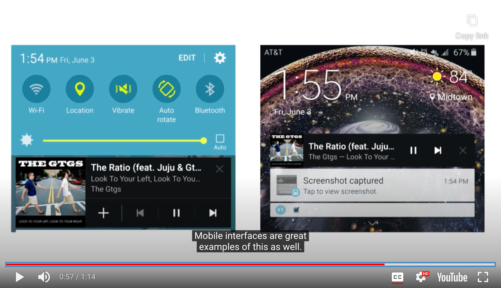

- Example_1 : Mobile interface
	- 버튼 사이즈
		- 너무 작아서 세부 조작이 어렵지 않을까 고려

- Example_2 : wearable / VR
	- Ease and Comfort principle이 더욱 중요해짐
- Physical Interaction 분야에서는 특히나...
	- 앉아서 사용? 키보드 사용 가능? 터치스크린?

### 11. Structure

> The Structure Principle : Design should organize the user interface purposefully, in meaningful and useful ways based on clear, consistent models that are apparent and recognizable to users, putting related things together and separating unrelated things, differentiating dissimilar things and making similar things resemble on another.
>
> - Larry Constantine & Lucy Lockwood

-> organize <u>user interfaces</u> in ways that helps the <u>user's mental model</u> match the <u>actual content of the task</u>.

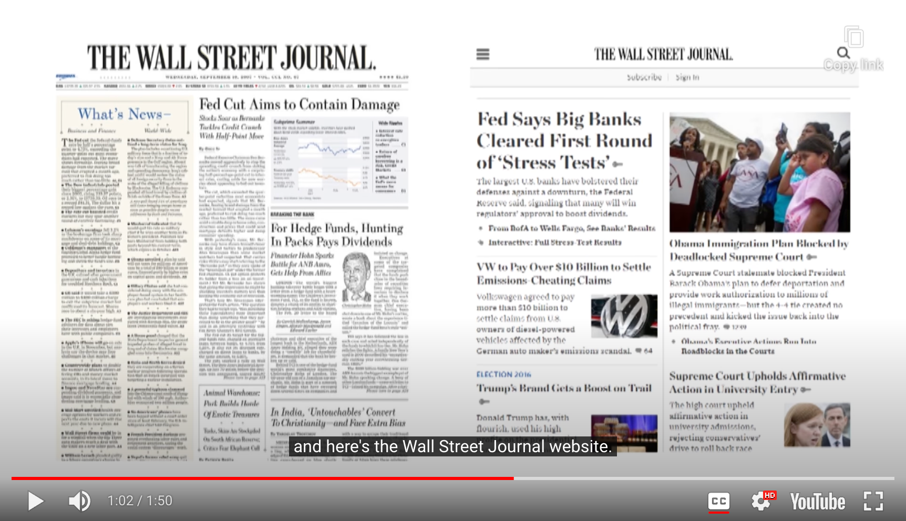

- Example : Newspaper
	- Same principles at work in the website <-> that work in the physical layout

### 12. Constraints

- ''There is no such things as user error''
	- It's because the system was not structured in a way to prevent or recover from it

> Constraints are powerful clues, limiting the set of possible actions. The thoughtful use of constraints in design lets people readily determine the proper course of action, even in a novel situation.
>
> - Don Norman

> Even better than good error messages is a careful design which prevents a problem from occurring in the first place. Either eliminate error-prone conditions or check for them and present users with a confirmation option before they commit to the action. 
>
> - Jakob Nielsen

- Example : password requirements

#### Norman's Four Types of Constraints

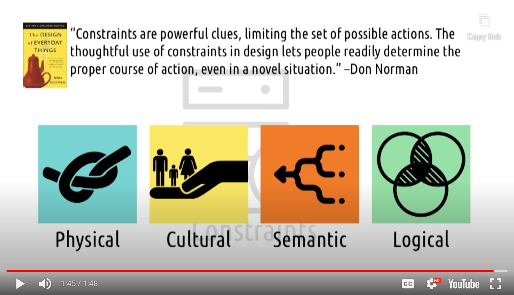

##### 1. Physical

ex. 3-prong plug

##### 2. Cultural

-> intercultural differeces 를 고려해야 함

##### 3. Semantic

ex. rear-view mirror : must reflect from behind

-> autonomous vehicels - might not need mirorrs?

- semantic constraints of today, might be gone tomorrow

##### 4. Logical

-> based on the situation at hand

ex. 가구 조립 : 끝까지 조립하면 결국 하나의 홈 + 하나의 나사못만 남아 있어야 함

#### Constraints vs. Others...

- Principles of **<u>Invisible Design</u>**
	- 많은 디자인 원칙들을 우리는 눈치 못챌 수 있다
		- succeeding allows the user to focus on the underlying tasks

- Constraints actively stand in the user's way
	- **<u>Visible Design</u>**

### 13. Tolerance

> Users often choose system functions by mistake and will need a clearly marked 'emergency exit' to leave the unwanted state without having to go through an extended dialogue. Support undo and redo.
>
> - Jakob Nielsen

> The Tolerance Principle : The design should be flexible and tolerant, reducing the cost of mistakes and misuse by allowing undoing and redoing, while also preventing errors wherever possible.
>
> - Larry Constantine & Lucy Lockwood

> The design minimizes hazards and the adverse consequences of accidental or unintended actions. 
>
> - Ronald Mace

-> Supporting user experimentation = System tolerance users' poking around with things 

​    That actually enhances the principle of discoverability

​    user feels safe experimenting with things -> they're more likely to discover what's available to them

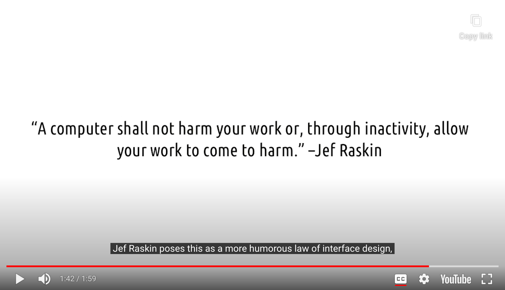

- Raskin's View

### 14. Feedback

> Feedback must be immediate. ... Feedback must also be informative. ... Poor feedback can be worse than no feedback at all, because it is distracting, uninformative, and in many cases irritating and anxiety-provoking.
>
> - Don Norman

> Error messages should be expressed in plain language (no codes), precisely indicate the problem, and constructively suggest a solution.
>
> - Jakob Nielsen

-> Not only shoud it be possible to recover from an error(Recoverability),

​    the system should tell you exactly <u>how to recover from an error</u>.

> The Feedback Principle : The design should keep users informed of actions or interpretations, changes of state or condition, and errors or exceptions ... through clear, concise, and unambiguous language familiar to users.
>
> - Larry Constantine & Lucy Lockwood

- Feedback Cycle은 전체 디자인 차원에서 항상 고려되어야 하는 부분(emblematic)
	- 여기선, Error에 대한 반응으로서의 feedback에 초점이 맞춰져 있음

### 15. Documentation

- one goal of usable design is **<u>to avoid the need for documentation</u>**

> Even though it is better if the system can be used without documentation, it may be necessary to provide help and documentation. Any such information should be easy to search, focused on the user's task, list concrete steps to be carried out, and not be too large.
>
> - Jakob Nielsen

- Example : 요즘 시대의 제품 설명서
	- 핵심 적인 내용만 적혀 있음. 나머지는 인터넷에서 how-to step-by-step으로 확인 가능

## Exploring HCI

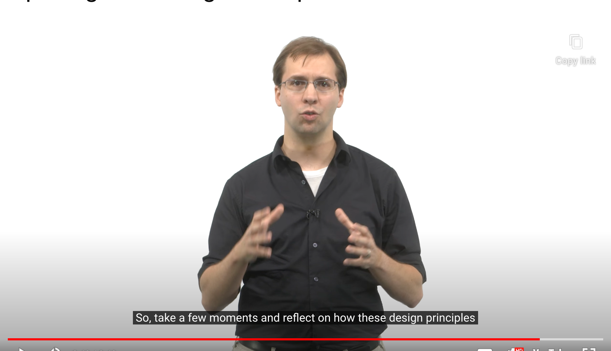

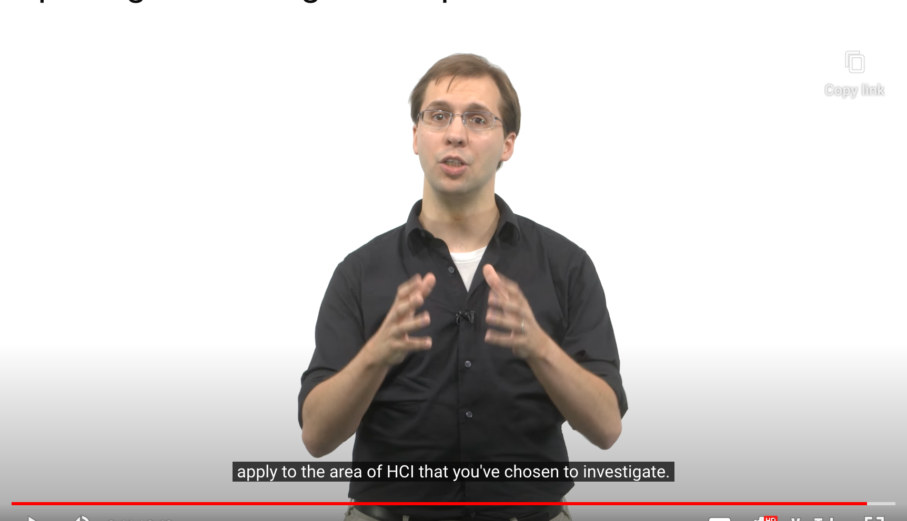

## Other Sets of Principles

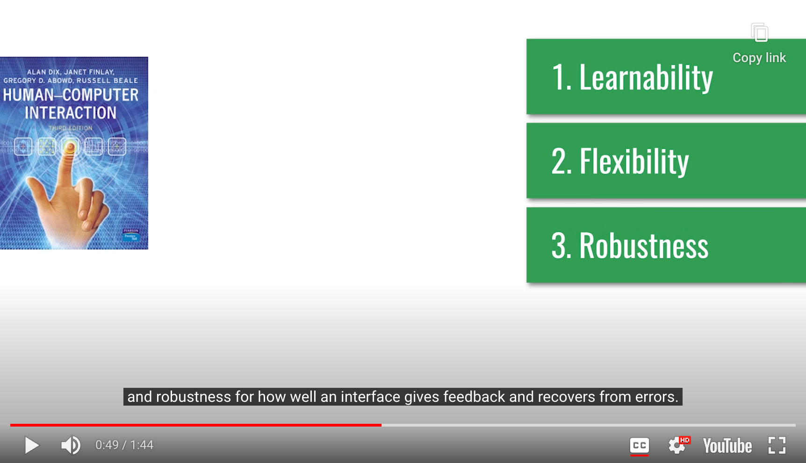

### 3 Categories of Principles

- By Dix, Finlay, Abowd, et al.

#### 1. Learnability

- How easily a new user can grasp an interface

#### 2. Flexibility

- How many ways an interface can be used

#### 3. Robustness

- How well an interfaces give feedback and recovers from errors

### And many more...

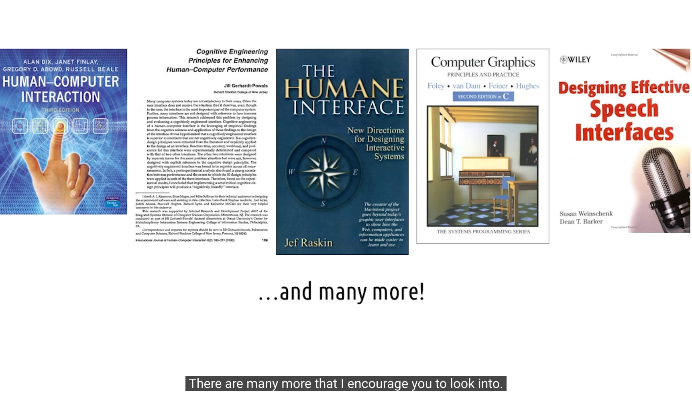

Design Principles:

[Human-Computer Interaction](https://smile.amazon.com/Human-Computer-Interaction-3rd-Alan-Dix/dp/0130461091/ref=sr_1_1?ie=UTF8&qid=1472593139&sr=8-1&keywords=human-computer+interaction+dix) by Dix, Finlay, Abowd, & Beale

[Cognitive Engineering Principles for Enhancing Human-Computer Performance](http://www.tandfonline.com/doi/abs/10.1080/10447319609526147)

[The Humane Interface](https://smile.amazon.com/Humane-Interface-Directions-Designing-Interactive/dp/0201379376/ref=sr_1_1?ie=UTF8&qid=1472593205&sr=8-1&keywords=the+humane+interface)

[Computer Graphics: Principles and Practice](https://smile.amazon.com/Computer-Graphics-Principles-Practice-3rd/dp/0321399528/ref=sr_1_1?ie=UTF8&qid=1472593229&sr=8-1&keywords=computer+graphics+principles+and+practice+3rd+edition)

[Designing Effective Speech Interfaces](https://smile.amazon.com/Designing-Effective-Speech-Interfaces-Weinschenk/dp/0471375454/ref=sr_1_1?ie=UTF8&qid=1472593267&sr=8-1&keywords=designing+effective+speech+interfaces)

[Designing the User Interface: Strategies for Effective Human-Computer Interaction](https://smile.amazon.com/Designing-User-Interface-Human-Computer-Interaction/dp/013438038X/ref=sr_1_1?ie=UTF8&qid=1472593373&sr=8-1&keywords=Designing+the+User++Interface+Interface)

[An Introduction to Human Factors Engineering](https://smile.amazon.com/Introduction-Human-Factors-Engineering/dp/8120343719/ref=sr_1_1?ie=UTF8&qid=1472593456&sr=8-1&keywords=An+Introduction+to+Human+Factors+Engineering)

------

## Conclusion

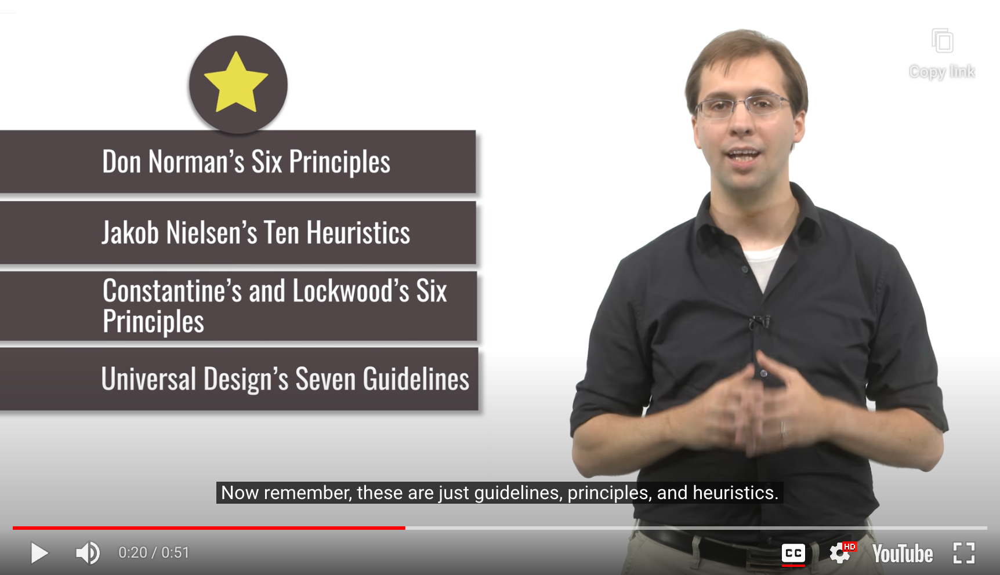

- 이 원칙들은 금과옥조가 아닌, 디자인을 할 때 고려해야 할 요소 이다
- 여러 디자인 원칙들 간의 충돌을 해결해야 할 수도 있다

- HCI Methods가 여전히 필요하다

1. need finding
2. prototyping
3. evaluation

-> to find out what actually works in reality 
