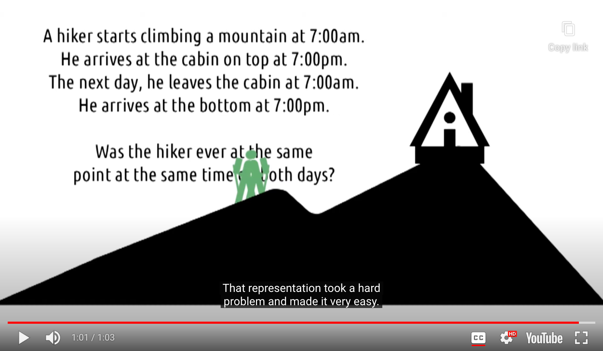

## Mental Model

- Mental Model : An internal, simulatable understanding of external reality
- Using mental models we generate expectations or predictions about the world
	- and then we check whether the actual outcomes match our mental model

-> When reality doesn't match with our mental model, it makes us uncomfortable

### How to do things good?

- 2 Ways of **<u>users' mental model in our systems match the way our systems actually work</u>**
	- Designing systems that act the way the user expects them to act
	- Designing systems that teach the user how they react

### Mental Models and Education

- Design interfaces = playing the role of an Educator

	- Goal : To teach user how the system works <u>through the design of interface</u>

	- Tactic : Have to design interfaces that <u>teach users while they're using them</u>
		- **<u>Good representations</u>** shows the user exactly how the system actually works

### Mental Model in Action

### 5 Tips : Mental Models for Learnable Interfaces

1. Predictability

- Can the user predict what will happen?

2. Synthesizablility

- User should be able to see the sequence of actions that led to their current state
	- GUI 에서는 어려울 수 있음 -> 대신, undo menu에서 log of actions를 제공해 주는 방법 고려 가능
	- CLI 에서는 자연스레 위 원칙이 잘 지켜짐

3. Familiarity

- ~= Normans' principle of Affordances
- The interface should leverage actions with which the user is already familiar from real-world experience
	- Ex) 상태 표시 good/bad -> 초록/노랑(good), 파랑/노랑(bad)

4.  Generalizability

- ~= Normans' principle of Consistency
- Knowledge of one user interface should generalize to others
	- Ex) save, copy, paste 기능 -> 다른 interface와 비슷하게 동작하도록 디자인

5. Consistency

- != Normans' principle of Affordances

- Similar tasks or operations within a single interface should behave the same way
	- Ex) ctrl + X -> cut texts (텍스트 선택되었을 때) / close application (텍스트 선택없을 때) : BAD

-> **''By book [Human-Computer Interaction](https://smile.amazon.com/Human-Computer-Interaction-3rd-Alan-Dix/dp/0130461091/ref=sr_1_1?ie=UTF8&qid=1472593139&sr=8-1&keywords=human-computer+interaction+dix) by Dix, Finlay, Abowd, & Beale''**

## Representations

(Bad Representation)

(Good Representation)

- Representation : Internal symbols for an external reality
- The most powerful tool in our arsenal
	- to help ensure users have effective mental models of our system

### Representation for Problem Solving

#### Example(1)

- Representation took a hard problem an made it very easy

#### Example(2)

- Audio is a poor representation of complex problems
	- FIRST, Write the problem out
- Written representation of the preblem

- Visual representation

- Better representation
	- Make sure that the circles always outnumber the squares

- Make it more self evident
	- As long as the sheep outnumber the wolves, the sheep can defend themselves, kind of

- Visualize a finite number of next legal states
	- Allow us to notice when we've accidentally revisitied in earlier states

- **<u>Characteristics of Good Representations</u>**

### Representations in Interfaces

- Google Calendar

(다른 사람과 일정이 잘 맞는지도 알 수 있음)

- PowerPoint

#### Keep in Mind...

- **<u>Representations when used correctly can make many tasks trivial, or even invisible</u>**

## Metaphors and Analogies

- Wall Street Journal 웹 사이트 - leverage an 'Analogies' to print edition

- Slack - 'chat app' Analogies

- WordPress + Huffington Post + Facebook 'Analogies'

**<u>-> When you use analogies to other interfaces, users may not know where the analogy ends</u>**

### Exploring HCI: Metaphors and Analogies

- Full keyboard - mobile phone keyboard
	- [Twiddler](https://twiddler.tekgear.com/)

- Remember!
	- **<u>Analogies make the interface more learnable, but they may restrict the interface to outdated constraints</u>**

### Design Priciples Revisited

- Interface를 사용할 때 사람들이 Analogy 나 Metaphor 를 활용하여 추론(reason)하는 이유는
	- 'Consistency' Principle이 그만큼 중요하기 때문!

- Interface가 시스템을 어떻게 사용해야 할지 사용자에게 가르쳐야 하는 이유는
	- 'Affordance' Principle과 연관됨
		- 시스템이 보여지는 방식이 사용자에게 어떻게 사용해야 할지 알려주어야 하기 때문

- Representation이 중요한 이유는 
	- 'Mapping' Principle과 연관됨
		- Interface와 task가 그 자체로(at-hand) 연결되어야 하기 때문
		- 좋은 representation은 사용자가 <u>interface 상의 actions</u> - <u>실제 outcomes</u> 사이의 mapping을 예상하게 해 줌

### Learning Curves

- Steep/Rapid learning curves <-> Slower learning curves
	- 어떻게 향상시킬 수 있을까?
		- By Metaphors and Analogies

## User Error: Slips and Mistakes

- As designers : There is really no such thing as User Error
	- Any user error is a failure of the interface to properly guide the user to the right action

- Slips
	- ex) Yes-No 버튼 위치가 바뀌어 있거나 / 기본이 No라서 Enter를 눌렀을 때 저장이 안되거나
- Mistakes
	- ex) revert의 뜻을 대부분의 사용자는 모른다 / 몰라서 No를 선택하면 작업한 결과물을 영영 잃어버린다

### 2 Types of Slips

- Action-Based : Doing the wrong thing
	- 올바른 action을 알고 있음에도, 사용자가 잘못된 action을 수행하거나, 잘못된 대상에 올바른 action을 사용할 경우
		- Yes 대신 No 를 클릭함

- Memory Lapse : Forget to do the right thing
	- 어떻게 하는지 알고 있지만, 잊어버리는 경우
		- 오븐에서 타이머 설정을 안함

### 2 Types of Mistakes

- Rule-Based : Doing the wrong thing
	- 사용자가 현재 상태를 올바르게 판단(assess)했음에도, 그것에 근거에 잘못된 결정을 하는 경우
		- 저장하고 싶다! -> revert에서 No라고 해야 될 것 같다 -> No 선택
- Knowledge-Based
	- 사용자가 처음부터 현재 상태를 잘못 판단(assess)하는 경우
		- 저장할게 있었나? -> 저장해야 하는 것 자체를 이해하지 못함

- Memory Lapse : Forget to do the right thing
	- 계획을 끝까지 수행해야 하지 못한 경우
		- 이상한 메세지 창이 나왔네? -> 컴퓨터 전원을 꺼버려야 지

**<u>우리의 목표는 위와 같은 일이 최대한 일어나지 않도록 올바른 디자인을 설계하는 것!</u>**

1. 일관성(consistent) 있는 연습의 도움을 받아 Routine error(action-based slips)를 방지한다
	- dialogue 디자인을 사용자가 친숙하도록 만든다
2. 인터페이스가 작업 기억의 짐을 덜어주도록(off load) 설계해 Memroy Lapse error를 방지한다
3. 좋은 심상(representation)을 통해 사용자가 올바른 mental model를 확립하도록 도와 Rule-Based / Knowledge-Based error를 방지한다
4. error 들이 피할 수 없다면... Tolerance Principle에 따른다
	- repercussions이 항상 가능하고 상태에 해를 끼치지 않도록 보장한다

## Learned Helplessness

 

- User learn that there is no mapping between their input and the output they receive.

### Learned Helplessness and Education

- 배우기를 거부하는 학생
	- 그들이 배우기 위해 어떤 노력을 해도 성공하지 못했기 때문...
	- They've learned to be helpless based on their past experiences

- 비유적으로 생각해보기
	- 나 : User / 울고불고 난리치는 어린 아이 : Interface
		- 우는 아이를 달래기 위해 어떤 피드백이 필요할까?
		- <u>Interface에 그와 같은 feedback을 어떻게 적용할 수 있을까?</u>

(요리할때 Learned Helplessness를 느끼신다는...)

## Expert Blindspot

- I AM NOT MY USER

- ALLWAYS REMEMBER IT

- Repeat! I AM NOT MY USER
