This content is based on 'Foundations of Instructional Design' book by Seels and Glasgow.

## Purpose of Problem Analysis

Need assessment is the process of defining the results (end) of the curriculum sequence (means)

In ID, the needs to be identified are the effects on individuals and organizations

- The process used to achieve the ends are needs of the designer, not of the learner

Assessed needs must always be stated as learner needs or outcomes

## Needs Assessment

A plan for gathering information about discrepancies and for using that information to make decisions about priorities

- The priorities that must be determined are the goals for the problem-solving effort
- The data collected by needs assessment procedures should provide a basis for stating goals.

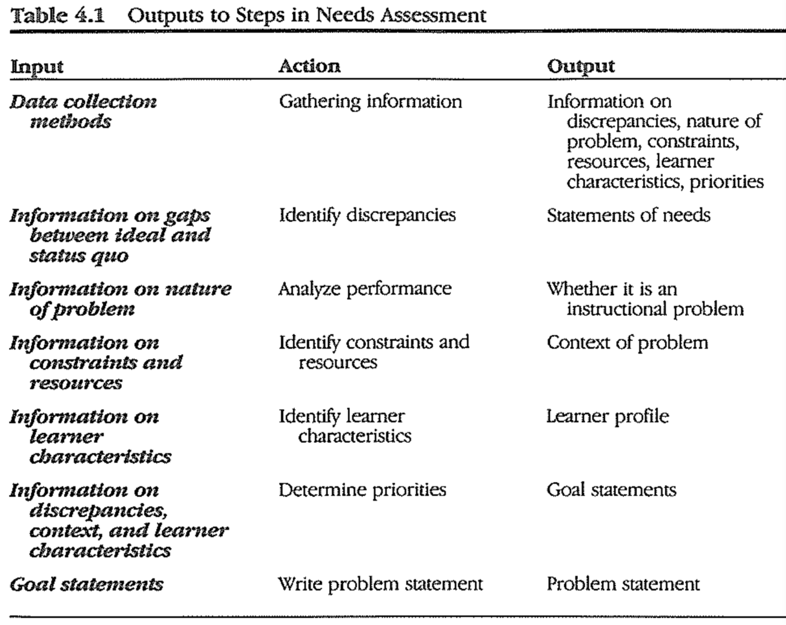

### 1. Gather Information

Data collection plan you must answer at 3 questions

(1) What do I need to know?

(2) How will I collect information?

(3) Whom or what will I use a source of information?

#### Build Matrix

- Conducting Educational Needs Assessments
	- 저자: D.L. Stufflebeam, Charles H. McCormick, Robert O. Brinkerhoff, Cheryl O. Nelson

Across the top, list the questions

Down the side, list the data collection procedures

Wherever collection procedure will answer a question put an x

#### Make Checklist

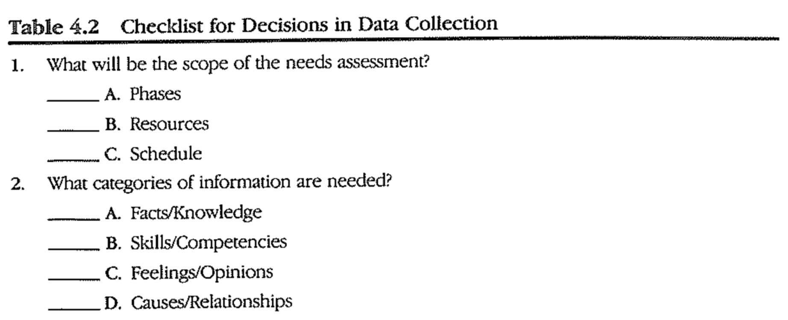

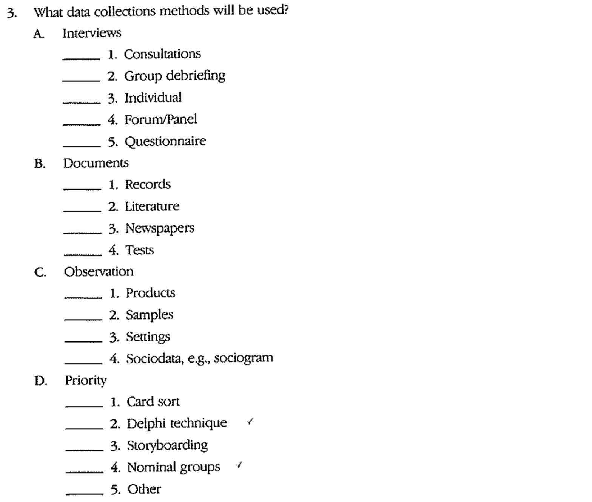

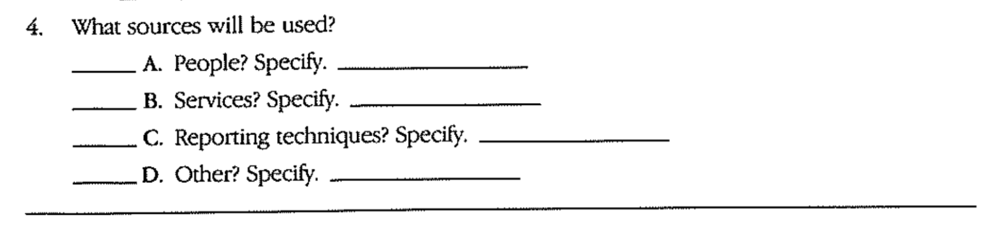

#### Write questions

In order to gather information, you have to prepare for writing quesitons and developing instruments

Allison Rossett's typology for generating needs assessment questions is helpful

- includes 5 areas of questioning
	1. nature of the problem
	2. priorities within the problem
	3. subject matter / skills
	4. attitude toward the problem
	5. cause of problem
- Don't have to use all the questions and categories at once
	- May omit some questions or categories completely

Type1

- Questions on problem finding
- Deal with the discrepancy and the nature of the discrepancy
	- 다른 구직자들과 비교했을때, 저는 다음과 같이 생각하는데...
	- 이 엔진 안전 수칙 수업에 등록하는데 어떤 경험이 영향을 미쳤나요?

Type2

- Questions cover problem selecting
- The respondents need to know on what basis you want them to rank items and whether you want them to describe their needs or a group's needs
	- 아래 기능들(skills)을 보고, 그것을 할 줄 아는게 얼마나 당신에게 중요한지에 따라, 숫자를 적어주세요.

Type3

- Questions on knowledge / skill proving
- What the learners know, if anything, about the skills 
	- 이 이력서를 검토해주세요. 이 사람의 강점과 약점에 대해 판단을 내리세요.

Type4

- Questions on finding feelings
- How does the learner feel about the problem? What are their emotions and attitude?
	- 알콜 중독과 자동차 안전에 대한 수업을 듣고난 후, 당신의 감정을 가장 잘 표현한 것은 무엇인가요? 하나만 골라주세요.

Type5

- Questions on cause finding
- What do the learners think is causing the problem?
	- 다음 중 올해 제품 판매에 문제를 일으킨 요인은 무엇인가요? 해당되는 항목에 모두 체크하세요.

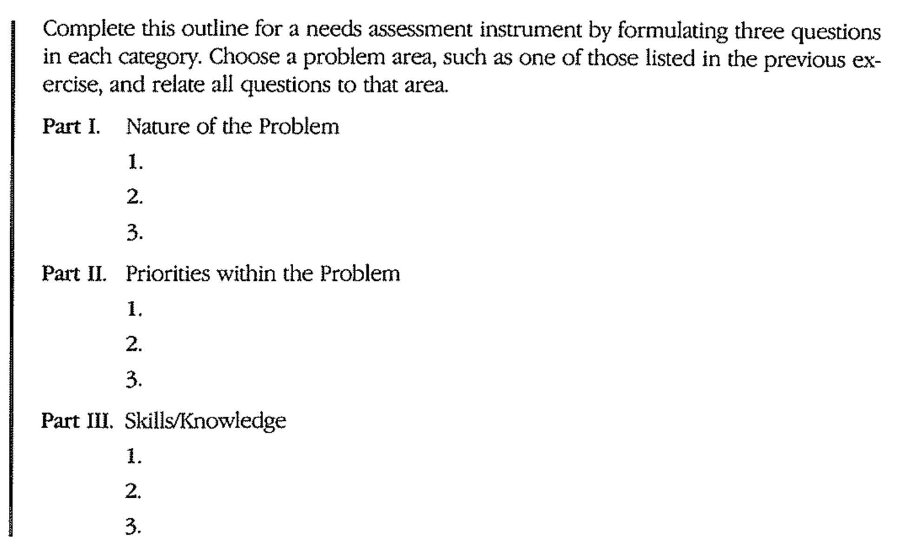

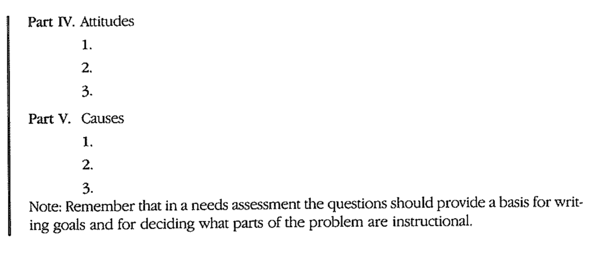

### 2. Identify Discrepancies

- discrepancy = gap between desired behavior and actual or predicted behavior

- Organizational Elements Model (OEM)
	- 5 elements that relate means to ends and the individual to organizations and society
		- Inputs, Processes : means
			- what organizations use and do
		- Products, Outputs, Outcomes : ends
		- 1: Outcomes is external to the organization
			- Represents impact on society

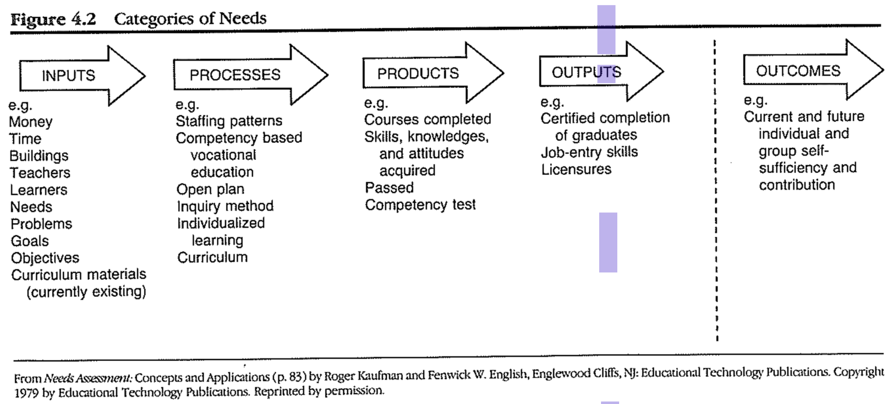

### 3. Do Performance Analysis

(1) Is this an instructional problem?

(2) What is causing the problem?

-> Identifying the nature of the problem and its causes

- At this point, problems are stated as goals to be accomplished
	- But, causes have yet to be clarified
- To reach a goal, it is necessary to attend to both instruction and management policy
	- Insturctional designer may opt to deal only with the instructional aspect

#### PROBE approach

- recommends PROBE when you are doing needs assessment on training for jobs
	- The more difficult the job, the more useful PROBE questions are
- If the answers indicate the problem is in the `behavioral repertoire`
	- instructional solution needed
- If the answers  indicate the problem in the `environment`
	- non-instructional solution

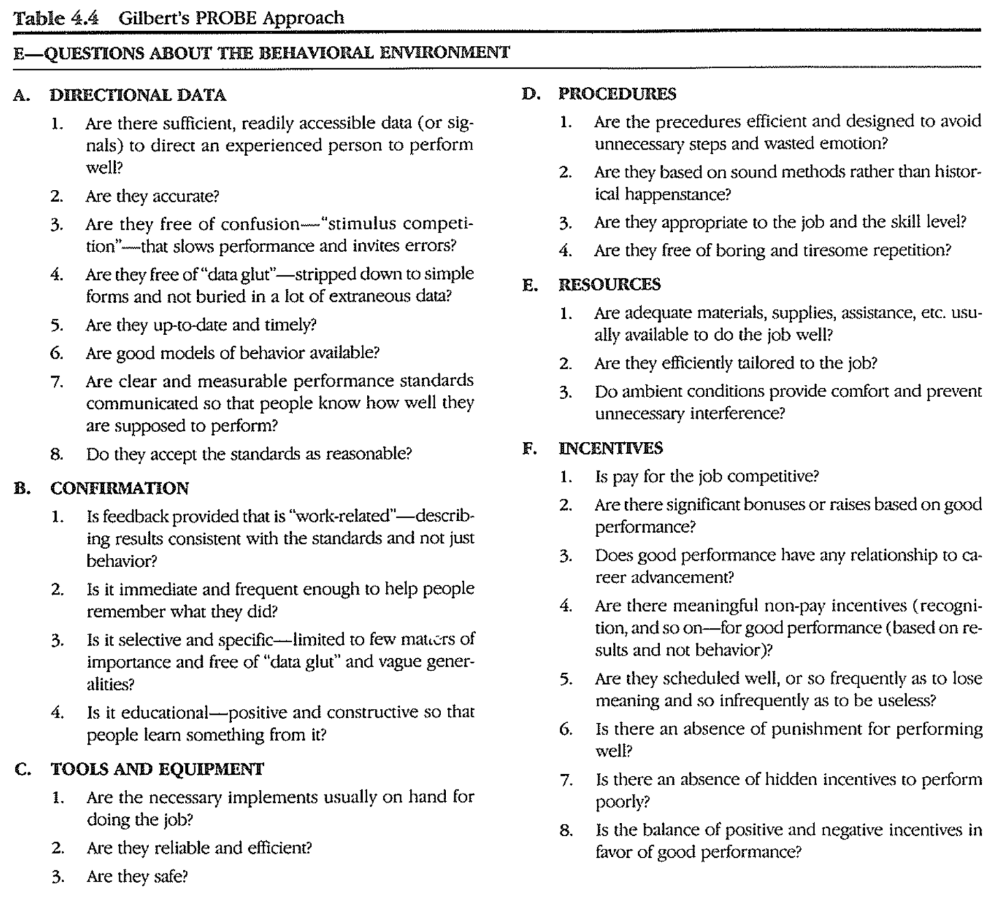

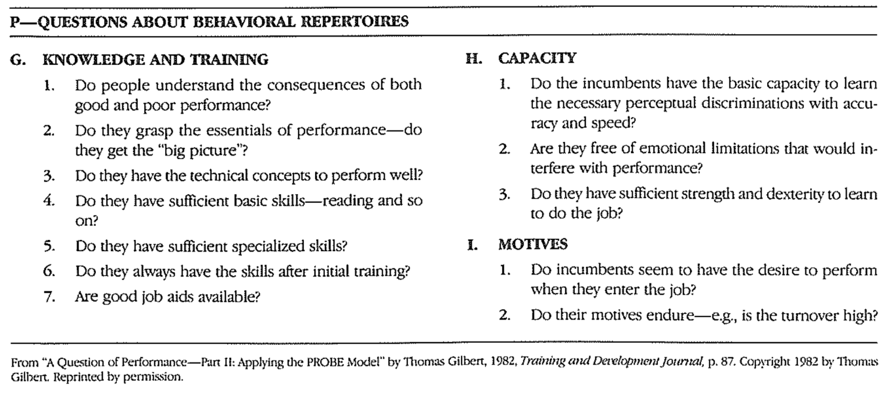

#### Mager and Pipe Flowchart

- competence (can do) <-> performance (does do)
	- If workers can't do
		- formal training is advised
	- If they can't do it but used to do it
		- practice and feedback are advised
	- If they can do it but don't do it
		- management of rewards and consequences (behavior management) is recommended
- Do not provide for instruction to develop attitudes
	- If knowledge and skills are considered competencies or instructional problems
	- Do not deal with the distiction between attitudes affected by instruction and attitudes affected by organizational conditions

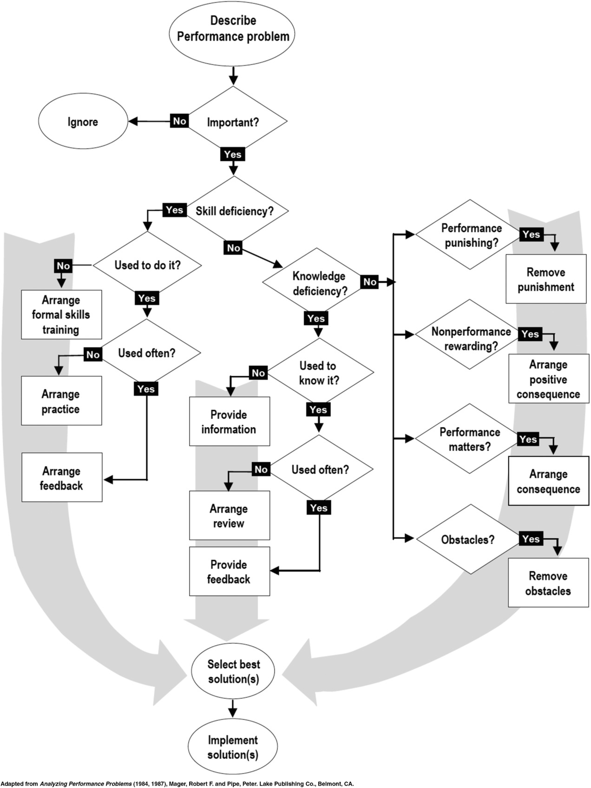'

### 4. Identify Constraints and Resources

- Constraints
	- limitation on the project
- Resources
	- something available for you to use on the project 

- EX) People, funds, equipment, time, space, group size, composition, philosophy, ... etc

### 5. Identify Learner Characteristics

- Useful when you decide on objectives / when you choose an instructional strategy / evaluation technique
- Difficult to know which information may be useful
	- Best strategy is to collect ANY information you think may be useful

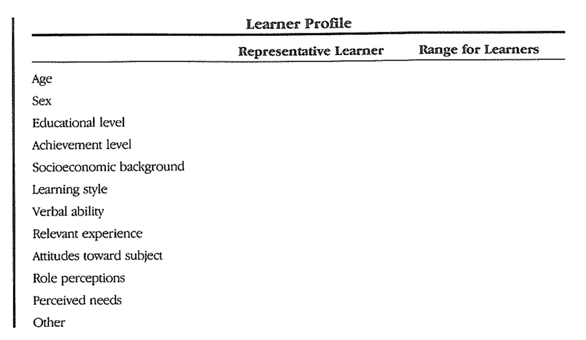

### 6. Identify Priorities and Goals

- It is not enough to identify the needs as gaps or discrepencies
	- The designer must determine which of these needs should have priority

- INTENT of needs assessment = To determine goals
	- Need assessement is not complete until priorities have been identified
- PURPOSE of needs assessment is to clarify the scope of problem-solving efforts
	- The process must lead to a statement of priorities

> The process for identifying, documenting and justifying the gaps between what is and what should be for results - products, outputs, and/or outcomes - and placing the gaps (needs) in priority order for closure.
> by Kaufman (1983, p.14)

- Several techniques
	- Delphi Technique, card sort, Q-sort, nominal group, and storyboarding

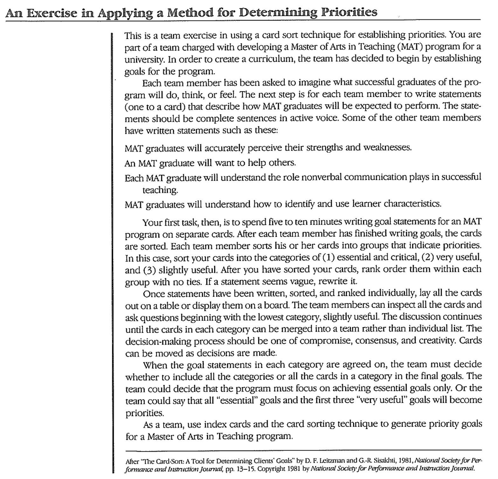

### 7. Write Problem Statement

#### RUPS problem statemet

- Research Utilizing Problem Solving
- Purpose of the RUPS problem statements
	- establish the background and context for the problem
	- state what type of problem it is
	- give a general goal for improvement
- RUPS works BEST when you answer the quetions in complete sentences

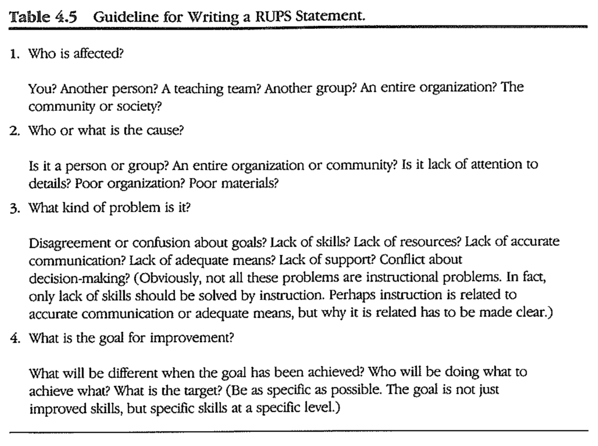

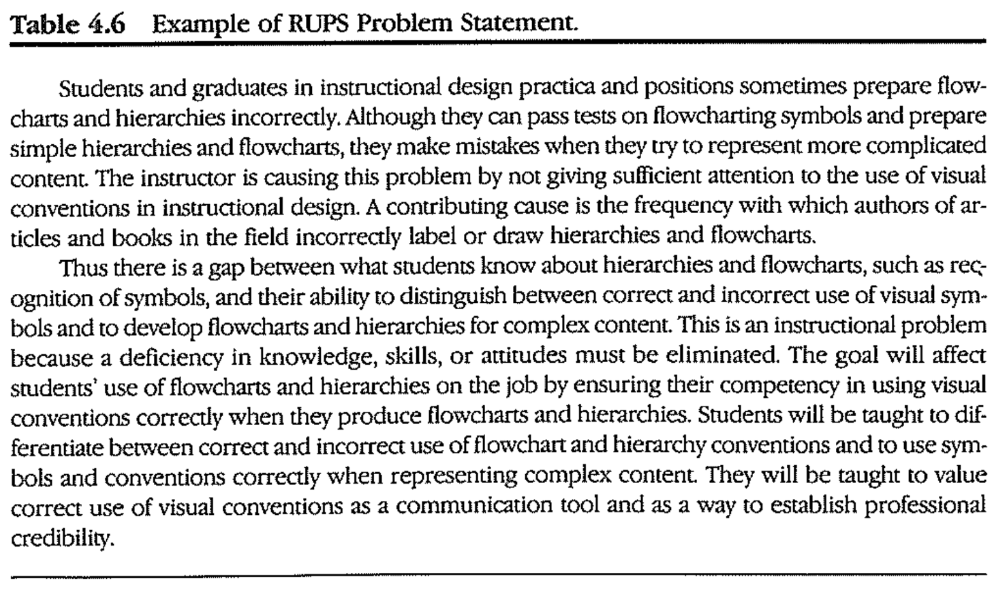

#### IDI probelm statement

- IDI problem definition process includes analyzing constraints, resources, and learner characteristics

	- This information is not summarized in the problem statement

- How to

	- List the discrepancies identified from the needs assessment

	- Explain which discrepancies are to be given priority and why
	- State the problem as how to achieve a goal
		- Tell who will accomplish the solution and how
		- Tell whether he or she will work on one phase of the problem (proposed solution) or on the whole problem

- IDI Method

1. Needs (status quo, what is desired, discrepancies)
2. Priorities
3. Problem Stetement (who is involved, solution processes, scope)

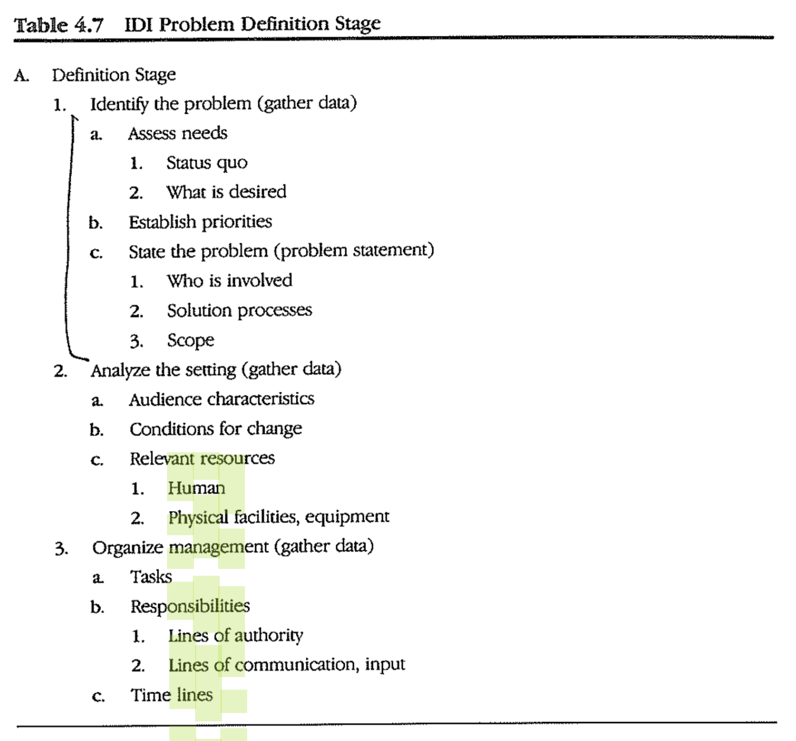

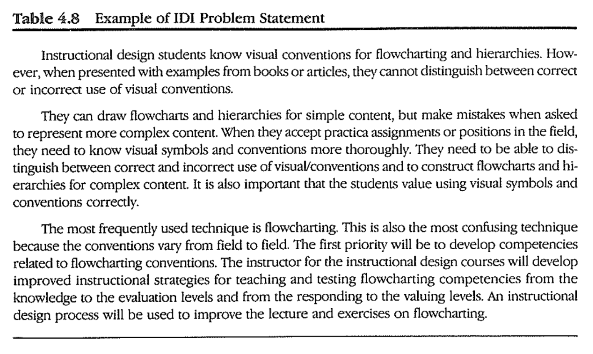
