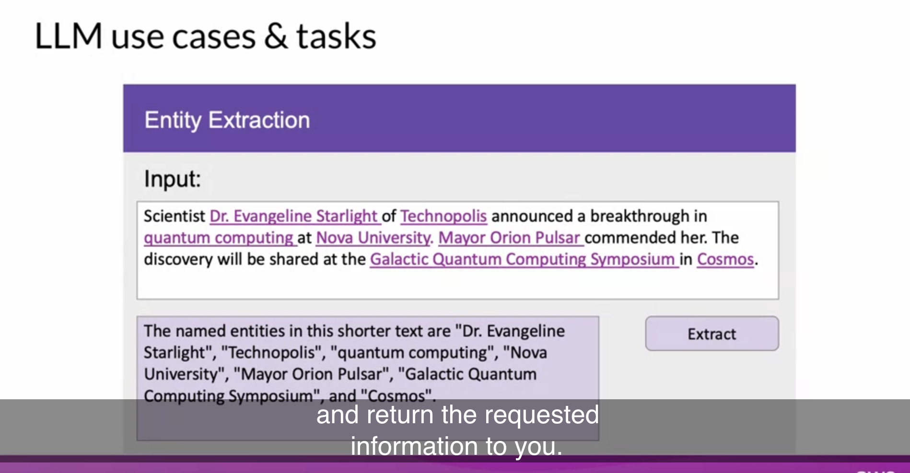

## Mindset

LLM은 general purpose technolgy 이다.

즉, Deep Learning이나 심지어 Electricity처럼 다양한 분야에 응용될 수 있다.

LLM을 다양한 분야에 적용하고 application을 만드는 것은 이제 막 시작한 분야이기 때문에 많은 연구가 필요하다.

마치 Deep Learning이 약 15년 전쯤 막 태동했던 것처럼.

**<u>그 발전을 이꾸는 주인공이 '당신'이 되기를...!</u>**


## LLM 이해하기


- LLM의 foundation models은 billions(수십억) of parameters를 가짐
	- 이것을 통해 emergent properties를 보여주는 것을 관찰
	- 이를 complex task, reason, problem solve 등 다양한 분야에 적용하려는 연구 활발
- LLM의 파라미터는 '메모리'라고 생각하면 된다
	- 모델의 파라미터가 많을 수록 기억하고 있는 게 더 많은 것


- LLM과 상호작용하는 방식은 다른 Machine Learning 이나 일반적인 Programming 방식과 다름
	- LLM은 '자연어'(natural language) = prompt 를 입력받고 특정 task를 수행할 수 있음


## LLM의 사용 범위


다양한 분야에 사용되고 있음

- Chatbot
- Write essay based on prompt
- Summarize
- Translate
- Write code



- Entity Extraction
	- ex. Named Entitiy Recognition (word classification의 일종)


- **<u>Augmenting LLM</u>**
	- 최근 각광 받는 분야 : LLM <-> 실제 세상을 연결
	- external data source와 연결
	- external APIs를 호출하도록 LLM을 활용


- 1.1억 개의 파라미터 (110M)  vs. 1760억 개의 파라미터 (176B)


## Transformer


Breakthrough Points

- Scale efficiently
	- multi-core GPUs 이용 가능
- Parallel process
	- input data를 병렬 처리 가능
	- 훨씬 더 큰 학습 데이터셋을 이용해 훈련 가능
- **<u>Attention to input meaning</u>**
	- 단어들의 의미에 대한 attention 학습 가능


- **Transformer Architecture**는 문장 안에서 모든 단어들의 relevance 와 context를 학습함
	- 즉, 앞뒤 단어가 아닌 "문장 안에 있는 모든 단어" 간의 관계를 학습
- "attention weights" 를 단어들 간의 관계에 적용하여 각 단어들마다 다른 모든 단어들 사이의 relevence 를 학습함
	- attention weights는 LLM의 훈련 과정에서 학습됨


Self-attention

- Attention Map

- 각 단어들과 다른 모든 단어들 사이의 "attention weights"를 보여줌
	- book <-> teacher, student 강한 연관성(or pay attention)
- 모든 input에 대해 위와 같이 attention 학습할 수 있게 됨 -> model이 언어를 해석할(encode) 수 있는 능력 엄청나게 향상


- 단순화된 다이어그램으로 이해하기!


### Tokenize

- 모델을 train할 때 사용했던 tokenizer를 문장을 생성할 때도(inference) 사용해야 함 


### Embedding

- multi-dimensional vectors 들은 input sequence의 개별 토큰들의 의미와 문맥을 이해(encode)하도록 학습됨


- 오리지널(논문 상) embedding vector의 크기는 512


### Positional Encoding

- 병렬적으로 input tokens에 대해 position embeddings 들을 더함
- 효과
	- 단어 순서에 대한 정보를 보존
	- 단어들의 위치에 따른 연관성을 잃지 안게 함


### Self-attention layer

- input sequence 의 token 사이의 관계들을 분석함
	- input sequence의 다양한 부분들에 집중함
	- 단어 사이의 문맥적인 의존성(contextual dependencies)을 더 잘 포착하기 위해

- self-attention weights 들은 training 과정에서 학습되고 저장됨
	- 각 단어들의 다른 모든 단어들과의 중요도를 반영함

- 단, 위 과정이 **여러번**에 걸쳐서 일어남!


### Multi-headed Self-attention

- 'multiple sets(heads) of self-attention weights' 들이 **병렬적으로** 또 각각 **독립적으로** 학습됨
- attention head의 개수는 모델마다 천차만별
	- 대부분 12 ~ 100 사이가 일반적

- Intuition
	- **<u>각각의 self-attention head 는 언어의 서로 다른 부분을 학습함</u>**
	- 언어의 어느 측면(aspect)을 attention head가 학습할지 사전에 강제하지 못함!
		- 각각 head의 weights들은 무작위로 initialized 되어 있음 -> 학습 과정에서 다양한 측면을 반영
	- attention maps 들은 해석하기 쉬울수도 있고, 어려울 수도 있음


### Feed forward network

- (모든 attention weights들이 input data에 적용된 이후)
	- output은 fully-connected feed-forward network 에서 처리됨

- The ouput of this layer is a vector of logits proportional to the probability score for each and every token in the tokenizer dictionary
	- 각 토큰들의 나머지 모든 토큰들에 대한 '로짓 비율'의 벡터 확률 점수가 ouput 값이 됨

```python
딥러닝에서 로짓

[0,1][0,1] 범위인 확률을 [−∞,∞][−∞,∞] 범위로 넓히는 로짓의 특성때문에,
딥러닝에서는 확률화되지 않은 날 예측 결과를 로짓이라고 부른다.
멀티 클래스 분류문제에서 보통 softmax 함수의 입력으로 사용된다.
```


### Softmax output

- 위 logits 들을 softmax layer에 넘기고 이를 확률분포로 돌려줌

- tokenizer vocaburaly 안의 모든 단어들의 확률값
	- 보통, 그 중 가장 높은 확률의 token이 예측되는 값
	- <u>But, 확률 분포에서 어떤 최종 선택을 할지 다양한 방법론이 존재!</u>
