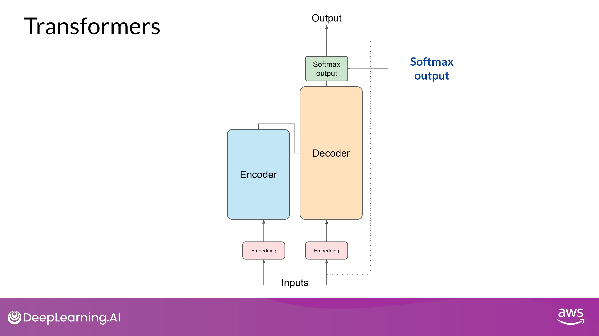

## Overal prediction process (end to end)

### Example : Translation task

- sequence to sequence task
	- original objective of the transformer architecture designers

#### 1. Tokenize input words

- 모델 학습에 사용된 것과 동일한 tokenizer를 이용해 토큰화

#### 2. Pass through Embedding layer

- Encoder side 네트워크에 입력

#### 3. Fed into the multi-head attention layer

#### 4. Fed through a feed-forward network

- output of the multi-head attention layer를 입력

- input sequence의 '구조'와 '의미'에 대한 깊은 representation을 data가 Encoder에 남김

#### 5. Insert the representation of Encoder to Decoder

- 이 representation이 Decoder의 중간에 삽입 됨
	- decoder의 self-attention mechanism에 영향을 줌

#### 6. Start input of the Decoder

- sequence의 첫 번째(start) token 이 decoder 의 입력에 추가됨

- This trigger the decoder to predict the next token
	- based on the contextual understanding provided from the Encoder

#### 7. Pass through rest layers

- Decoder self-attention layer의 output -> feed-forward net -> softmax output -> token!
- 이렇게 첫번째 token 얻음
- 여기서 얻은 token을 다시 input에 넣어 looping 돌림

#### 8. Pass output token back to input

- output이 다시 input으로 사용되고 다시 다음 token을 예측함
	- ex) 297 다시 입력 -> 450 예측

- 이렇게 end-of-sequence token을 예측할 때까지 반복

#### 9. Detokenize into words

- final sequence of tokens 들을 자연어로 다시 변환

#### 10. Predict next token : multiple ways!

- softmax layer의 ouput을 다음 token 예측에 사용하는 다양한 방법이 존재
- **<u>이는 생성된 text가 얼마나 창의적인지(creative)에 영향을 줌</u>**

### Summary

- The Encoder encodes input sequences into a deep representation of the structure and meaning of the input. 

- The decoder, working from input token triggers, uses the encoder's contextual understanding to generate new tokens. 

- It does this in a loop until some stop condition has been reached. 

## Variations of architecture

### 1. Encoder Only Models

- Seq-2-Seq model 처럼 사용 가능
	- 추가 수정을 하지 않는 이상, input seq와 output seq는 같은 길이(length)가 됨
- 요즘에는 잘 쓰이진 않음
- 여기에 layer를 추가함으로써, 분류 작업을 하도록 훈련 가능
	- sentiment analysis

- ex) BERT 가 대표적

### 2. Encoder Decoder Models

- Seq-2-Seq task 들을 잘 수행함
- input seq와 output seq가 다른 길이인 경우들
	- translation

- **scale하고 훈련해서 text generation task도 수행 가능**

- ex) BART, T5

### 3. Decoder Only Models

- 최근에 가장 많이 활용됨
- **scale할 수록 능력(capabilities)이 올라감**
- 대부분의 task에 일반적으로 사용됨

- ex) GPT family
	- BLOOM, Jurassic, LLaMA, etc...

## Transformers: Attention is all you need

### Brief Overview

"Attention is All You Need" is a research paper published in 2017 by Google researchers, which introduced the Transformer model, a novel architecture that revolutionized the field of natural language processing (NLP) and became the basis for the LLMs we now know - such as GPT, PaLM and others. The paper proposes a neural network architecture that replaces traditional recurrent neural networks (RNNs) and convolutional neural networks (CNNs) with an entirely attention-based mechanism. 

The Transformer model uses self-attention to compute representations of input sequences, which allows it to capture long-term dependencies and parallelize computation effectively. The authors demonstrate that their model achieves state-of-the-art performance on several machine translation tasks and outperform previous models that rely on RNNs or CNNs.

The Transformer architecture consists of an encoder and a decoder, each of which is composed of several layers. Each layer consists of two sub-layers: a multi-head self-attention mechanism and a feed-forward neural network. The multi-head self-attention mechanism allows the model to attend to different parts of the input sequence, while the feed-forward network applies a point-wise fully connected layer to each position separately and identically. 

The Transformer model also uses residual connections and layer normalization to facilitate training and prevent overfitting. In addition, the authors introduce a positional encoding scheme that encodes the position of each token in the input sequence, enabling the model to capture the order of the sequence without the need for recurrent or convolutional operations.

- [Paper Link](https://arxiv.org/abs/1706.03762) -> 꼭 정독해보기!

## Remember!

우리는 transformer model과 '자연어'(natural language)를 통해 interacting 한다!

- By code가 아닌, prompt를 글로 작성해서

- 즉, transformer architecture의 모든 세부사항을 알 필요는 없다

그러므로, Prompt Engineering 이 중요하다