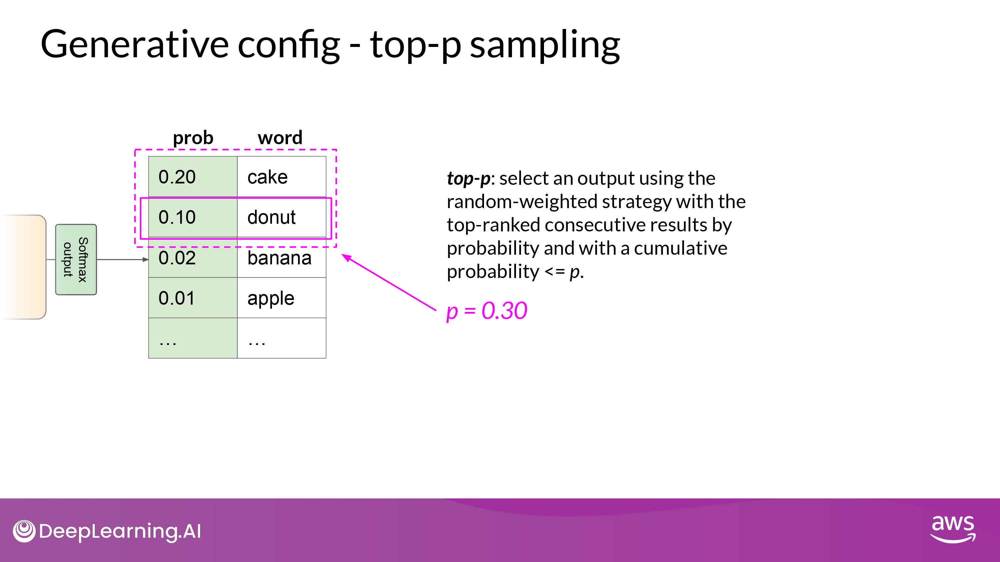

## Prompting and prompt engineering

- 용어 정리
	- Prompt : 모델에 먹이는 input 텍스트
	- Inference : 텍스트를 생성하는 작업
	- Completion : 생성된 output 텍스트
	- Context window : prompt에 사용될 수 있는 전체 텍스트의 양 / 메모리 크기

### In-Context Learning(ICL)

#### Zero-shot

- 수행할 task에 대해서 LLM에게 알려주는 것
	- 예시 들기
	- 데이터 추가
- 프롬프트 구성
	- Instruction : Classify this review / Sentiment:
	- Context : (review text)

#### One-shot

- 큰 모델은 zero-shot learning을 아주 잘함
	- 작은 모델은 잘 못함

- 하나의 예시를 추가
- But, 하나의 예시로도 부족한 경우 있음

#### Few-shot

- 여러개의 예시를 추가
- model이 예시를 통해 배우도록 prompt 를 engineer 하는 과정
	- Prompt Engineering의 일부

- Context Window 크기에 주의!
	- 가능한 prompt 길이의 한계
- **<u>5~6개의 예시에도 잘 task 수행을 못한 다면 -> fine-tuning 고려</u>**
	- task를 더 잘 수행하도록 새로운 데이터로 추가적인 학습!

## Generative configuration

- inference 과정에서 모델의 output에 영향을 미치는 요소들
-  training parameter와는 다름

### Max new tokens

- 모델이 생성할 token 수의 최대치를 조정하는 것
- completion의 length가 200 보다 작을 수 있음
	- ex) 모델 predicting이 sequence token 마지막에 도달

### Greedy / Random Sampling

Greedy

- 일반적으로 활용
	- 항상 highest probability 단어를 채택하는 방식
- 짧은 문장 생성할 때

- 단점
	- 반복되는 단어 / 반복되는 sequence를 생성할 가능성 높아짐

Random Sampling

- 창의적인 답을 생성할 때
	- 반복되는 단어 / 문장을 더 다양화하고 싶을 때
- 명시적으로 모델 파라미터에서 설정해줘야 할 때도 있음
	- ex) do_sample = True

### Sample top K / P

- 가장 확률이 높은 k개의 option 중에서만 ramdom sampling 함
	- 정확히는 ramdom probability weighting method 활용

- 확률의 누적합이 p를 넘지 않도록 하는 선택지 중에서 ramdom sampling 함
	- also, apply ramdom probability weighting method

### Temperature

- 다음 단어 예측 계산에 사용되는 **확률 분포의 개형**을 변화시킴
	- top_p, top_k와 다르게 모델의 예측값 자체를 변경
- Temperature이 높으면 무작위성 증가, 낮으면 무작위성 감소
	- 높을수록 개형이 더 평탄해지는 원리
- temperature = 1 -> softmax 함수의 default값 활용

## Project Lifecycle

### 1. Define the use case

- LLM의 능력은 size와 architecture에 따라 크게 좌우됨

- 다양한 task를 수행해야 하는 / 하나의 task만 수행하면 되는지
	- **<u>model이 수행해야 하는 task를 최대한 구체적으로 정의해야 함</u>**

### 2. Choose existing model or Pretrain your own

- 일반적으로 존재하는 모델 활용을 먼저 고민
- 모델을 바닥부터 학습시킬 필요가 있는 경우만(어쩔수없이) 진행

### 3. Prompt enginnering / Fine-tuning / Align with human feedback

- Prompt Engineering 시도해보기
	- 5~6개 예시의 ICL로 해결이 안된다?

- Fine Tuning 하기
	- 의도에 맞게 동작하게 하고 싶다?

- RLHP (Reinforcement Learning with Human Feedback) 진행
	- (추가적인 find-tuning이라고 간주 가능)

- metics, benchmark로 이 과정을 계속 Evaluation 하기
	- 얼마나 성능이 좋은지 / 얼마나 의도에 부합(align)하게 작동하는지 평가

**<u>위 과정은 highly iterative 하게 이루어 저야 함!</u>**

prompt engineering -> evaluating the outputs, 

then using fine tuning to improve performance -> revisiting and evaluating prompt engineering one more time

### 4. Application Intergration

- 배포에 용이하도록 optimize model
	- 컴퓨터 자원 효율적 활용
	- 사용자들에게 최적의 경험 제공

- additional infrastructure 를 적용할지 고민하기
	- Hallucination
	- Lack of Reasoning / Mathemetics
		- 어떻게 잘할 수 있게 할지?!
