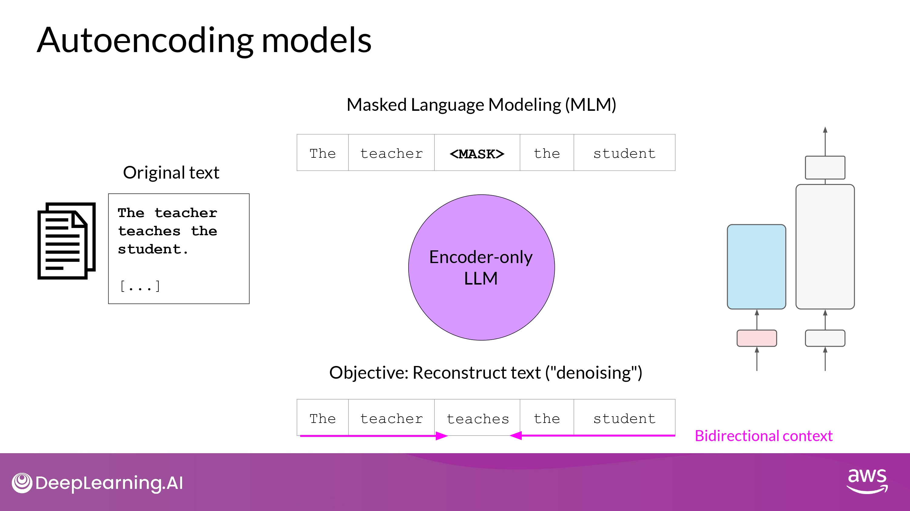
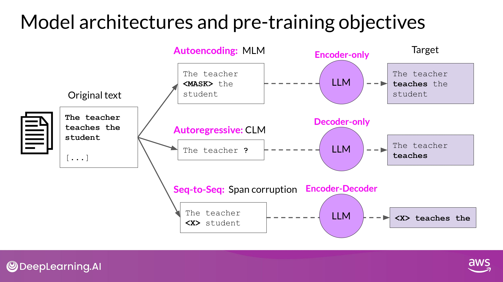

## Pretraining Large Language Model

- 바닥부터 모델을 학습시키는게 이점이 있는 specific한 상황이 있을 순 있다...
- BUT, 이미 존재하는 foundation model을 갖고 application 을 제작하는게 일반적!
	- Model hub 에서 살펴보며 쇼핑:)

 

- best use cases
- how it was trained
- known limitations

위와 같은 정보를 통해 모델 선택 가능

## Model architecture and pre-training objectives

- training data를 모은다면, 데이터 품질을 위한 작업이 필요
	- address bias
	- remove harmful content
- 위 과정에서 1-3% tokens 정도만 pre-training 에 사용되곤 함
	- 모델을 pre-training 하겠다 마음먹을 때 얼마나 필요할지 꼭 고려해야 하는 부분!

### 1. Encoder-only models

- = Autoencoding models
- masked language modeling(MLM)으로 사전 학습됨
	- random mask된 토큰 input
	- mask 토큰 예측하기
		- 위 과정을 "denoising objective" 라고도 함
- input sequence에 대해 Bidirectional representation 을 가짐
	- <u>모델이 토큰의 전체 문맥을 이해하고 있다는 뜻 (이전 단어만이 아닌!)</u>

- bi-directional context를 가진 task에 적합!
	- sentence classification
	- token classfication

### 2. Decoder-Only Model

- = Autoregressive models
- casual language modeling(CLM)을 통해 학습
	- 이전 token sequence에 의해 다음 token을 예측하는게 학습 목표
		- 다음 단어 예측 = Full Language Modeling 이라고도 부름

- 모델은 바로 앞 input 토큰만을 알고 있음
	- 모델은 문장의 마지막이 어떻게 될지 전혀 모른다는 뜻
	- input sequence에 대해 '한 token'씩 반복하며 '바로 다음 token'을 예측
- context is unidirectional

- 주로 text generation
- Large decoder-only model -> 'Strong Zero-shot Inferece' 능력
	- 여러 task 가능

### 3. Sequence-to-Sequence

- 사전학습 목표(pre-training objective)는 모델마다 천차만별
- ex) T5 모델
	- span corruption을 통해 사전학습
		- input token의 'random sequence'를 마스킹 하는 것
	- mass sequences -> unique Sentinel token 으로 대체
		- vocabulary에 추가되는 특별 token, BUT 실제 input text의 단어와 일치하지 않음
	- mask를 auto-regressively 하게 다 구조화하는 task 수행
		- output은 Sentinel token + 예측된 token들 (순서 유지)

- 주로, input 과 output 으로서 body of texts 가 있는 경우 사용됨

### Recap

## new Moore's law for LLMs?

