## Approximate GPU RAM needed

- 1 parameters = 4 byte (32-bit float)
-  1B params = 4 * 10^9 bytes = 4GB

 

## How to Reduce Memory?

### Quantization

- BFLOAT16 = 16-bit half precision

#### 1. FP16

- projection을 통해 상당 부분 precision 잃는 것 감수해야
	- FP16, 소수점 6자리 까지만 표시 가능
- memory 요구량을 절반! 으로 줄일 수 있음

#### 2. BFLOAT16

- BFLOAT16 = BF16 = 16-bit half precision
	- half precision FP16 과 full precision FP32 의 '하이브리드'
- 장점
	- training stability에 엄청난 도움을 줌
	- NVIDIA's A100과 같은 GPU에서도 사용 가능

- 특징
	- 'truncated 32-bit float'라고 불리기도 함
		- full 32-bit float의 범위를 다 담을 수 있기 때문
	- exponent에 8 bits 를 동일하게 사용
		- fraction 줄임 -> 계산 속도 올려서 모델 성능 향상
- 단점
	- 정수 연산에 안맞음 (deep learning에서는 별로 없으니까...)

#### 3. INT8

- parameters 4byte -> 1byte!
- BUT, precision에 대한 'pretty dramatic' 손실을 경험하게 될것...

### Summary

- KEY POINT
	- **<u>우리는 모델 training에서 memory footprint를 줄이기 위한 quantization을 사용할 수 있다!</u>**
- BFLOAT16 이 일반적 선택
	- FP32의 dynamic range도 보장하면서
	- memory footprint를 절반으로 줄여주므로

### Approximate GPU RAM needed after Quantization

- 모델 파라미터 자체 사이즈 기준

- parameters, gradients, optimazer states 모두 포함해 실질적 필요한 메모리
	- <u>**~= 모델 파라미터 메모리 * 20배**</u>

#### Maybe You need more GPU

- 이정도는 single GPU로 학습이 불가능
	- distributed computing technique 필요
		- train model across mutiple GPUs
	- GPU 100대 이상... 마이 비쌈...

## Efficient multi-GPU compute strategies

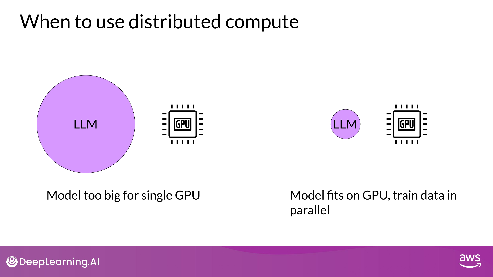

- 메모리가 부족하지 않더라도, 빠른 훈련을 위해 multi-GPU 환경이 필요할 수 있음

### Distributed Data Parallel (DDP)

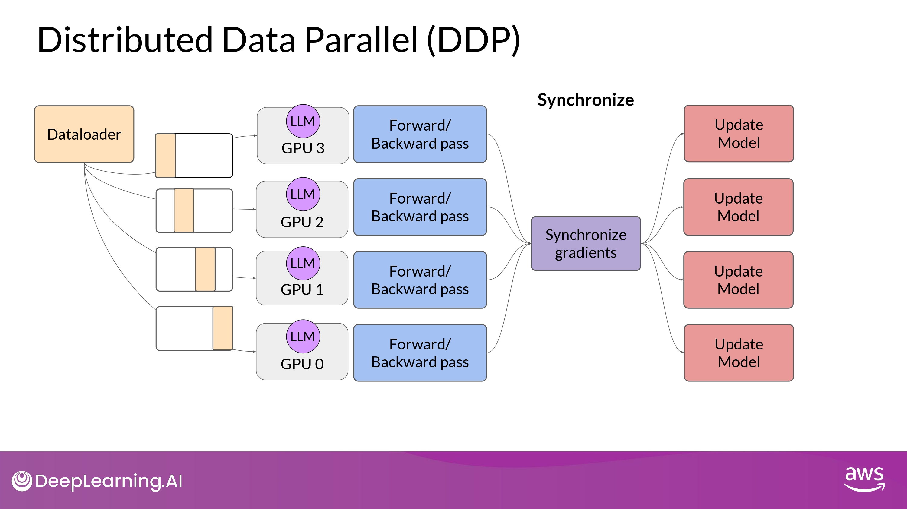

PyTorch Distributed Data Parallel (DDP)

- 기본 원리

1. large datasets을 multiple GPU에 분산시키기
2. data batch 들을 병렬 처리하기

3. 동기화하기

단, **<u>DDP는 model weights, additional parameters, gradients, optimizer states 모든게 single GPU에 들어맞아야 가능</u>**

model이 너무 크다면 다른 technique 고려!

-> **<u>model sharding</u>**

### Fully Sharded Data Parallel (FSDP)

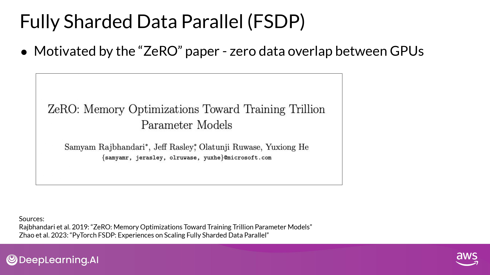 

#### ZeRO ( Zero Redundancy Optimizer)

##### How ZeRO works?

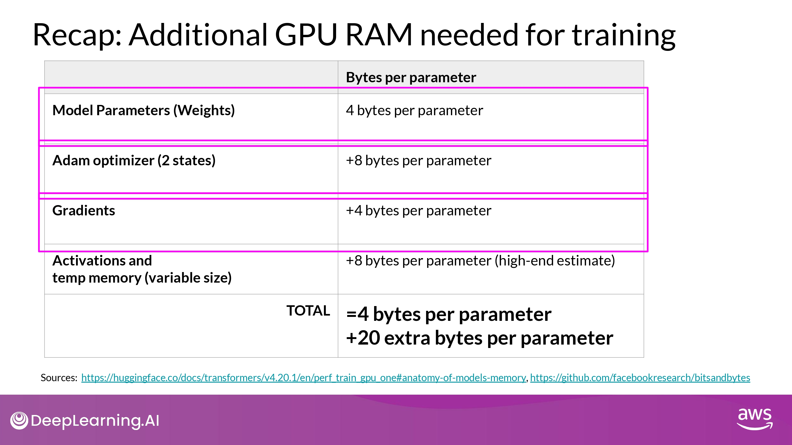

- optimizer에 가장 메모리가 많이 들어감 (weight 보다 2배)
- 그다음 weights, gradients

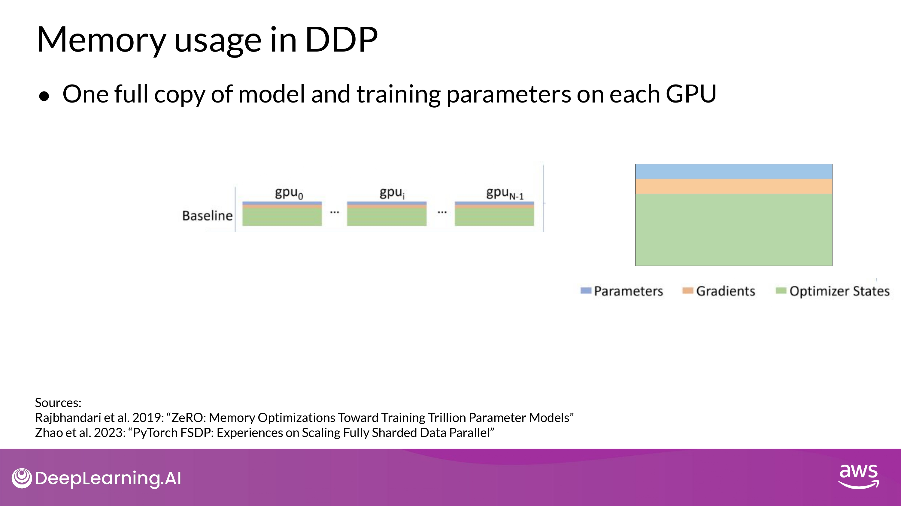

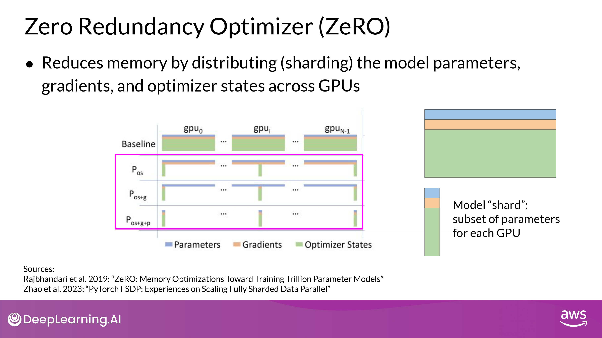

- DDP에서는 '전체 모델 복사본'이 GPU에 그대로 올라감
- ZeRO는 위 문제를 해결
	- <u>**parameters, gradients, optimazer states를 GPU 간에 분산(sharding) 함**</u>

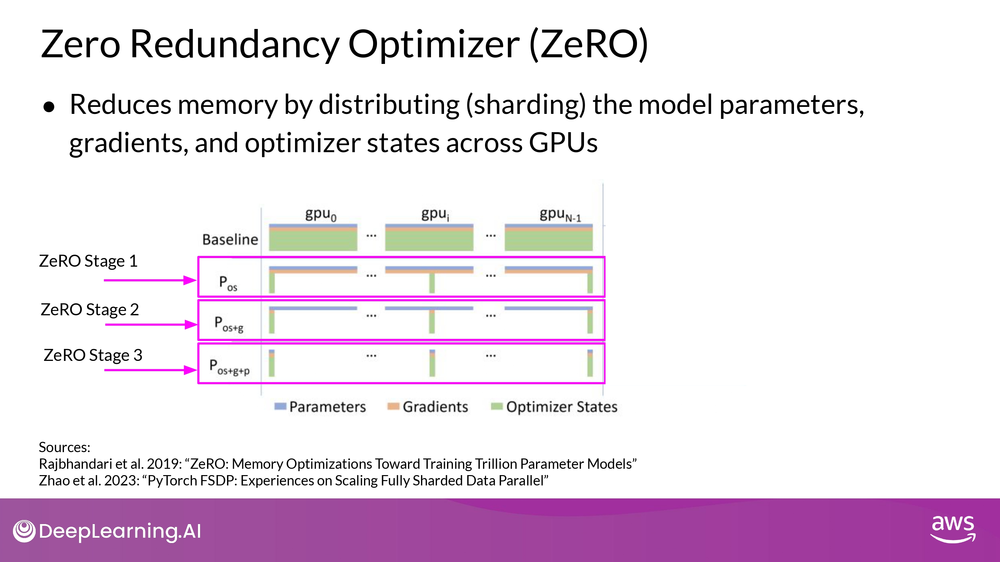

- Stage 1
	- shards only 'optimzer' states across GPU
		- 메모리 footprint를 최대 factor of four(?) 줄일 수 있다고
- Stage 2
	- shards the 'gradients' across GPU
		- Stage 1과 함께 적용될 때, 메모리 footprint <u>**최대 8배**</u> 까지 줄일 수 있음
- Stage 3
	- shards 'all component' across GPU
		- +Stage1,2 | 메모리가 GPU 갯수에 비례해 <u>**선형적(linear)으로 감소**</u>
		- ex) sharding across 64 GPUs -> 메모리 1/64로 감소!!

#### DDP vs. FSDP

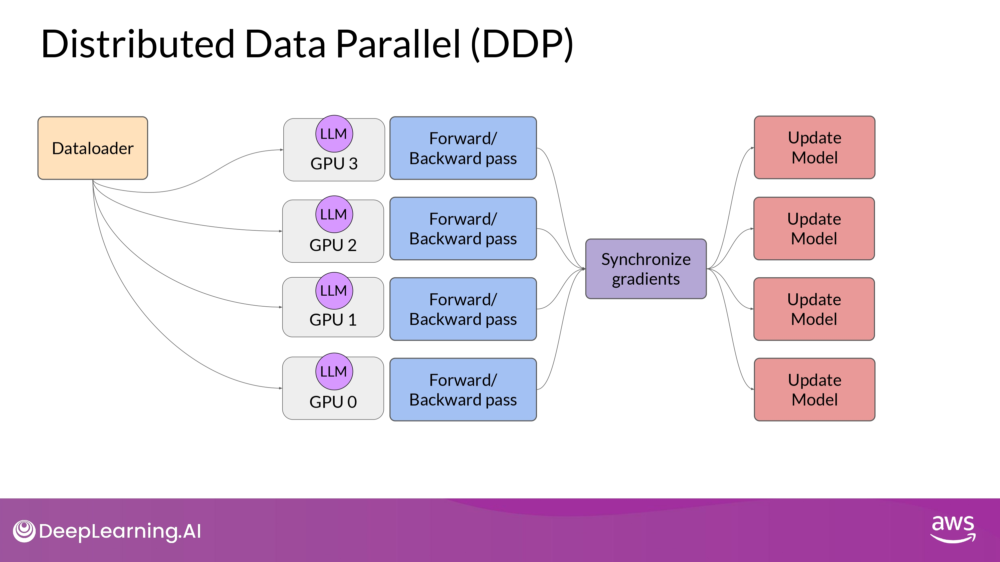

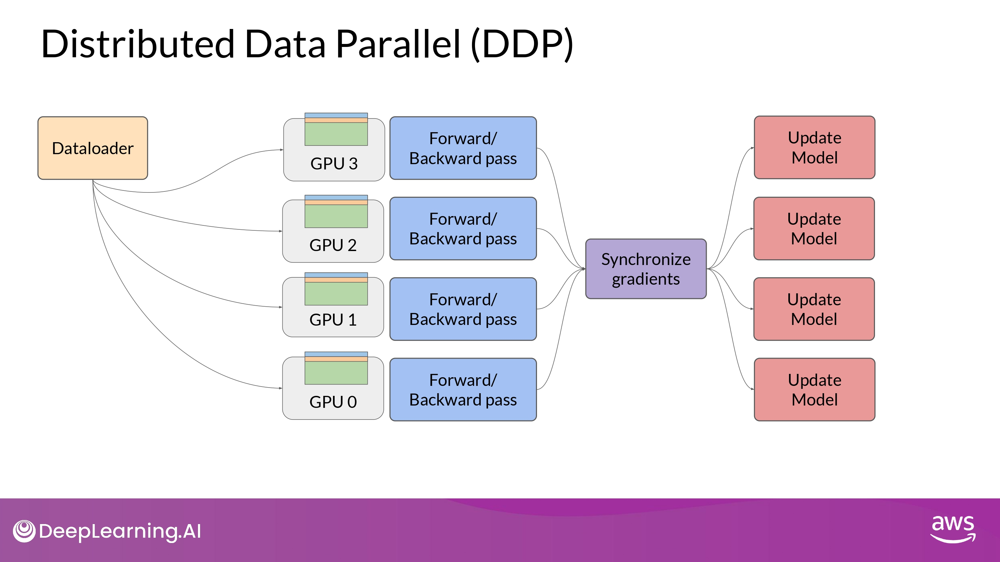

##### DDP

- full copy parameters + graidients + optimizer states per GPUs

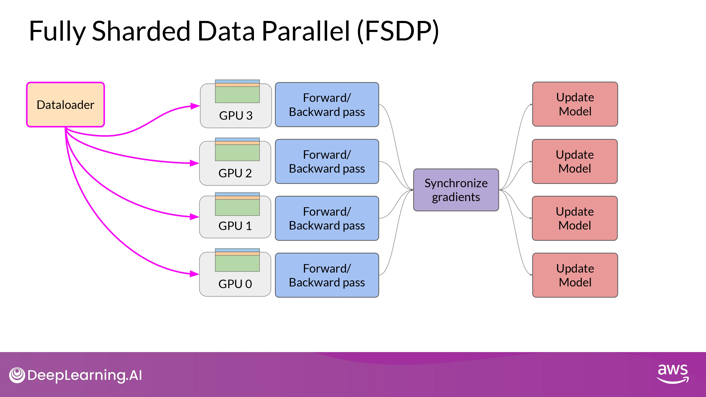

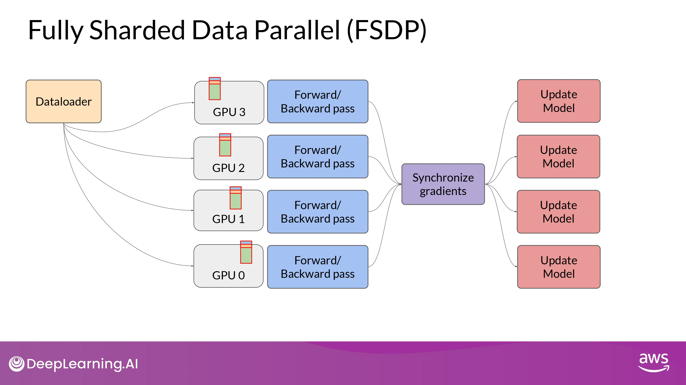

##### FSDP

- 'distribute(shard)' parameters + graidients + optimizer states per GPUs
	- one of the strategy in ZeRO paper
- GPU 칩 1개에 안들어가는 큰 model을 나눌 수 있다!

- 구동 원리

	- forward / backward pass를 하기 전에 모든 GPU의 데이터를 모아야 함

- 아래는 내용이 정확히 이해 안되서 일단 설명을 다 적어놓는 걸로...

	- Each GPU requests data from the other GPUs on-demand to materialize the sharded data into unsharded data for the duration of the operation.

	- After the operation, you release the unsharded non-local data back to the other GPUs as original sharded data.

	- You can also choose keep it for future operations during backward pass for example.
		- Note, this requires more GPU RAM again
		- typical performance vs. memory trade-off decision

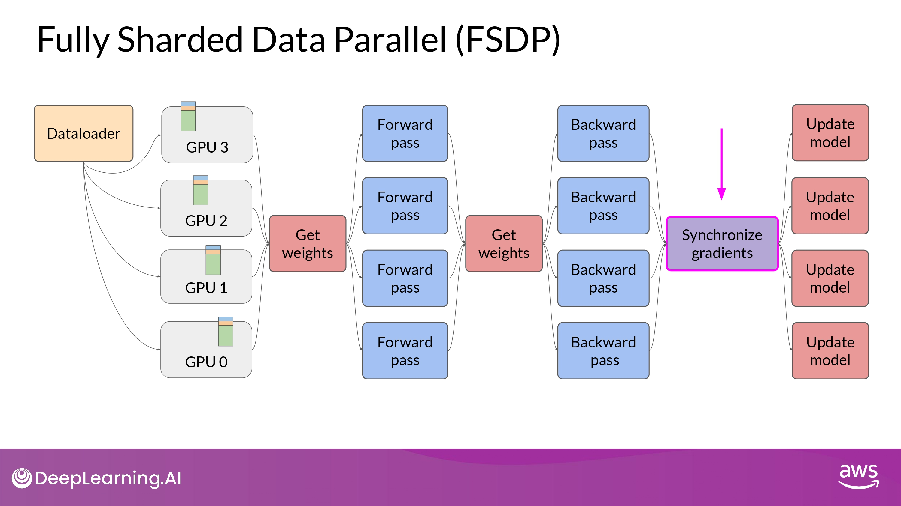

- Final Step after the backward pass
	- FSDP는 GPU 간의 gradients를 모두 동기화(synchronize) 함
		- (DDP와 동일)

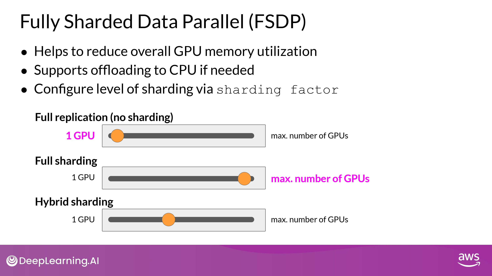

- Supports offloading to CPU if needed?
	- 선택적으로, FSDP 학습 연산(training computation)의 일부인 offloads를 CPU에서 수행 가능
		- GPU 사용량을 더 줄일 수 있게 해줌
- Configure level of sharding?
	- performance <-> memory utilization trade-off 설정

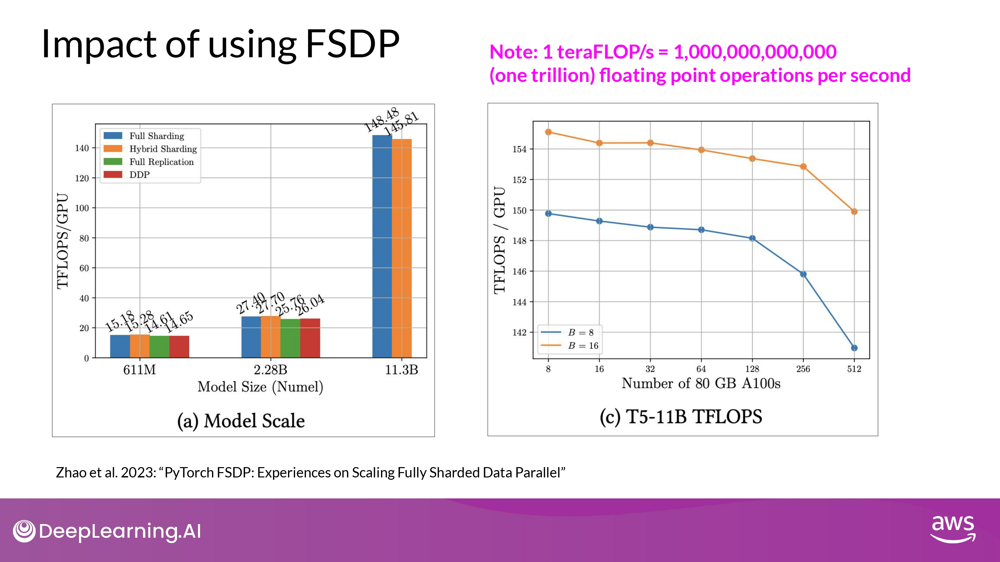

#### Impact of using FSDP

- 실험 구성
	- 컴퓨팅 자원
		- <u>NVIDIA A100 GPU 512개</u>를 최대치로 활용 (미친 컴퓨팅 파워...)
		- 각각 80GB 메모리...
	- 모델
		- 크기가 다른 T5 모델
- 결과 해석_1 (left)
	- 611M, 2.28B
		- <u>**FSDP | DDP 성능 비슷**</u>
	- 11.3B (2.28B < model)
		- **<u>DDP runs into out-of-memory error</u>**
		- <u>**FSDP easily handle models this size**</u>
			- achieve much higher teraflops 
			- (when lowering the model's precision to 16-bit)

- 결과 해석_2 (right)
	- <u>**GPU의 개수를 증가시켰을 때, GPU teraflops 7%씩 감소**</u>
		- GPU 개수 8 -> 512
		- 11B T5 model 
		- B = batch_size
	- model 사이즈가 커질수록, 더 많은 GPUs에 분산될 수록
		- <u>GPU 간의 communication volume이 늘어나면서 성능에 영항을 미침</u>
		- slowing down the computation...
- 결론
	- **<u>FSDP를 작은 모델과 큰 모델 모두에게 사용할 수 있다</u>**
	- **<u>FSDP를 통해 multiple GPU 환경에서 seamlessly scale your model training 할 수 있다!</u>**

---

(위 본문 내용 및 ppt 사진 자료는 모두 DeepLearning.AI 의 강의자료에서 가져왔으며, 상업적 목적으로 이용할 수 없습니다.)
