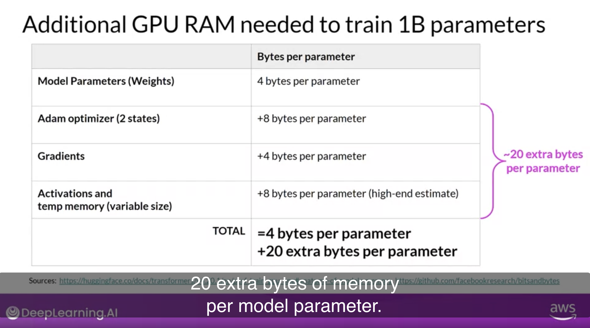
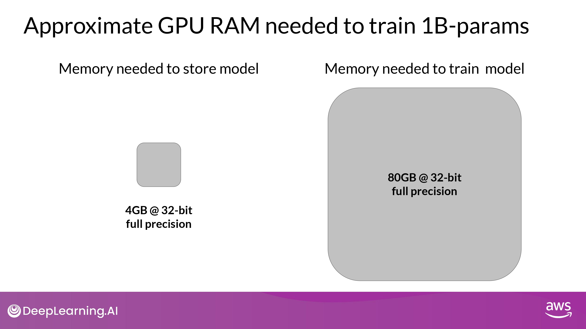
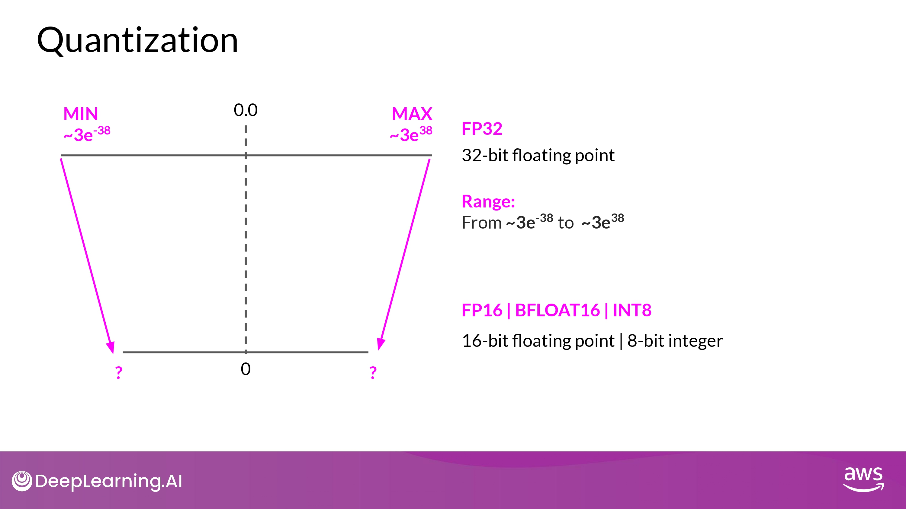
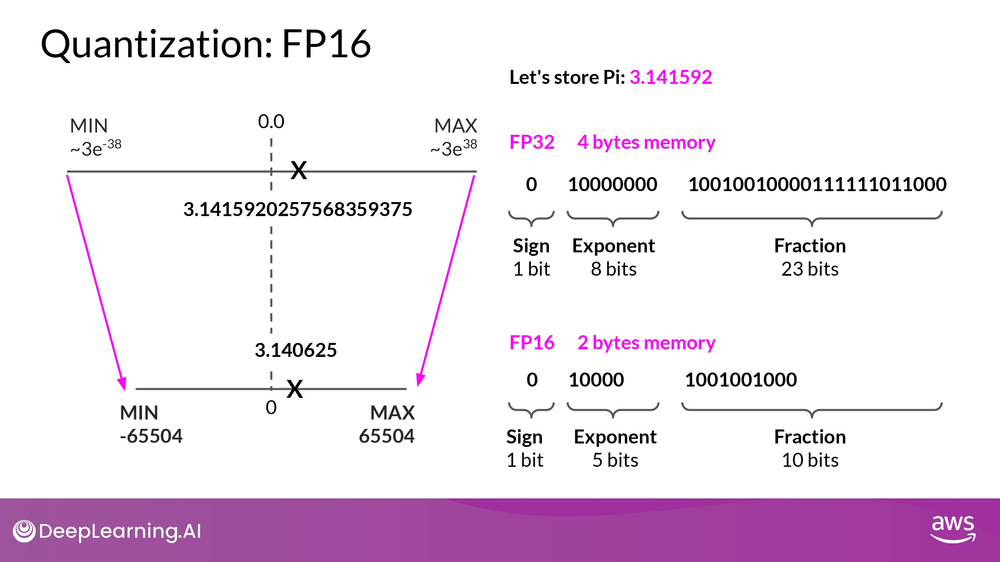
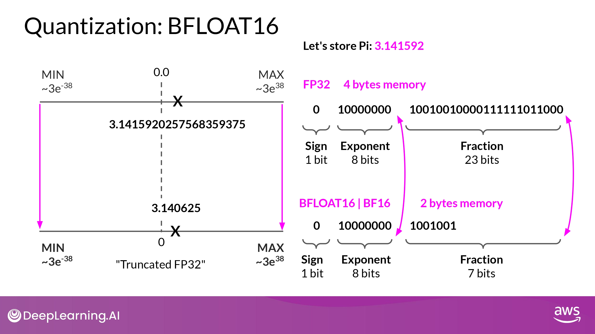
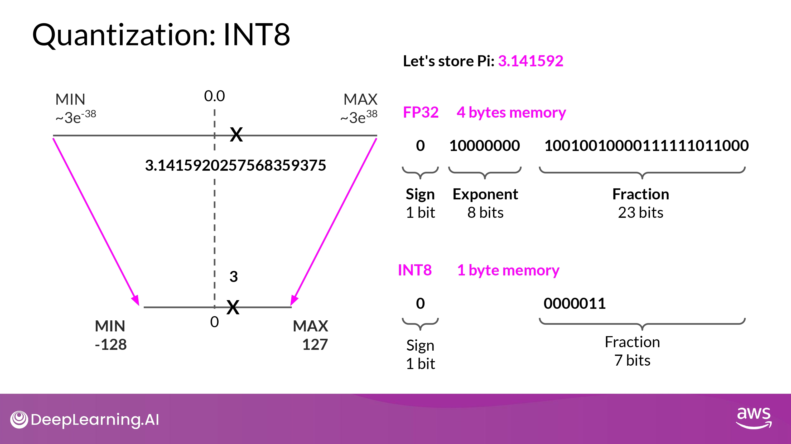
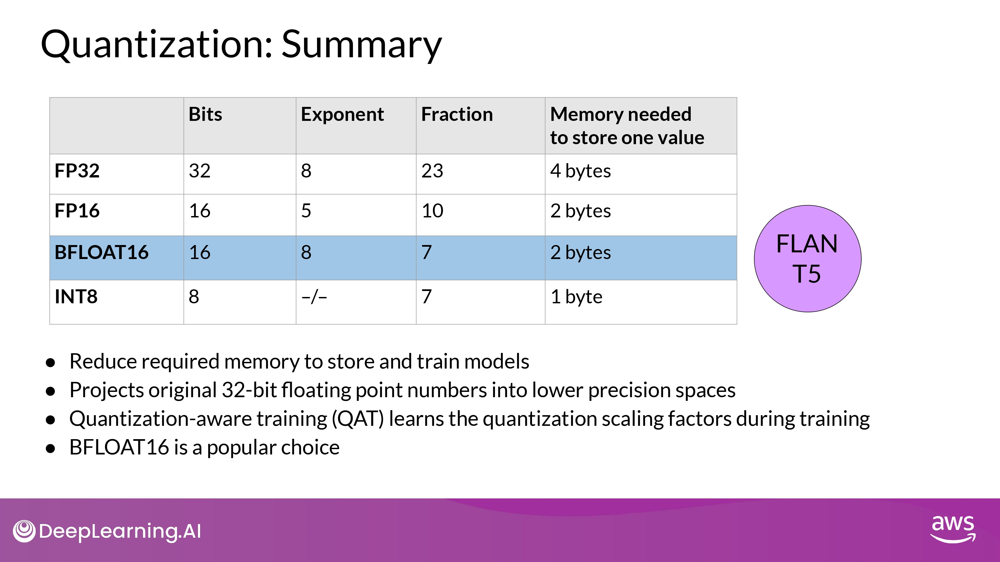
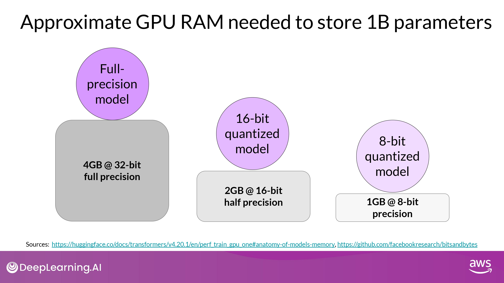
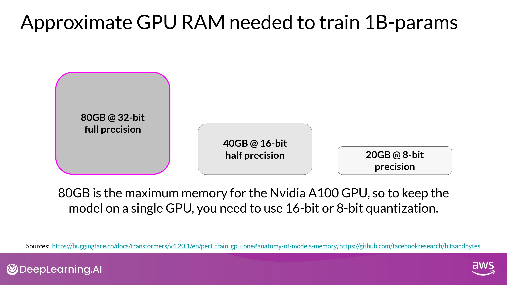
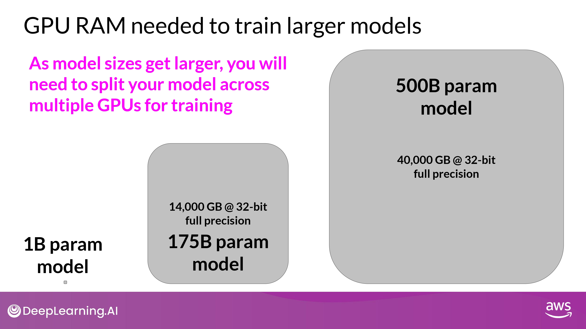

## Approximate GPU RAM needed

- 1 parameters = 4 byte (32-bit float)
-  1B params = 4 * 10^9 bytes = 4GB

 

## How to Reduce Memory?

### Quantization

- BFLOAT16 = 16-bit half precision

#### 1. FP16

- projection을 통해 상당 부분 precision 잃는 것 감수해야
	- FP16, 소수점 6자리 까지만 표시 가능
- memory 요구량을 절반! 으로 줄일 수 있음

#### 2. BFLOAT16

- BFLOAT16 = BF16 = 16-bit half precision
	- half precision FP16 과 full precision FP32 의 '하이브리드'
- 장점
	- training stability에 엄청난 도움을 줌
	- NVIDIA's A100과 같은 GPU에서도 사용 가능

- 특징
	- 'truncated 32-bit float'라고 불리기도 함
		- full 32-bit float의 범위를 다 담을 수 있기 때문
	- exponent에 8 bits 를 동일하게 사용
		- fraction 줄임 -> 계산 속도 올려서 모델 성능 향상
- 단점
	- 정수 연산에 안맞음 (deep learning에서는 별로 없으니까...)

#### 3. INT8

- parameters 4byte -> 1byte!
- BUT, precision에 대한 'pretty dramatic' 손실을 경험하게 될것...

### Summary

- KEY POINT
	- **<u>우리는 모델 training에서 memory footprint를 줄이기 위한 quantization을 사용할 수 있다!</u>**
- BFLOAT16 이 일반적 선택
	- FP32의 dynamic range도 보장하면서
	- memory footprint를 절반으로 줄여주므로

## Approximate GPU RAM needed after Quantization

## Maybe You need more GPU

- 이정도는 single GPU로 학습이 불가능
	- distributed computing technique 필요
		- train model across mutiple GPUs
	- GPU 100대 이상... 마이 비쌈...

