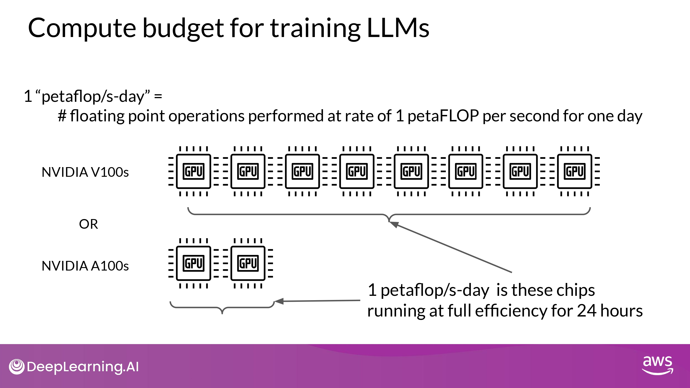

## Question

model_size / training_configuration / performance 사이의 상관관계는??

-> determine "how big models need to be?" 

## Scaling laws

### Scaling choices for pre-training

- 이론적으로 Dataset size, Model size를 키우면 Model performance도 증가
	- but, 이때 Compute budget을 고려해야 함

#### Compute budget for training LLMs

- 단위 : 1 petaflop per second day
	- NVIDIA V100 8개 최대 효율로 24시간 사용할 때 연산량
	- NVIDIA A100 2개 ~

#### Compute Buget in pre-training various LLMs 

- model 종류

1. Encoder only
	- BERT / ROBERTA
2. Encoder-Decoder
	- T5
3. Decoder only
	- GPT-3

- 그래프 해석
	- y-axis : logarithmic
		- Each increment vertically is a power of 10
	- T5 3B : 100 petaflops/s-day
	- GPT-3 175B : 3,700 petaflops/s-day

#### Compute budget vs. model performance

##### Ideal case

- in OpenAI paper 에서 소개 
- 설명
	- y-axis : Test Loss
		- performance에 대한 proxy 측정 지표
		- 낮을 수록 성능 높음
	- x-axis : Compute (petaflops/s-day)
		- using more compute power
		- training for longer
		- or BOTH
- 결론
	- 지수 증가 관계가 있음을 알 수 있다 (power law relationships)
		- x축 y축 모두 logarithmic -> 선형 관계
	- 즉, compute budet 늘리면 model performance도 향상 된다

##### Practical case

- 대부분의 경우 Compute Budget은 상수
	- Dataset size 늘리거나
	- Model size 키우거나

- 결론
	- Compute Budget과 동일
	- **<u>Dataset Size, Model Size -> power laws relationships</u>**

- 의문
	- 그럼 Dataset Size와 Model Size의 최적의 조합은??
		- pre-training compute optimal models??

## Compute-Optimal LLMs

### Chinchilla paper

- by DeepMind

#### Findings

- **<u>LLM들은 대부분 'over-parameterized' 되거나 'under-trained' 되어 있다.</u>**
- Smaller models may be able to achieve the same performance as much larger ones
	- if they are trained on larger datasets.

#### Chinchilla scaling laws

- **<u>파라미터 개수 * 20 = 적정 token 개수 (dataset size)</u>**

- 결과 해석
	- GPT-3, OPT-175B, BLOOM : under-trained
	- LLaMA-65B : optimal

- 중요한 발견
	- **<u>compute-optimal Chinchilla 모델이 non-compute optimal GPT-3 보다 낫다!</u>**
		- 많은 범위의 downstream evaluation tasks 에서 좋은 성능 보임

### What's next?

- 앞으로의 행보
	- 큰게 더 나을까...?
		- GPT-4 ???B
	- 최적화 하는게 더 나을까...?
		- BloomberGPT 50B

## Pre-training for domain adaptation

- 일반적으로 pre-training model 사용하는게 유리
- 하지만 바닥부터 pre-training 할 필요도 있음...!
	- legal / medical

- **<u>Pretraining model from scratch will result in better models for highly specialized domains</u>**

### BloombergGPT : domain adaption for finance

- Financial data / Public data 모두 활용
	- financial benchmarks 에서 최고의 성능 달성 목표
	- 또한, general purpose LLM benchmarkds 에서도 괜찮은 성능 유지 목표
		- (maintaining competitive performance)

- 그래프 축
	- x-axis : FLOPs = Compute Budget
	- (left)
		- y-axis : optimal model size
			- in billions of params
	- (right)
		- y-axis : optimal training dataset size
			- measured in number of tokens
- 그래프 설명
	- 점-선 수직 선
		- Bloomberg's Compute Budget
	- 색칠 영역
		- compute-optimal scaling loss
			- Chinchilla paper의 rule 반영
- 결과 해석
	- compute-budget (상수)
		- 1.3M GPU hours ~= 230,000,000 petaflops
	- model parameters = 50B
		- Chinchilla approach 반영
		- compute-optimal 색칠 영역 근처
	- actual number of token = 569B
		- <u>Chinchilla value 보다 적은 데이터 학습</u>
		- **<u>Why? : financial domain data에 대한 제한된 접근성 때문</u>**
			- 특정 도메인 데이터를 대량으로 구하기 매우 어렵다...!
- 의의
	- 실제 세계에서의 제약(constraints)은 모델을 pre-training할 때 trade-off 를 일으킬 수 있음을 시사함

---

(위 본문 내용 및 ppt 사진 자료는 모두 DeepLearning.AI 의 강의자료에서 가져왔으며, 상업적 목적으로 이용할 수 없습니다.)
