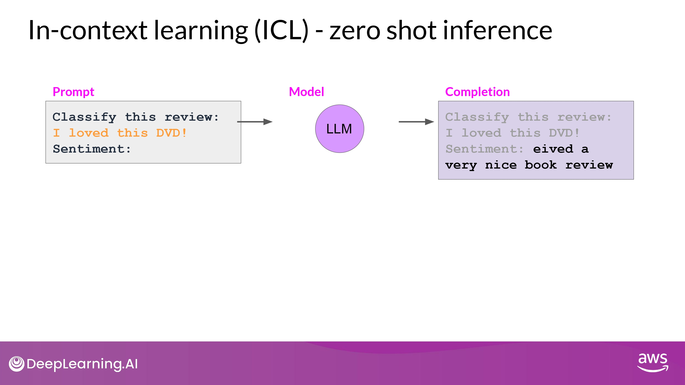

## Instruction Fine Tuning

### Review

#### zero shot inference

#### few shot inference

#### Limitations

-> In this case, we need <u>fine-tuning</u>

### LLM fine-tuning

- By Selfsupervised learning

- Supervised learning by Fine-Tuning
	- labeled example -> 모델의 weight를 update하게  

- labeled examples = **<u>prompt - completion pairs 형태</u>**
	- 특정 task에 대해서 'good completion'을 할 수 있도록 모델의 성능을 향상시키는 과정

### Instruction Fine Tuning

- trains the model using examples that
	- **<u>demonstrate how it should respond to a specific instruction</u>**

- Task에 따른 Instruction을 포함한 datasets을 구축함
	- Instruction의 일반화를 위해 다양한 형태로 제공

#### Full fine-tuning

- 막대한 컴퓨팅 자원 소모
	- ALL gradients, optimizers, other components 를 저장할 공간 필요
		- Memory Optimazation / Parallel Computing 전략을 사용 고려

#### Sample prompt instruction templates

- 인터넷에 존재하는 많은 data들을 instruction에 맞게 재구조화 해야 함
	- why? 초기 LLM 학습용 데이터는 위 목적에 부적합
- Github_lib : [promptsource](https://github.com/bigscience-workshop/promptsource)
	- raw data -> prompt (instruction + example from dataset)

#### Process

 

- Training - Validation - Test
	- Data Split

- prediction - label : loss_function
	- Cross-Entrophy
		- LLM에서 prediction은 결국 'Probability Distribution across Tokens'
- Back-propagation
- many batches of prompt completion pairs
	- over several epochs

- While Training : Validation Metrics

- Final Check : Test Accuracy

## Catastrophic Forgetting

### Fine-tuning on a single task

- 한 task에 대해서만 잘 수행하기를 원한다?
	- 500 ~ 1000개의 예시 datasets 으로 충분할 수 있음
- 하지만, <u>Catastrophic Forgetting</u> 발생 가능성이 있다

### Catastrophic Forgetting

- Full Fine Tuning이 LLM의 weights를 변경시키면서 발생함
	- 특정 task에 대해서는 성능 향상
	- 다른 일반적인 task에 대해서는 성능 하락...
	- 위의 예시에서
		- Sentiment Analysis :)
		- Entity Recognition :( 성능 이슈!

### How to avoid to it?

1. 한 task만 잘해도 된다면 굳이 신경쓰지 않아도 괜춘

2. Multitask Fine Tuning

	- **<u>여러 task에 걸친 50 ~ 100,000 예시 datasets 으로 학습 시키는 것</u>**
	- <u>일반 fine-tuning 보다 많은 데이터 / 컴퓨팅 자원 필요!</u>

3. Parameter Efficient Fine Tuning (PEFT)

	- **<u>원본 LLM의 weight를 보존하면서, task-specific 한 adapter layers 와 parameters 의 작은 일부분만을 변화 시키는 것</u>**

	- 좋은 robustness를 보임
		- 대부분의 pre-trained weights들은 변함이 없기 때문
	- 현재도 많은 연구가 되기 있는 분야

