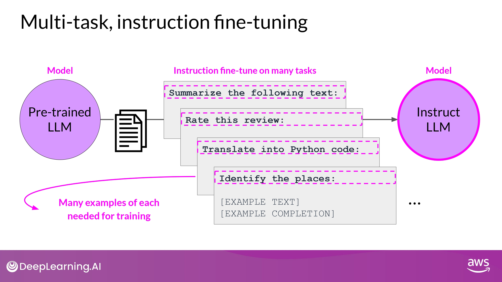

## Multi-task Instruction Fine Tuning

- 단점
	- 매우 많은 데이터가 필요함
	- 50 ~ 100,000 예시의 'training set'을 준비해야 함
		- 그래도 공들인 가치가 있다고...!

### FLAN (Fine-tuned LAnguage Net)

- FLAN fine-tuning 은 training-process의 가장 마지막 단계

- FLAN-T5 : FLAN instruct version of T5
- FLAN-PALM : FLAN instruct version of PALM foundation model

 #### FLAN-T5

- samsum : 16,000 messenger like conversations with summaries
	- dialogue - summary

- promt_template
	- <u>같은 instruction에 대해서 다양한 방법을 포함</u>
		- model generalize & perform better

- samsum 데이터셋 1 record -> 위 대화 template으로 학습 데이터 하나 만듬
	- 이 데이터를 fine-tuning 에 활용

#### Improving FLAN-T5

- customer service chat 에서 활용되는 언어 구조 - samsum (day-to-day chat) 데이터셋이 겹치는 부분이 많지 않음...
	- <u>**내 task에 맞는 dataset을 통해서 FLAN-T5를 더 fine-tuning 할 수 있다**</u>
		- LAB에서 직접 해볼 예정!

- 13,000 support chat dialogues & summaries
	- FLAN-T5 원래 training dataset에 포함 되지 않음

#### Example

- Hallucination 발생
- 내용 부실

- 중요한 내용 충실히 반영
- Hallucination 없음

## Paper Review : Scaling instruct models

[This paper](https://arxiv.org/abs/2210.11416) introduces FLAN (Fine-tuned LAnguage Net), an instruction finetuning method, and presents the results of its application. The study demonstrates that by fine-tuning the 540B PaLM model on 1836 tasks while incorporating Chain-of-Thought Reasoning data, FLAN achieves improvements in generalization, human usability, and zero-shot reasoning over the base model. The paper also provides detailed information on how each these aspects was evaluated.

Here is the image from the lecture slides that illustrates the fine-tuning tasks and datasets employed in training FLAN. The task selection expands on previous works by incorporating dialogue and program synthesis tasks from Muffin and integrating them with new Chain of Thought Reasoning tasks. It also includes subsets of other task collections, such as T0 and Natural Instructions v2. Some tasks were held-out during training, and they were later used to evaluate the model's performance on unseen tasks.

## Model Evaluation

