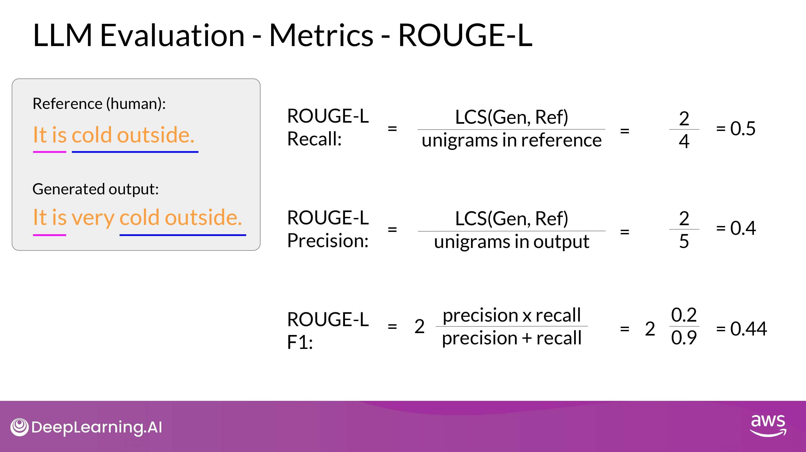

## Multi-task Instruction Fine Tuning

- 단점
	- 매우 많은 데이터가 필요함
	- 50 ~ 100,000 예시의 'training set'을 준비해야 함
		- 그래도 공들인 가치가 있다고...!

### FLAN (Fine-tuned LAnguage Net)

- FLAN fine-tuning 은 training-process의 가장 마지막 단계

- FLAN-T5 : FLAN instruct version of T5
- FLAN-PALM : FLAN instruct version of PALM foundation model

#### FLAN-T5

- samsum : 16,000 messenger like conversations with summaries
	- dialogue - summary

- promt_template
	- <u>같은 instruction에 대해서 다양한 방법을 포함</u>
		- model generalize & perform better

- samsum 데이터셋 1 record -> 위 대화 template으로 학습 데이터 하나 만듬
	- 이 데이터를 fine-tuning 에 활용

#### Improving FLAN-T5

- customer service chat 에서 활용되는 언어 구조 - samsum (day-to-day chat) 데이터셋이 겹치는 부분이 많지 않음...
	- <u>**내 task에 맞는 dataset을 통해서 FLAN-T5를 더 fine-tuning 할 수 있다**</u>
		- LAB에서 직접 해볼 예정!

- 13,000 support chat dialogues & summaries
	- FLAN-T5 원래 training dataset에 포함 되지 않음

#### Example

- Hallucination 발생
- 내용 부실

- 중요한 내용 충실히 반영
- Hallucination 없음

## Paper Review : Scaling instruct models

[This paper](https://arxiv.org/abs/2210.11416) introduces FLAN (Fine-tuned LAnguage Net), an instruction finetuning method, and presents the results of its application. The study demonstrates that by fine-tuning the 540B PaLM model on 1836 tasks while incorporating Chain-of-Thought Reasoning data, FLAN achieves improvements in generalization, human usability, and zero-shot reasoning over the base model. The paper also provides detailed information on how each these aspects was evaluated.

Here is the image from the lecture slides that illustrates the fine-tuning tasks and datasets employed in training FLAN. The task selection expands on previous works by incorporating dialogue and program synthesis tasks from Muffin and integrating them with new Chain of Thought Reasoning tasks. It also includes subsets of other task collections, such as T0 and Natural Instructions v2. Some tasks were held-out during training, and they were later used to evaluate the model's performance on unseen tasks.

## Model Evaluation

### Model evaluation metrics

- We need an automated, structured way to make measurements

- ROUGE : Recall Oriented Understudy for Gisting Evaluation
	- summarization
	- 자동 기계 요약 - 사람 요약의 차이를 비교 목적

- BLEU : BiLingual Evaluation Understudy
	- translation
	- 기계 번역 - 사람 번역 차이 비교 목적

### ROUGE

#### ROUGE-1

- recall
	- 분자 : the number of words or unigrams matchs between the generated output and the reference
	- 분모 : reference size - the number of words or unigrams in the reference 
- precision
	- 분자 : unigrams matches - the number of words or unigrams matchs between the generated output and the reference 
	- 분모 : output size
- F1
	- recall, precision의 조화 평균

- 단어의 순서를 고려하지 않는 단점
- 문장의 의미도 반영되지 않음

#### ROUGE-2

- bigram을 사용하면 단어의 순서를 고려할 수 있음

- ROUGE-1 보다 낮은 점수
	- 문장의 길이가 길어질수록 score가 더욱 낮아지게 됨

#### ROUGE-L

- LCS : Longest Common Subsequence
	- reference 와 generated output 의 가장 긴 공통 subsequence 의 길이

#### (Keep in Mind)

- ROUGE score 값을 맥락에 맞게 사용해야 한다
- **<u>같은 task 로 score 값이 결정될 때만 모델 비교에 사용할 수 있다!</u>**
	- ex) summarization
- 다른 task에 대한 score는 서로 비교할 수 없다(not comparable)

#### ROUGE Limitation

- ROUGE hacking
	1. 같은 단어의 반복
		- ROUGE clipping 으로 해결 가능
			- unigram이 reference에서 일치하는 갯수의 최대치를 설정하는 것
	2. 단어 순서 차이
		- ROUGE clipping 으로도 해결 불가능
- ROUGE 에서 다양한 n-gram을 적용하면서 최적의 score를 찾아야 함
	- 문장, 문장의 길이, 내 상황에 따라 천차만별!

### BLEU

- BLEU score 는 보통 기계 번역의 품질(quality) 평가에 유용
- 여러 개의 n-gram size에 대한 평균 precision을 계산
	- avg(ROUGE-1 of precision + ROUGE-2 of precision + .... + ROUGE-n of precision)

- 번역 품질의 수량화!
	- 기계 번역의 n-gram이 얼마나 referene 번역과 일치하는지 비교
- 방법
	- Average precision across a range of different n-gram sizes
	- (Hugging Face에 공개된 library가 있으니 사용해서 계산하면 됨)

### We need Further

- ROUGE 와 BLEU 는 학습의 중간에 diagnositc 접근으로 사용 추천
- **<u>For overall evaluation of model,</u>**
	- **<u>we need Evaluation Benchmarks</u>**

## Benchmarks

### (Keep in Mind)

- LLM의 성능 평가를 위해 올바른 datasets을 고르는 것이 무엇보다 중요

- TIPS

	- model의 특정 skill에 초점을 맞춘 datasets을 고르는 것이 유용함
		- ex) reasoning / common sense knowledge
		- ex) disinformation / copyright infringement

	- training 과정에서 해당 datasets을 학습한 적이 없는지 확인하는 것도 중요
		- 처음 보는 데이터에서 evaluation이 수행되어야 올바르게 LLM의 성능 평가가 가능

- GLUE : General Language Understanding Evaluation
- SuperGLUE
- MMLU : Massive Multitask Language Understanding
- BIG-bench

	- Lite
	- BIG-bench
	- BIG-bench Hard

- HELM : Holistic Evaluation of Language Models

### GLUE

- 다양한 NLP task로 이루어져 있음
	- sentimental analysis.
	- question-answering. etc.

- 여러 task에 걸쳐 모델의 일반적인 성능 평가 지표

### SuperGLUE

- GLUE + new tasks + more difficult tasks
- 다양한 NLP task
	- multi-sentence reasoning
	- reading comprehension

- Leaderboards도 있음

- Link
	- [SuperGLUE](https://super.gluebenchmark.com/leaderboard)
	- [GLUE](https://gluebenchmark.com/leaderboard/)

### MMLU & BIG-bench

- 기본적인 language understanding 보다 훨씬 나아간 task 들을 평가함

- MMLU
	- tasks 종류
		- elementary mathematics
		- US history
		- computer science
		- law, and more...
- BIG-bench
	- 현재 <u>204개의 task</u>를 포함
	- tasks 종류
		- linguistics
		- childhood development
		- math
		- common sense reasoning
		- biology
		- physics
		- social bias
		- software development, and more...
	- 3개의 사이즈 dataset을 제공
		- inference cost 최적화 목적

### HELM

- 목적
	- to improve transparency of the model
	- to offer guidance on which models perform well for specific tasks
- multi metric approach
	- 16 core scenarios에 대해서 7개의 metrics 존재
	- model - metric trade-off 를 명확하게 보여주기 위함

- Living Benchmark
	- 계속 발전시켜 나가는 것이 목표
		- 새로운 scenarios, metrics, models 추가 해나갈 계획

- Link

	- [HELM](https://crfm.stanford.edu/helm/latest/)

---

(위 본문 내용 및 ppt 사진 자료는 모두 DeepLearning.AI 의 강의자료에서 가져왔으며, 상업적 목적으로 이용할 수 없습니다.)
