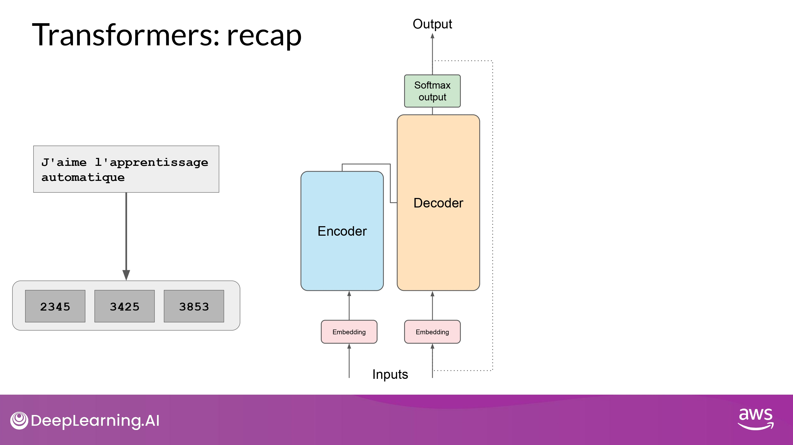
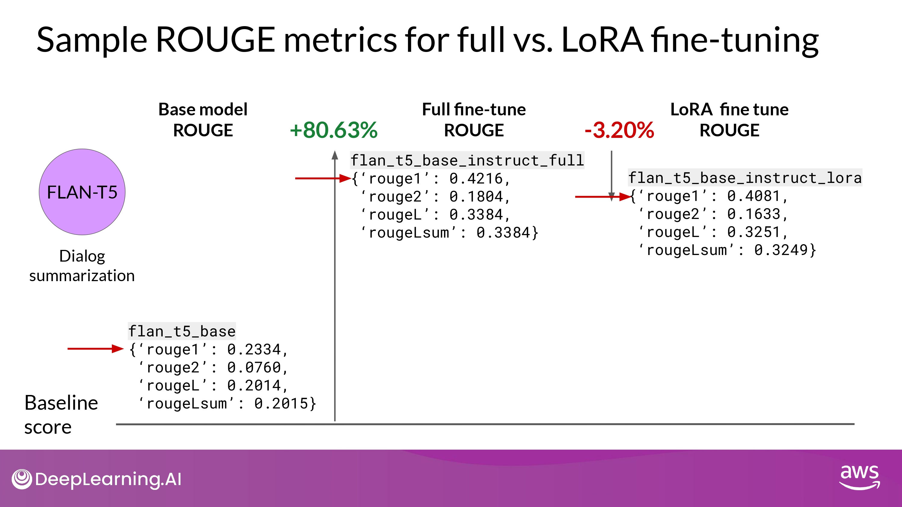

## Parameter efficient fine-tuning (PEFT)

 

- 전체 weight가 변경되기 위해선 막대한 저장 공간 및 연산량 필요...

### Approach

- 대부분의 model weights 들을 freeze 함
	- 모델 parameters의 일부분(subset) 만을 fine-tuning 함
		- ex) 특정 layer, components

- model weights 들을 전혀 건들지 않음
	- 새로운 layers 나 parameters 를 추가함
		- 새로운 부분만 fine-tuning 함
- 장점
	- single GPU로도 학습 가능
	- catastrophic forgetting에도 덜 취약

### Full vs. PEFT

- Full
	- 학습시키는 task에 대해서 매번 새로운 model을 만드는 방식

- PEFT

	- 일부분의 weight만 만드는 방식
		- 새로운 parameter + backbone LLM = fine-tuned weights -> inference에 활용됨

	- each task can be easily swapped our for inference
		- multiple task에 대하여 efficient adaptation 가능
	- **<u>PEFT adapter</u>** 표현!

### Methods

- 각각의 경우 Trade-offs 존재

#### Selective

- train only certain components of the model or specific layers, or even individual parameter types

- the performance of these methods is mixed and there are significant trade-offs between parameter efficiency and compute efficiency

- <u>We won't focus on them in this course.</u> 

#### Reparameterization

- create new **<u>low rank transformations</u>** of the original network weights
	- LoRA

#### Additive

- keep all of the original LLM weights frozen
	- add new **<u>trainable components</u>**
- 2 main approach
	- Adapters
		- add new trainable layers to the architecture of the model
			- 보통 attention / feed-forward layers 다음 위치에 encoder / decoder 안에 넣음
	- Soft Prompts
		- keep the model architecture fixed and frozen
			- focus on munipulating the input
				- 1. add trainable parameters to prompt embeddings
				- 2. keep the input fixed and retraining the embedding weights

## Low-rank Adaptation, LoRA

### Transformers: recap

- text -> token

- token -> embedding vector

- vector -> 2 NN [self-attention -> feed-forward network]
	- pre-training 과정에서 위 network의 weight 들이 학습됨

### LoRA

- Embedding vector가 생성된 이후
	- self-attention layer에 먹여짐(fed into)
		- where a series of weights are applied to calculate the attention scores
- If Full fine-tuning
	- 위 layer의 모든 parameter 값들이 갱신됨

- Training

	1. 기본 모델의 모든 파라미터 값을 freezing 함
	2. 기본 weight에 2개의 rank decomposition matrices를 주입한다 
		- 위 행렬의 dimension은 고정되어 있고, 이 행렬곱은 기본 매트릭스(weight를 수정하려 하는)의 dimension과 동일하다

	3. 기본 LLM의 weight는 frozen하고, 작은 매트릭스 들을 훈련시킨다
		- 동일한 지도학습 과정을 통해

- Inference
	1. 2개의 low-rank 매트릭스 들을 곱하고, frozen weights 와 동일한 dimension의 매트릭스를 만든다 (A * B)
	2. 위 매트릭스 값을 기본 weight에 더한다
	3. 위 최종 값을 updated weights로 사용한다

- Finish
	- 특정 task를 잘 수행할 수 있는 LoRA fine-tune 모델을 얻었따!
- Advantage
	- 기본 parameter와 차이가 별로 없으므로, <u>inference latency에 영향이 적음</u>

- Further Issue
	- self-attention layer에만 LoRA를 적용해도 충분히 성능이 나오더라
		- but, feed-forward layers 같은 다른 components 에도 적용할 수 있다
	- 어쨌든, 대부분의 LLM 파라미터들은 attention layer에 있으므로 여기에 trainable parameters를 적용하는게 제일 무난한 선택

#### Concrete Example

- Single GPU에서도 fine-tuning 을 가능하게 해 줌

#### Scalability

- 여러 rank-decomposition 매트릭스들을 학습시켜 놓고
	- inference time에 바꿔가며 사용할 수도 있따!

- LoRA matrices 매우 작은 저장 용량 차지

- use LoRA to train for many tasks
	- Switch out the weights when you need to use them
	- avoid having to store multiple full-size versions of the LLM

#### Sample ROUGE metrics : full vs. LoRA

- REMEMBER
	- FLAN-T5 는 이미 fine-tuning 된 capable 한 모델이지만
	- <u>특정 tasks에 대해 fine-tuning을 추가적으로 진행하는게 도움이 된다</u>!!

#### How to choose rank?

- 여전히 연구 중인 분야
- 원칙 상
	- rank가 작을 수록, trainable parameter수가 작고, computing 자원을 덜 소모

- language generation task에 대해 rank의 영향 실험
- 해석
	- val_loss : 최종 loss 값
	- 다양한 benchmarks metrics 값 : BLEU, ROUGE_L, etc...
	- bold : 최고 성능 값
- 결과
	- rank=16보다 크면 plateau 현상 발생
		- 16보다 더 큰 매트릭스? 효과 없다... 
	- 4 < rank < 32 : trainable parameter 줄이기 <-> performance 보존하기 - trade-off 보여줌
- 최종 결론
	- 직접 해봐라! more practitioners attempt needed

### QLoRA

- combine LoRA with Quantization
	- further reduce memory footprint

