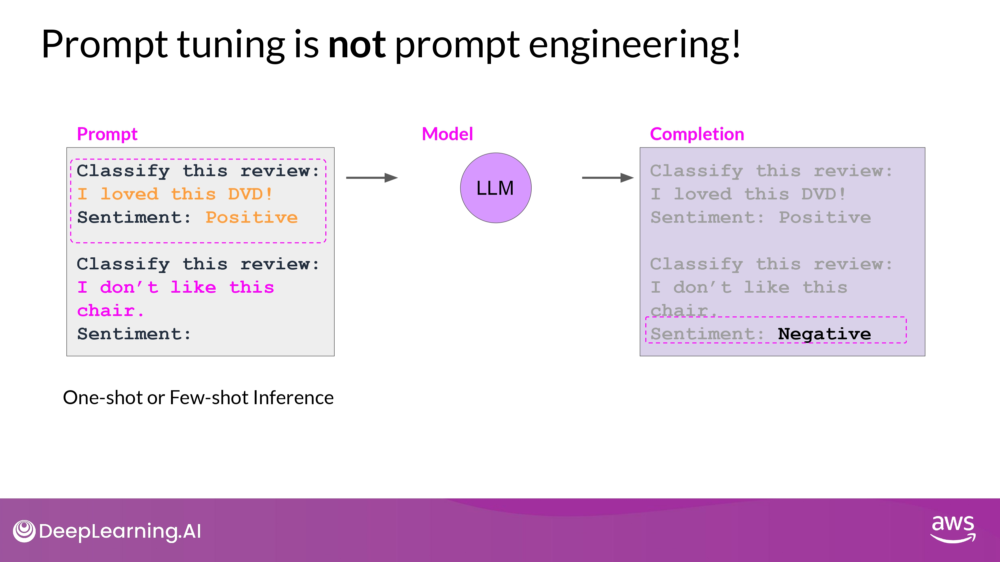
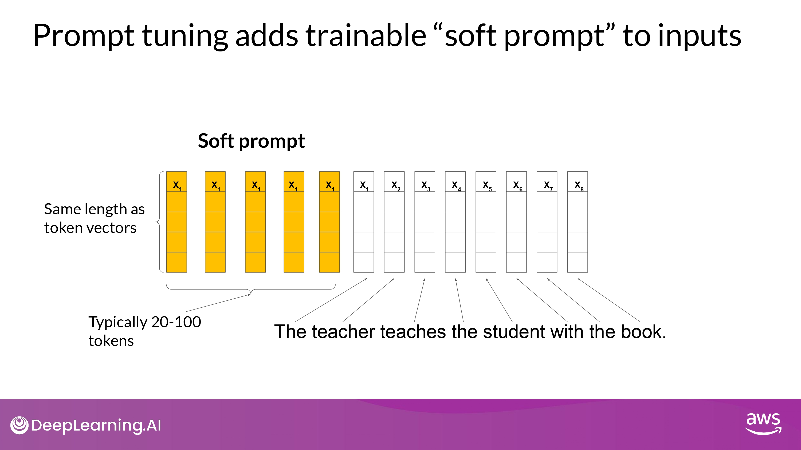
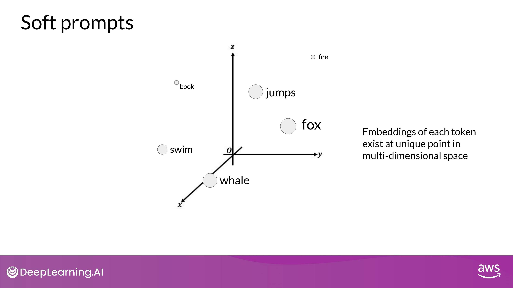
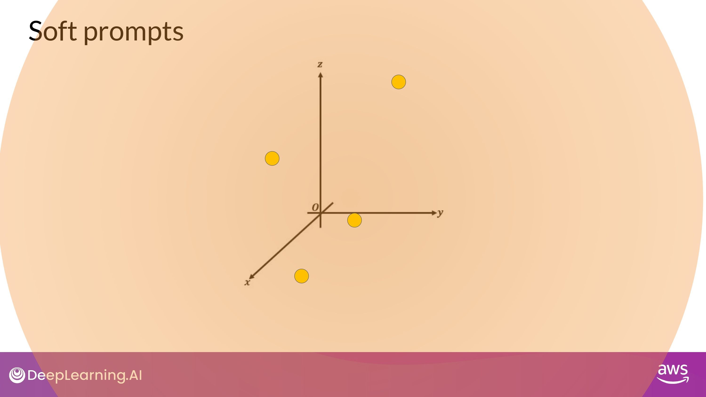
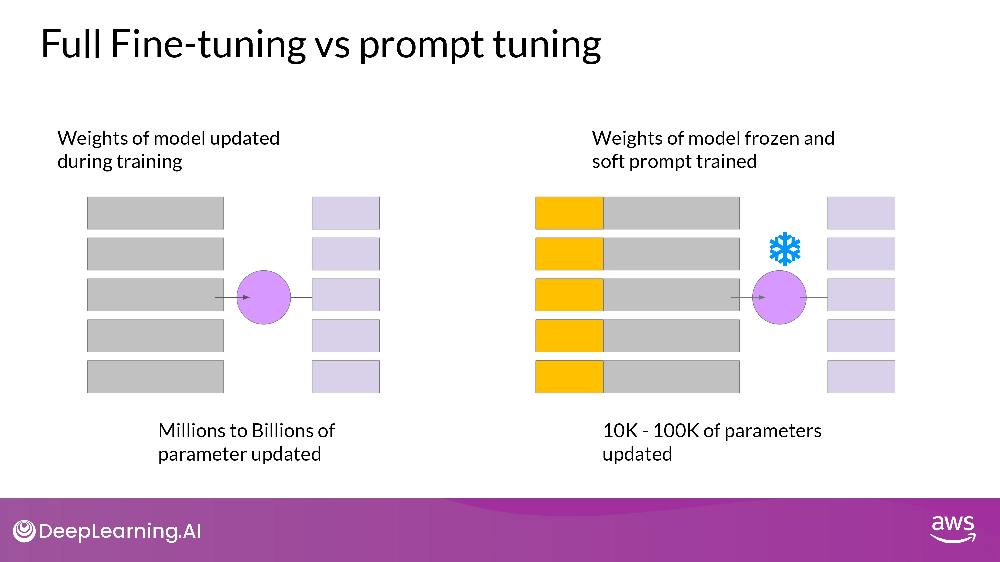
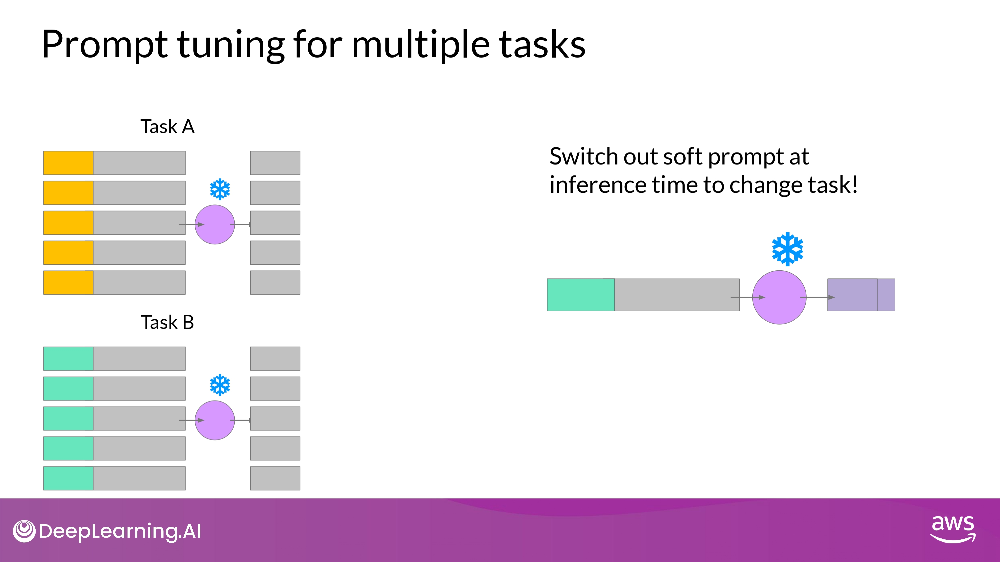
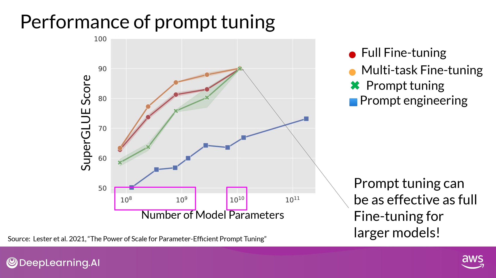
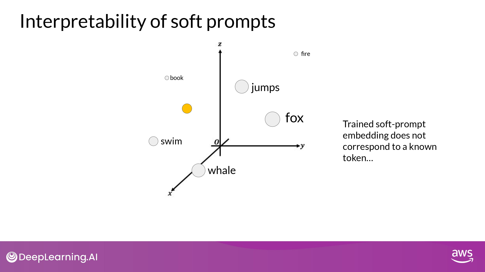
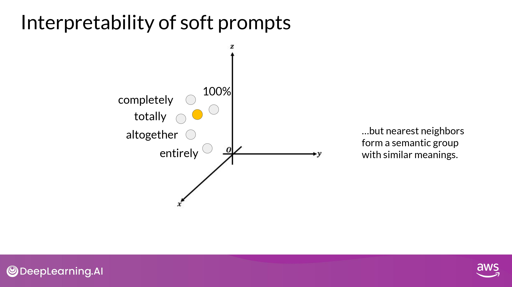
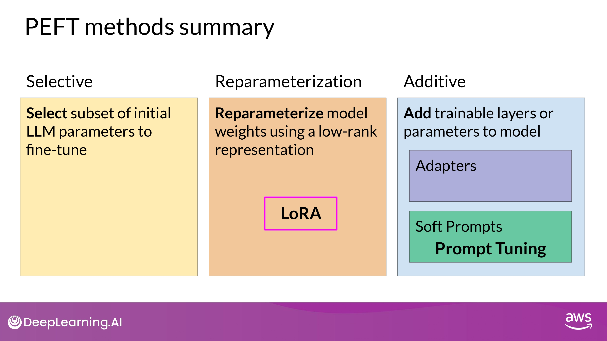

## Prompt Tuning

### NOT prompt engineering!

- 단점
	- context window 제한
	- task에 맞는 성능을 달성하지 못할 수 있음(구조적 한계로)

### Prompt tuning with soft prompts

- Process
	- prompt + **<u>additional trainable tokens</u>** = **<u>Soft prompt</u>**
	- supervised learning process에 맡김
	- optimal values 찾아 줌
		- it gets prepended to embedding vectors that represent input text
- soft prompt vector
	- language token의 embedding vector와 동일한 length
	- 20 ~ 100 virtual tokens : sufficient for good performance

- 어떠한 값도 될 수 있는 virtual token
	- within the continous multidimensional embedding space
	- 지도학습을 통해 이 token 들이 perfomance 에 최적화되도록 학습 됨

#### Full fine-tuning vs. prompt tuning

- Full fine-tuning
	- training dataset =  input prompt + output completions (=labels)
	- weight updated by supervised learning
- Prompt-tuning
	- LLM의 weight 들은 frozen 됨
	- soft prompt의 embedding vectors들이 update 됨
		- prompt에 대한 model의 completion을 최적화시킴 

#### Prompt tuning for multiple tasks

- set of soft prompt를 다양한 task 별로 학습 시킴
- Inferecne 할 때 soft prompt (learned tokens) + input prompt 합쳐서 사용

- 결론
	- 다양한 task에 <u>동일한 LLM 사용가능</u>
	- Inference time에 task에 따라 soft prompt를 바꾸기

#### Performance of prompt tuning

- 해석
	- 작은 LLM (10^8 ~ 10^9) 에서는 Full Fine-tuning > Promt tuning
	- **<u>10B (10^10) 에서는 Full Fine-tuning ~= Promt tunin</u>g**
		- prompt-engineering 보다 훨씬 향상된 성능 보임

#### Interpretability

- train token (soft prompt)은 LLM의 vocabulary의 어떤 값과도 같지 않음

- 최근접이웃 토큰들을 분석하면 정보 알 수 있다
	- soft prompt location shows that they form tight semantic clusters
	- soft prompt 가장 가까운 단어들은 서로 비슷한 의미를 지님
- The word identified usually have some meaning related to the task
	- suggesting that the prompt are learning word like representations

## Summary

## Week 2 Resources

Below you'll find links to the research papers discussed in this weeks videos. You don't need to understand all the technical details discussed in these papers - **you have already seen the most important points you'll need to answer the quizzes** in the lecture videos. 

However, if you'd like to take a closer look at the original research, you can read the papers and articles via the links below. 

### **Multi-task, instruction fine-tuning**

- [**Scaling Instruction-Finetuned Language Models**](https://arxiv.org/pdf/2210.11416.pdf) - Scaling fine-tuning with a focus on task, model size and chain-of-thought data.
- [**Introducing FLAN: More generalizable Language Models with Instruction Fine-Tuning**](https://ai.googleblog.com/2021/10/introducing-flan-more-generalizable.html) - This blog (and article) explores instruction fine-tuning, which aims to make language models better at performing NLP tasks with zero-shot inference.

### **Model Evaluation Metrics**

- [**HELM - Holistic Evaluation of Language Models**](https://crfm.stanford.edu/helm/latest/) - HELM is a living benchmark to evaluate Language Models more transparently. 
- [**General Language Understanding Evaluation (GLUE) benchmark**](https://openreview.net/pdf?id=rJ4km2R5t7) - This paper introduces GLUE, a benchmark for evaluating models on diverse natural language understanding (NLU) tasks and emphasizing the importance of improved general NLU systems.
- [**SuperGLUE**](https://super.gluebenchmark.com/) - This paper introduces SuperGLUE, a benchmark designed to evaluate the performance of various NLP models on a range of challenging language understanding tasks.
- [**ROUGE: A Package for Automatic Evaluation of Summaries**](https://aclanthology.org/W04-1013.pdf) - This paper introduces and evaluates four different measures (ROUGE-N, ROUGE-L, ROUGE-W, and ROUGE-S) in the ROUGE summarization evaluation package, which assess the quality of summaries by comparing them to ideal human-generated summaries.
- [**Measuring Massive Multitask Language Understanding (MMLU)**](https://arxiv.org/pdf/2009.03300.pdf) - This paper presents a new test to measure multitask accuracy in text models, highlighting the need for substantial improvements in achieving expert-level accuracy and addressing lopsided performance and low accuracy on socially important subjects.
- [**BigBench-Hard - Beyond the Imitation Game: Quantifying and Extrapolating the Capabilities of Language Models**](https://arxiv.org/pdf/2206.04615.pdf) - The paper introduces BIG-bench, a benchmark for evaluating language models on challenging tasks, providing insights on scale, calibration, and social bias.

### **Parameter- efficient fine tuning (PEFT)**

- [**Scaling Down to Scale Up: A Guide to Parameter-Efficient Fine-Tuning**](https://arxiv.org/pdf/2303.15647.pdf) - This paper provides a systematic overview of Parameter-Efficient Fine-tuning (PEFT) Methods in all three categories discussed in the lecture videos.
- [**On the Effectiveness of Parameter-Efficient Fine-Tuning**](https://arxiv.org/pdf/2211.15583.pdf) - The paper analyzes sparse fine-tuning methods for pre-trained models in NLP.

### **LoRA**

- [**LoRA Low-Rank Adaptation of Large Language Models**](https://arxiv.org/pdf/2106.09685.pdf) -  This paper proposes a parameter-efficient fine-tuning method that makes use of low-rank decomposition matrices to reduce the number of trainable parameters needed for fine-tuning language models.
- [**QLoRA: Efficient Finetuning of Quantized LLMs**](https://arxiv.org/pdf/2305.14314.pdf) - This paper introduces an efficient method for fine-tuning large language models on a single GPU, based on quantization, achieving impressive results on benchmark tests.

### **Prompt tuning with soft prompts**

- [**The Power of Scale for Parameter-Efficient Prompt Tuning**](https://arxiv.org/pdf/2104.08691.pdf) - The paper explores "prompt tuning," a method for conditioning language models with learned soft prompts, achieving competitive performance compared to full fine-tuning and enabling model reuse for many tasks.