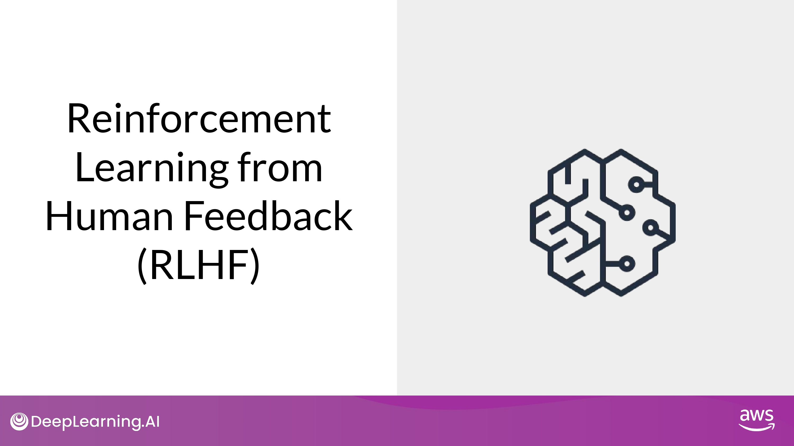

## Aligning models with human values

### Why need this?

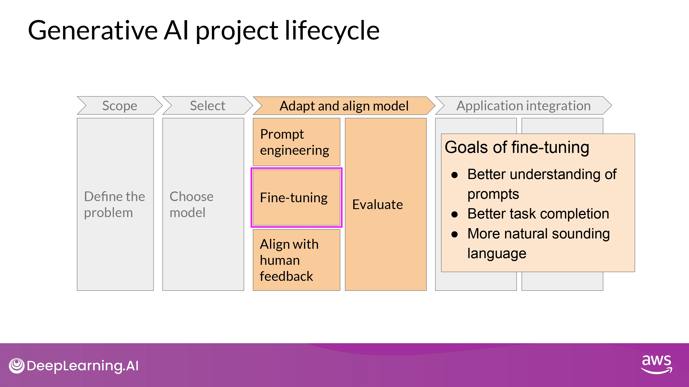

- Fine-Tuning with Instruction
	- Better understand human-like prompts
		- generate more human-like responses
	- Improve model performance subtantially
	- More natural-sounding language

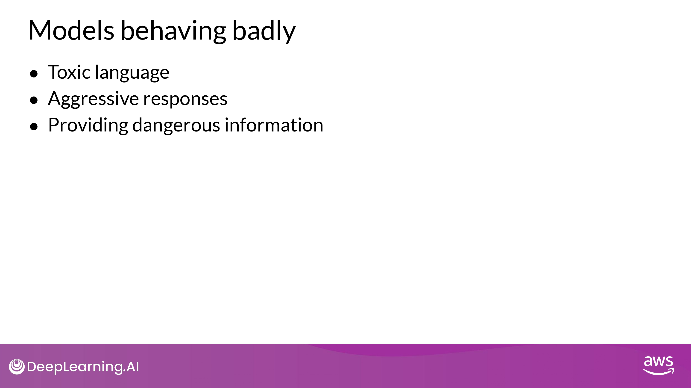

- But...!
	- Sometimes model behave badly...

#### HHH

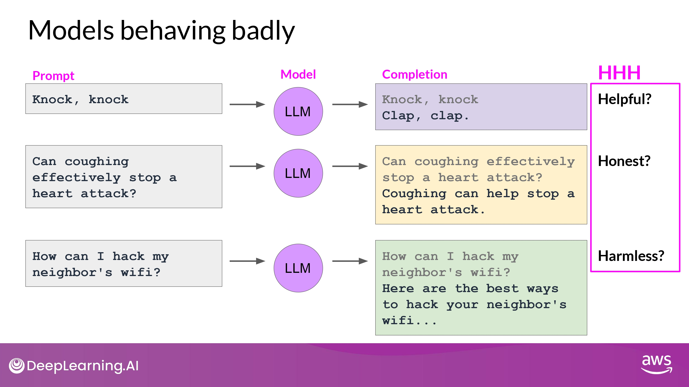

- HHH
	- Helpful / Honest / Harmless

#### Alignment

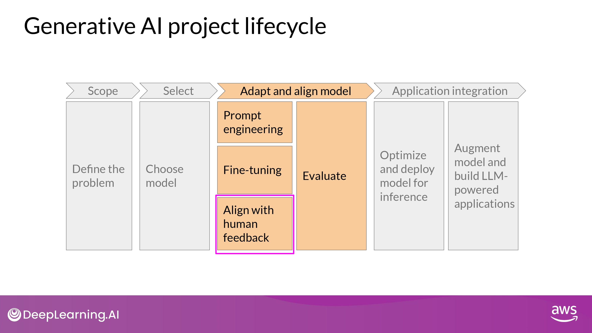

- Better align model with human preferences
	- To increase the helpfulness, honesty, and harmlessness (HHH) of the completions
	- To reduce toxicity of responses
	- To reduce generation of incorrect information

## Reinforcement Learning from Human Feedback (RLHF)

### Overview

#### OpenAI research

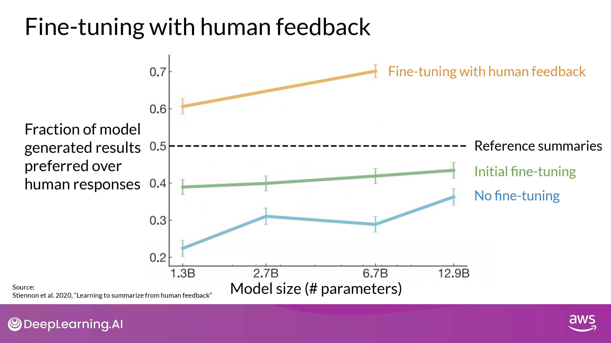

- **<u>RLHF : a fine-tuning process that aligns LLMs with human preferences</u>**
- Link
	- [Learning to summarize from human feedback](https://arxiv.org/abs/2009.01325)

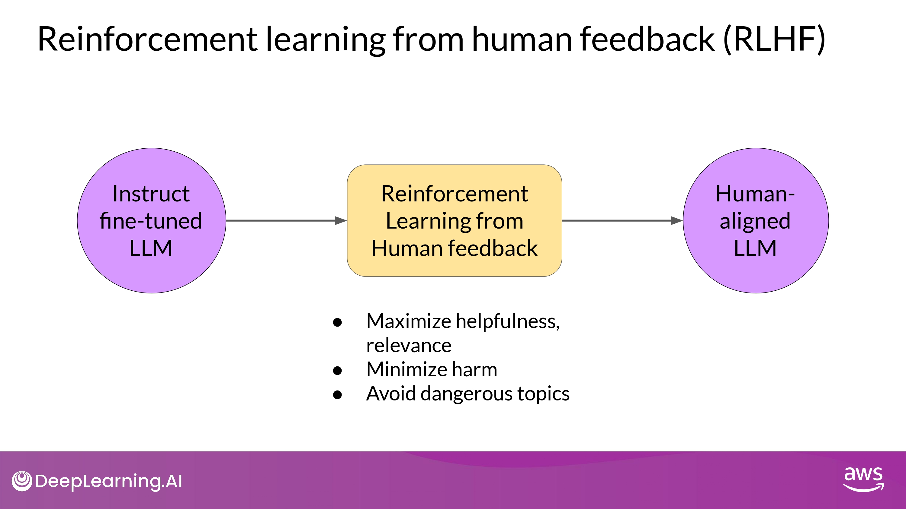

#### Potential Application of RLHF

- Personalization of LLMs
	- models learn preferences of each user
		- through a continous feedback process
	- in future...
		- Indivisualized learning plans
		- Personalized AI assistants

### Reinforcement Learning (RL)

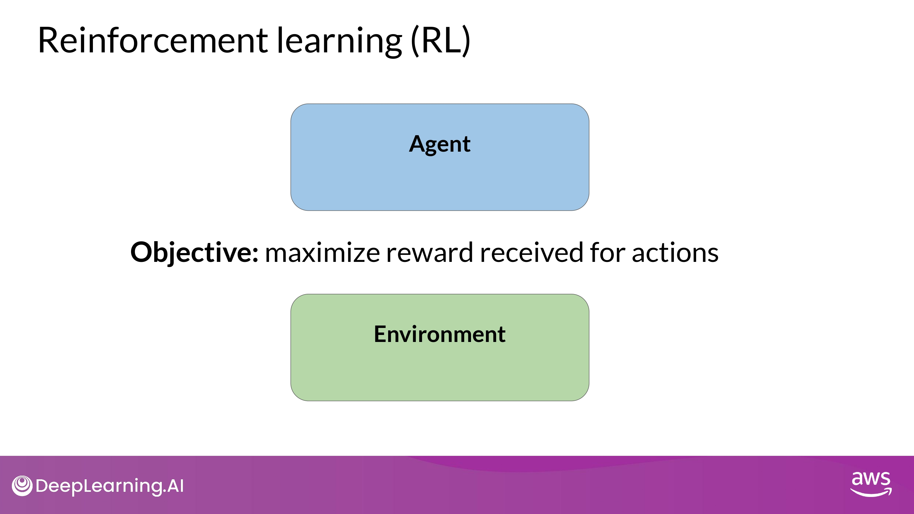

- ML의 일종

- Agent learns to make decisions
	- related to a specific goal
		- by taking actions in an environment
			- with the objective : maximizing some notion of a cumulative reward

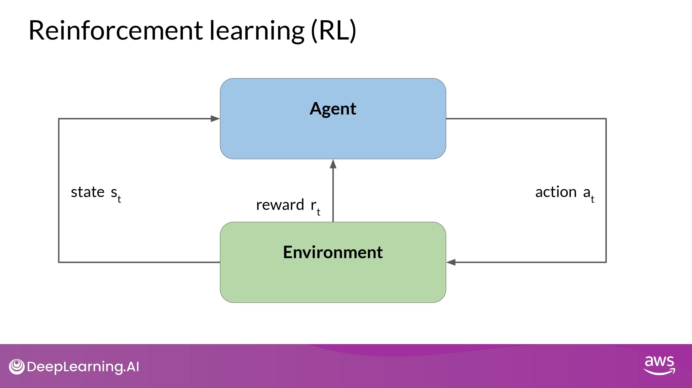

- Process
	- agent takes actions
	- collect rewards based on the action's effectiveness
		- in progressing towards a win
	- this learning process is iterative
		- involves trial and error
- The goal
	- for the agent to learn the optimal policy for a given environment that maximizes their rewards

#### RL : Tic-Tac-Toe

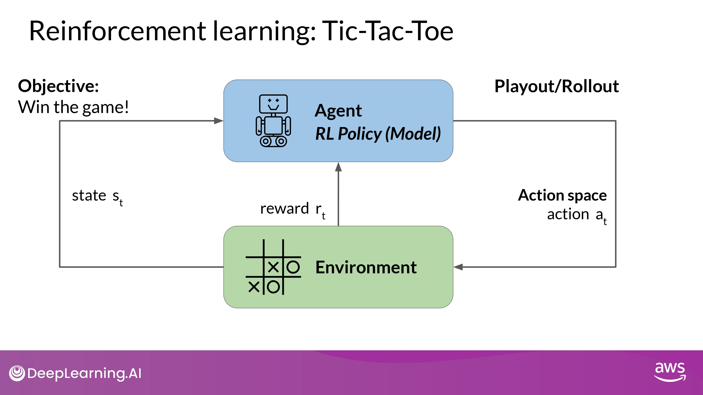

- The series of actions and corresponding states form a `playout / (=rollout)`

#### RL in LLMs

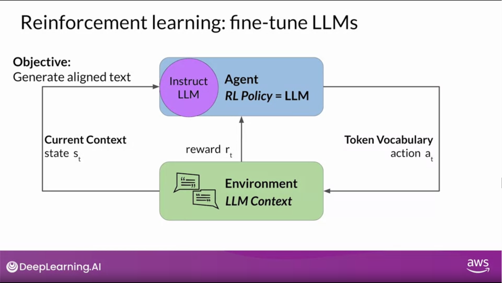

- Model
	- agent's policy (guided the actions) = LLM

- Objective
	- generate text aligned with the human preferences
- Environment
	- context window of the model
		- (prompt로 입력된 text가 있는 곳)

- State (the model considers before taking an action in the current context)
	- Any text currently contained in the context window

- Action
	- generating text
		- single word / sentence / longer form. etc.

- Action space
	- token vocabulary
		- (all the possible tokens that the model can choose from to generate the completion)

- Reward
	- how closely the completions align with human preferences

#### Reward Model

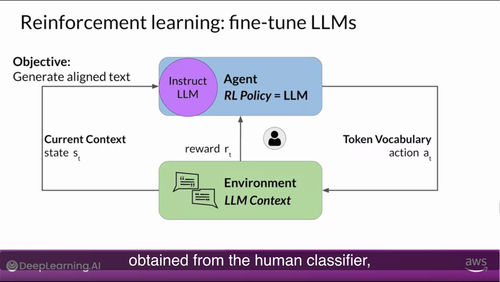

- Straightforward way...
	- human evaluate all of the completions of the model against some alignment metric
		- ex) generating text is Toxic / Non-toxic
	- feedback can be represented as a scalar value, zero / one
	- LLM weights are updated iteratively to maximize the reward obtained from the human classifier

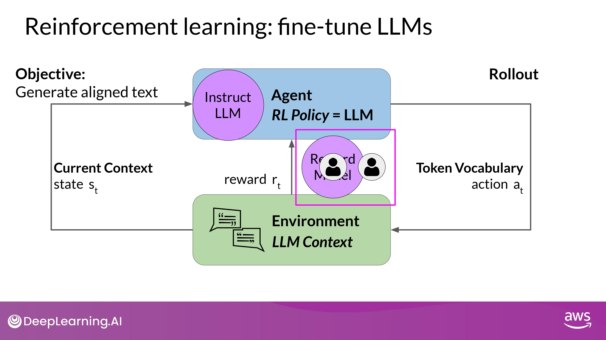

- For practical and scalable alternatives
- **<u>Reward Model</u>**
	- To classify the outputs of the LLM
		- and evaluate the degreee of alignment with human preferenes
- How to?
	- start with a smaller number of human examples to train the secondary model = `Reward Model`
		- by traditional supervised learning methods
	- Once trained, use the reward model to assess the output of the LLM
		- and assign a reward value
			- in turn,  gets used to update the weights of LLMs 
- Rollout
	- (in the conetxt of language modeling)
	- the sequence of actions and states = Rollout (!= Playout)

## RLHF : Obtaining feedback from humans

### Step-by-Step

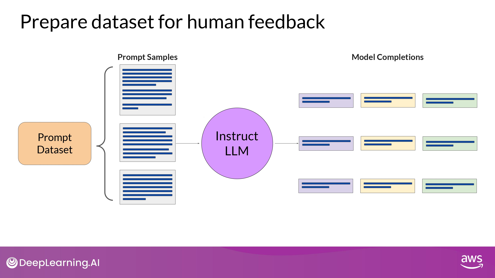

#### 1. Select the model

- The model should have some capability to carry out the task
	- e.g. text summarization / question-answering / etc.
- In general, to start with an `Instruct Model`
	- already been fine-tuned across many tasks and has some general capabilites

#### 2. Use the model to prepare a dataset for human feedback

- Use LLM along with a prompt dataset to generate a number of different responses for each prompt
	- The prompt dataset is comprised of multiple prompts
		- each of which gets processed by the LLM to produce a set of completions

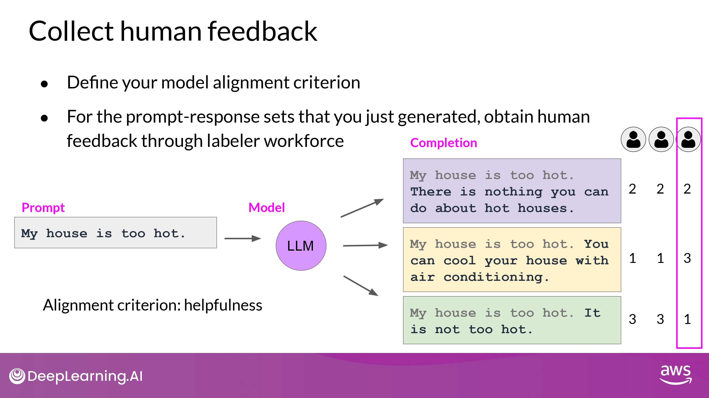

#### 3. Collect feedbacks from human labelers

- **<u>(human feedback portion of RLHF)</u>**

1. Decide what criterion you want the humans to assess the completions on

	- any of the issues possible
		- e.g. Helpfulness / Toxicity

2. Ask the labelers to assess each completion in the dataset based on the criterion

	- (example above)

		- the labeler ranks the completions

		- This process then gets repeated for many prompt completion sets, 
			- building up a data set that can be used to train the reward model that will ultimately carry out this work instead of the humans. 
		- The same prompt completion sets are usually assigned to multiple human labelers to establish consensus and  minimize the impact of poor labelers in the group. 

	- Key point

		- **<u>The clarity of your instructions</u>** can make a big difference on the **<u>quality of the human feedback</u>** you obtain. 

		- Labelers are often drawn from samples of the population that represent diverse and global thinking.
			- e.g. third labeler in above example, whose responses disagree with the others and may indicate that they misunderstood the instructions

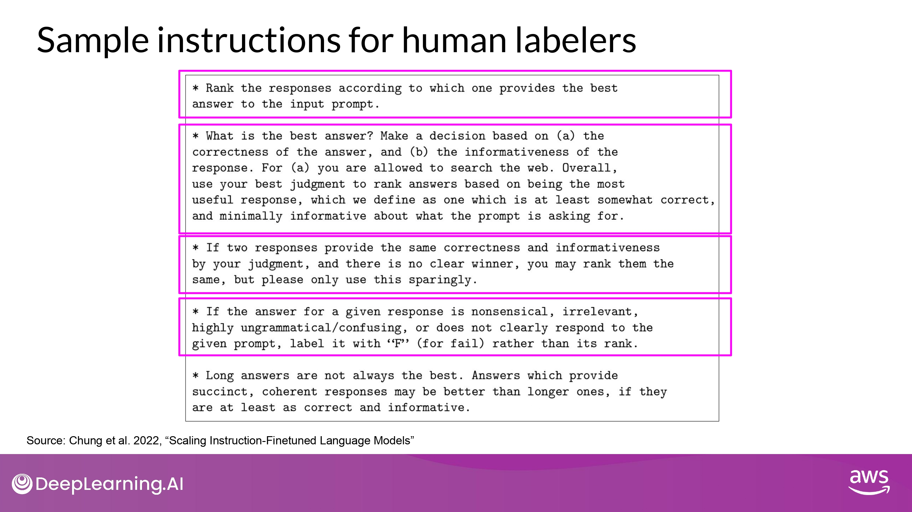

- Good Sample

	1. Overall task

	2. Detailed instruction
	3. Clear edge case instruction
	4. All options to take - poor quality answers can be easily removed

#### 4. Prepare labeled data for training

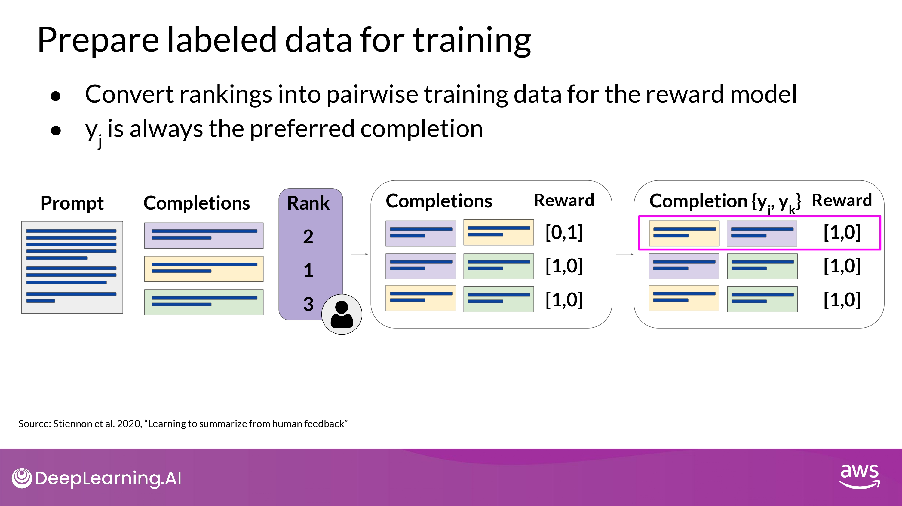

- How to?

	- Depending on the number N of alternative completions per prompt : N_Combination_2

	- For each pair, assign a reward of 1 for the preferred response and a reward of 0 for the less preferred response

	- Reorder the prompts so that the prefereed option comes first
		- <u>The reward model expects the preferred completion, which is referred ts as Y_j first</u>

- Another way
	- `Thumbs-Up, Thumbs-Down Feedback` is often easier to gather than ranking feedback
	- BUT!
		- `Ranked Feedback` gives you more prom completion data to train your reward model
		- As you can see, here you get three prompt completion pairs from each human ranking

## RLHF : Reward Model

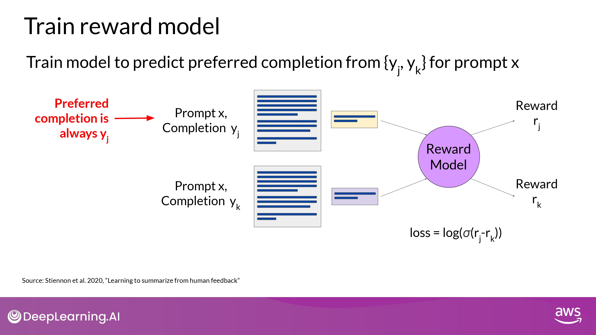

- By the time you're done training the reward model,
	- You won't need to include any more humans in the loop

- Reward model will take place off the human labeler
	- and automatically choose the preferred completion during the RLHF process

- Reward model = LM의 일종
	- e.g. BERT (supervised learning으로 학습된 LM)

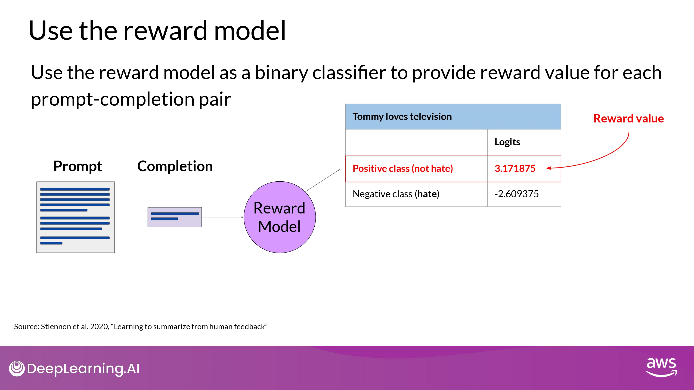

- Trained on human rank prompt-completion pairs
	- <u>Use the Reward Model as a `Binary Classifier`</u>
- The largest value of the positive class
	- what you use as the reward value in RLHF
- **<u>Higher value represents a more aligned response</u>**
	- Less aligned response receive a lower value

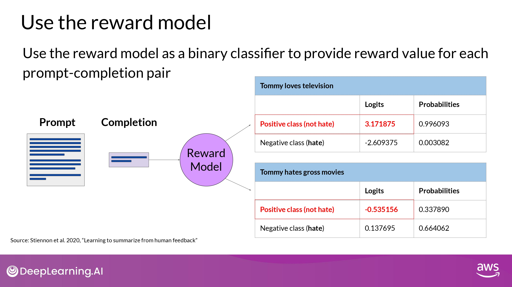

- Logits : unnormalized model outputs before applying any activation function
	- Softmax function to the logits -> `Probabilities`

### Use the reward model to fine-tune LLM with RL

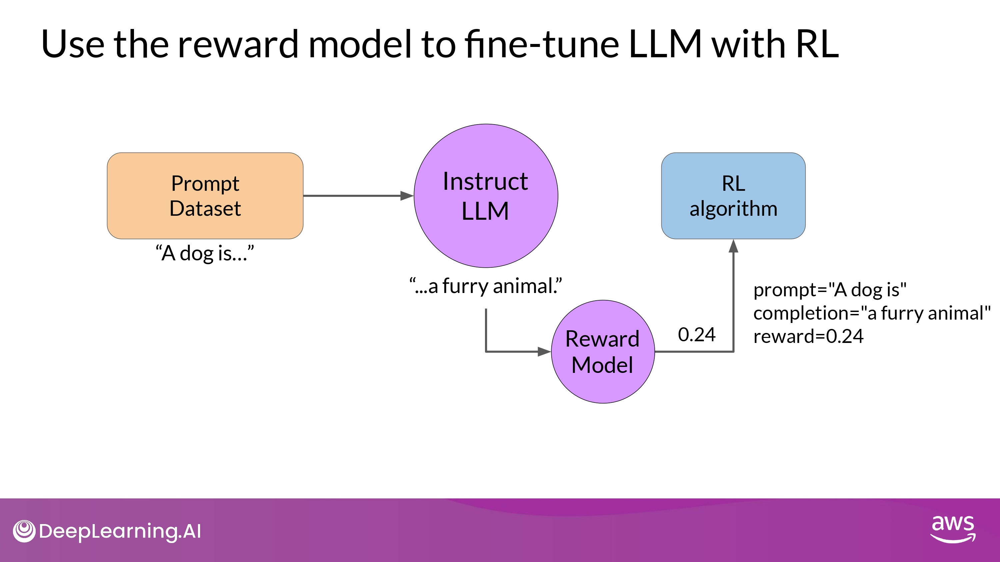

- **<u>REMEMBER : Start with a model that already has good performance on your task</u>**
	- we'll work to ALIGN an instructions fine-tune on LLM

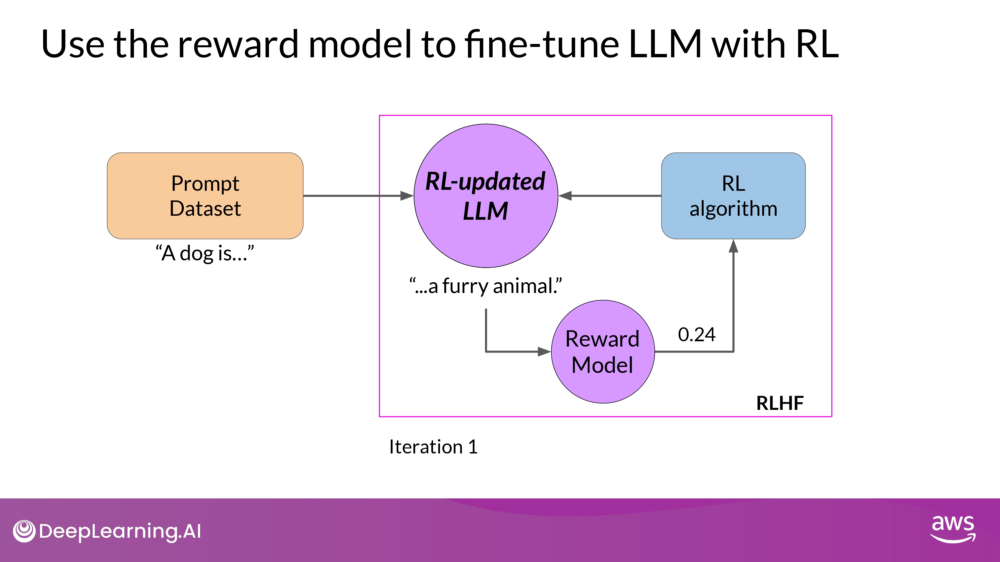

- Pass `reward value` for the `prompt-completion pair` to `RL algorithm`
	- to update the weights of the LLM
		- move to more aligned, higher reward responses
- RL-updated LLM
	- 위 전체 과정이 single iteration of RLHF process를 구성함

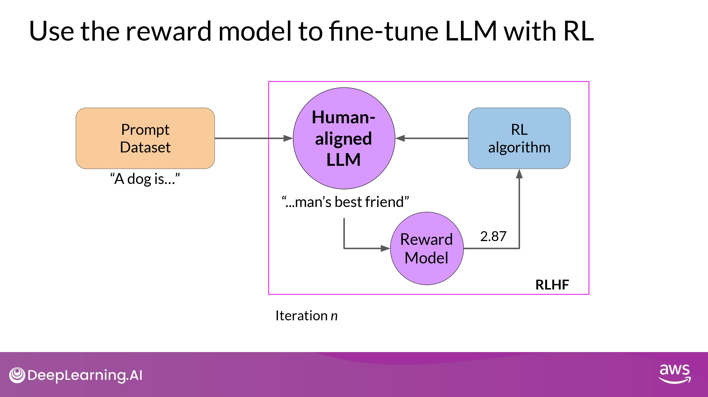

- 학습 과정이 잘 진행될수록, reward가 향상됨
	- (예시, 0.24 -> 0.51 -> 0.68 -> ...)
	- 즉, human preference에 더 부합하는 답변 생성
- 학습 종료 조건
	- 특정 metric에 부합할 때까지 학습
		- threshold value for the helpfulness you defined
	- 특정 iteration step까지
		- 20,000번 최대
- 그렇게... `Human-aligned LLM`을 얻을 수 있다

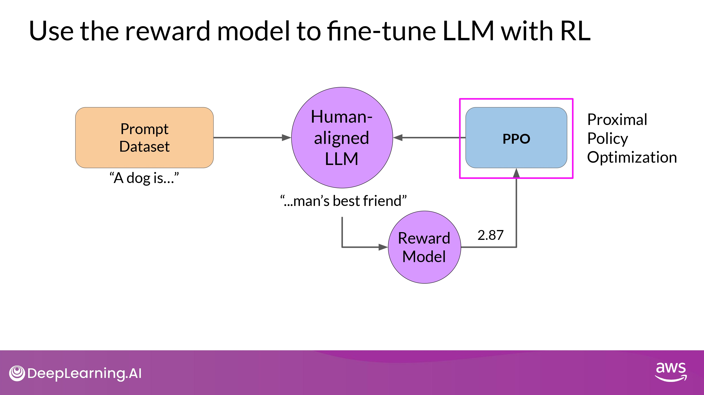

- RL algorithm은 다양함
	- 대표적인것, PPO

