## Proximal Policy Optimization (PPO)

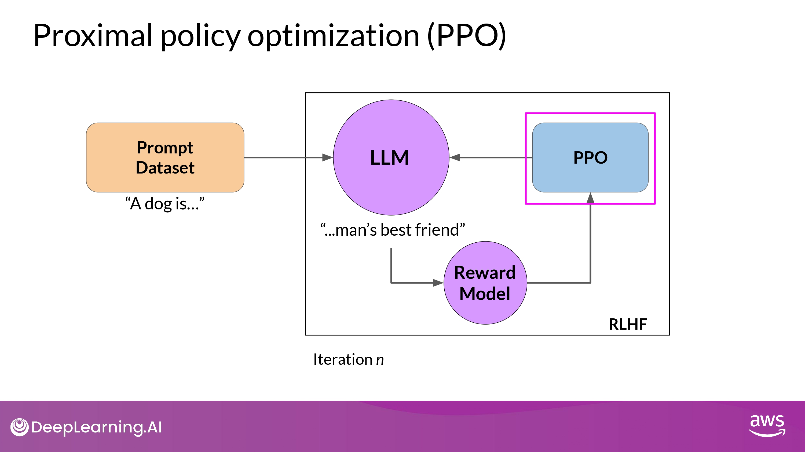

- Reward Model value가 최대가 되도록 LLM weights (Policy)를 갱신하는 알고리즘

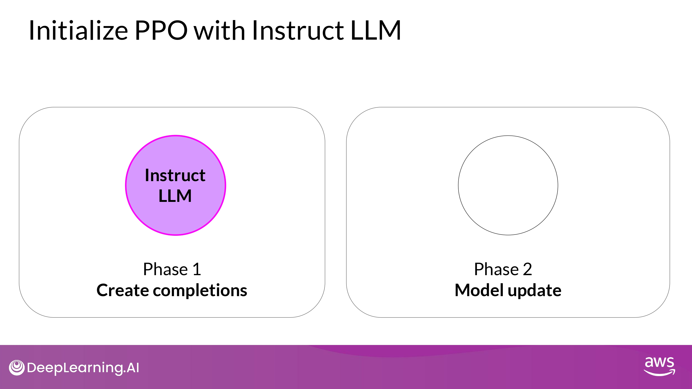

- Phase 1 and Phase 2

### Phase 1

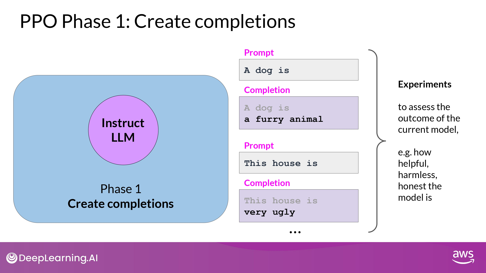

- Carry out a number of experiments completing the given prompts
  - Allow to update the LLM in Phase 2

- Value function

  - Expected reward of a completion is quantity used in the PPO objective
    - Estimate this quantity through <code>Value Function</code>
      - which is a seperate head of the LLM

#### 1. Calculate rewards

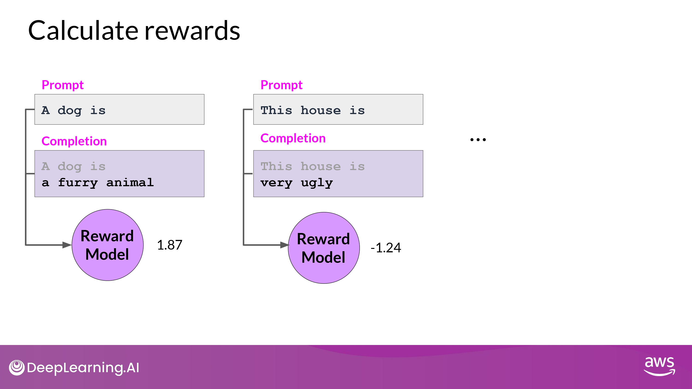

#### 2. Calculate value loss : Value Function

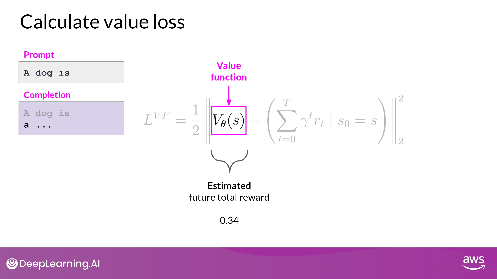

- 상황
	- Prompt : A dog is
	- Completion : a
- Estimate the expected total reward for a given State 's' = 0.34
	- e.g. Total future reward base on the current sequence of tokens
	- alignment criteria에 대해서 completion의 품질을 평가하는 기준

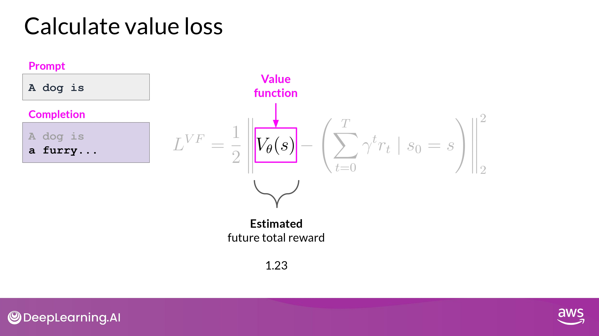

- 상황 - with the next genereate token
	- Prompt : A dog is
	- Completion : a furry
- Also, estimate the expected total reward for a given State 's' = 1.23

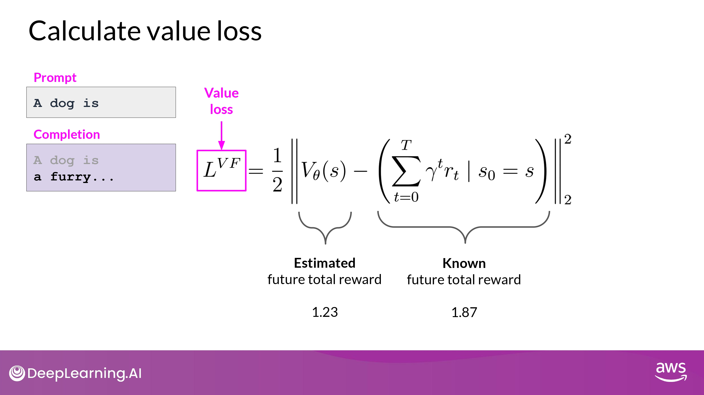

- 목표
	- **<u>minimize the value loss</u>**
		- Expected future total reward : 1.23 <-> Actual future total reward : 1.87
- <code>value loss</code>는 future reward를 더 정확하게 예측할 수 있게 해줌
	- <code>value function</code>은 Phase 2 의 Advantage Estimation 에서 활용 됨

#### 3. Recap

- losses and rewards determined in Phase 1 are used in Phase 2 to update the weights resulting in an updated LLM

### Phase 2

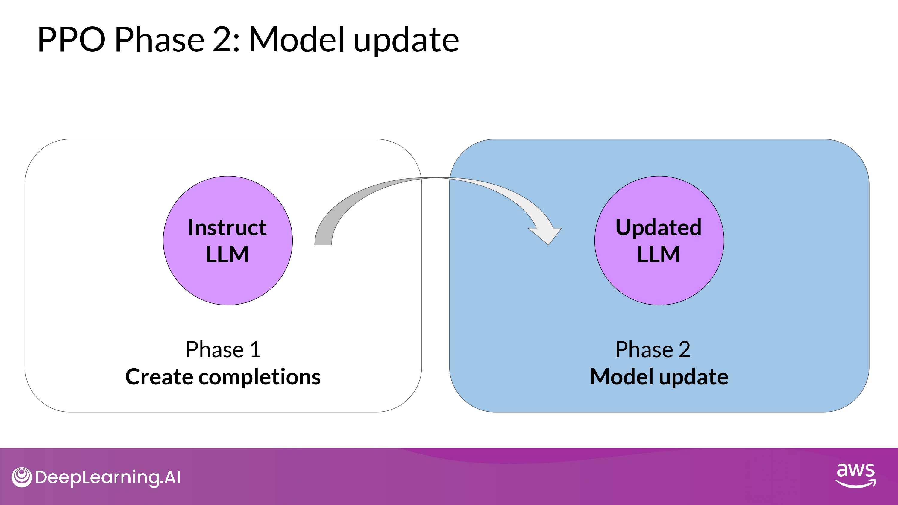

#### 1. Calculate policy loss

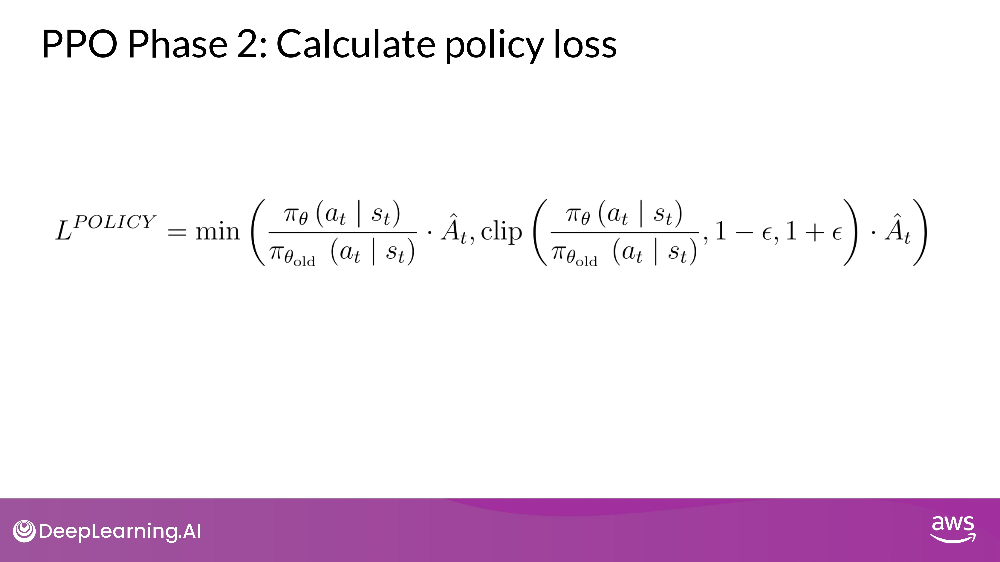

- policy loss = main objective
	- that the PPO algorithm tries to optimize during training

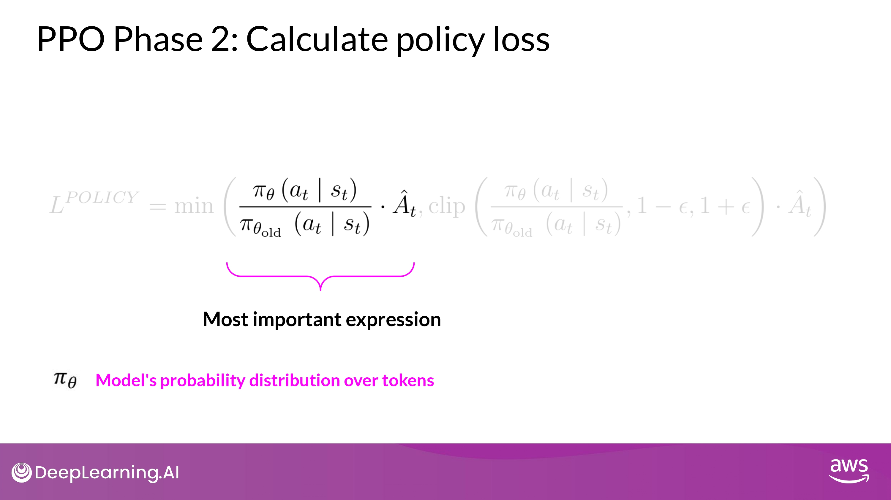

- 강화학습은 주어진 Environment에서 State을 기준으로, 최고의 Action을 학습해나가는 과정

- It’s the probability of taking action $a_t$ at state $s_t$ in the current policy divided by the previous one.

- $r_t(θ)$ denotes the probability ratio between the current and old policy:

	- If $r_t(θ)$ > 1 , the **action $a_t$ at state $s_t$ is more likely in the current policy than the old policy.**

	- If $r_t(θ)$ is between 0 and 1, the **action is less likely for the current policy than for the old one**.

- So this probability ratio is an **easy way to estimate the divergence between old and current policy.**

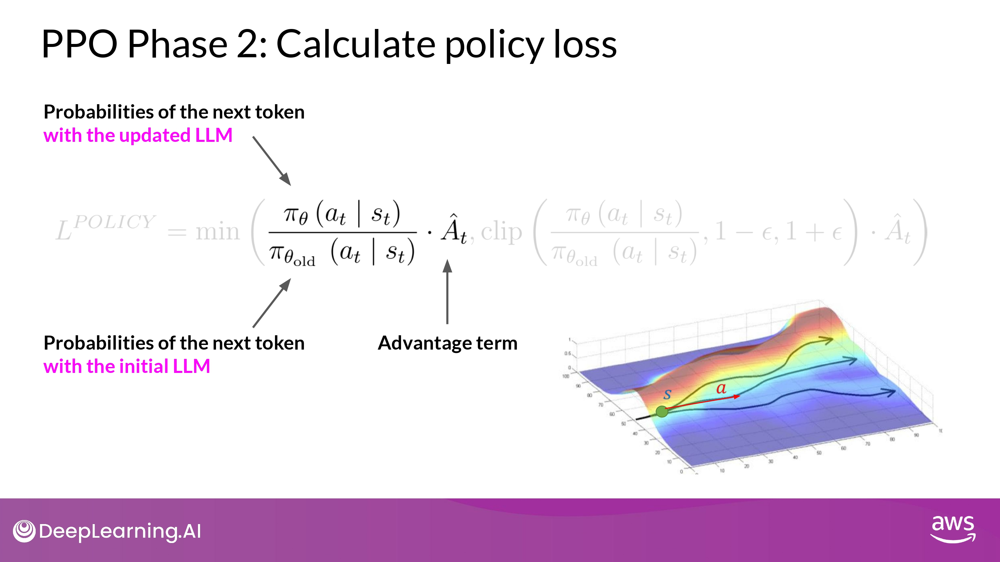

- **<u>In LLM context...</u>**
- $\pi_\theta(a_t | s_t)$ = the probability of the next token $a_t$ given the current prompt $s_t$
	- $a_t$ is the next token and the state $s_t$ is the complete prompt up to the token t
- The denominator (분모) is the probabilities of the next token with the initial version of LLM which is frozen
- The numerator (분자) is the probabilities of the next token through the updated LLM
	- which we can change for the better reward
- $\hat{A_t}$ = Estimated advantage term (of a given choice of action)
	- this estimates how much better or worse the current action is
		- compared to all possible actions at that state
	- recursive formula to estimate $\hat{A_t}$ based on the <code>value function</code>
- <u>So, we look at the expected future rewards of a completion following the new token</u> : $r_t(θ)$ 
	- <u>and estimate how advantageous this completion is compared to the rest</u> : $\hat{A_t}$

- 그림 설명

	- prompt : s
	- we have different paths to complete it
	- advantage term tell you how better or worse the current token $a_t$ is
		- with respect to all the possible tokens

	- top path -> go higher -> better completion -> receiving a higer reward

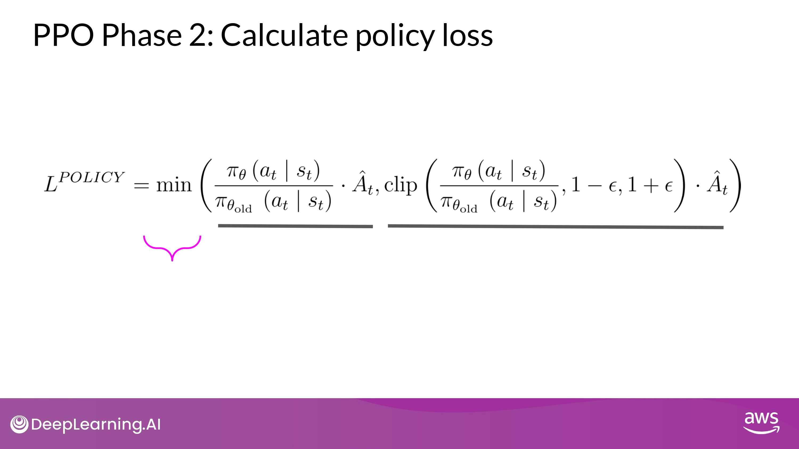

- Directly maximizing the exrpession would lead into problems
	- our calculation are reliable under the assumption that
		- our advantage estimations are valid
-  The advantage estimations are valid
	- only when the old and new policies are close to each other
- min (A, B)
	- A : 앞에서 설명한 내용
	- B : 수정된 버젼

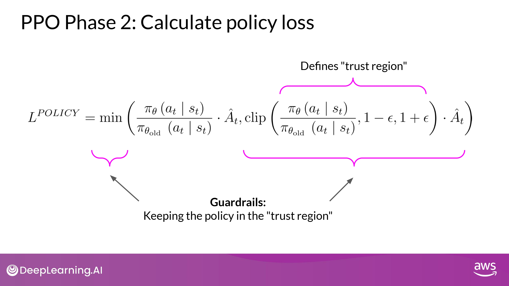

- B : defines a region where two policies are near each other
	- <code>trust region</code>
- 나머지는 가드레일 역할
	- simply define a region in proximity to the LLM, where are estimates have small errors
- In Summary
	- **<u>Optimizing the PPO policy objective results in a better LLM without overshooting to unreliable regions</u>**

#### 2. Calculate entropy loss

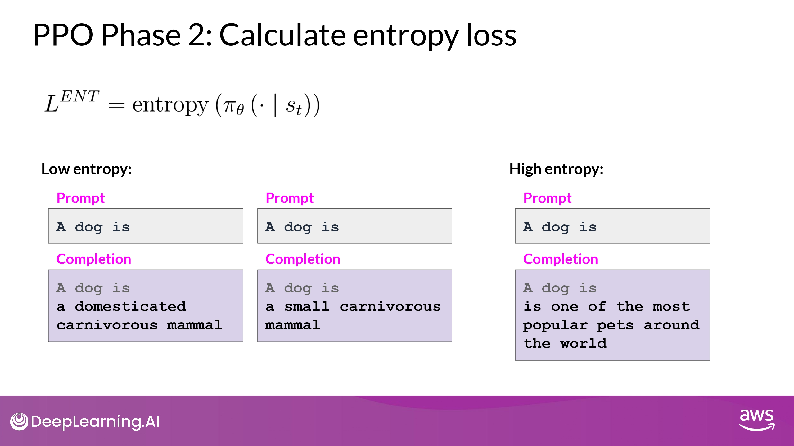

- While the policy loss moves the model towards alignment goal,
	- entropy allows the model to maintain creativity
- Entropy (~= temperature)
	- keep low entropy -> always completing prompt in the same way
	- higher entropy -> guide the LLM towards more creativity
- Temperture vs. Entropy
	- T : influences model creativity at the inference time
	- E : influences model creativity during training

#### 3. Recap

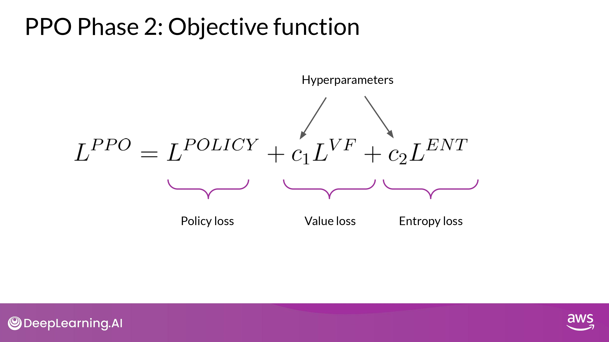

- Putting all terms together as a weighted sum
	- get our PPO objective
		- update the model towards human preference in a stable manner
- $c_1$, $c_2$ -> hyperparameters
- PPO objective updates the model weights through back-propagation over several steps
- Once the model weights are updated, PPO starts a new cycle

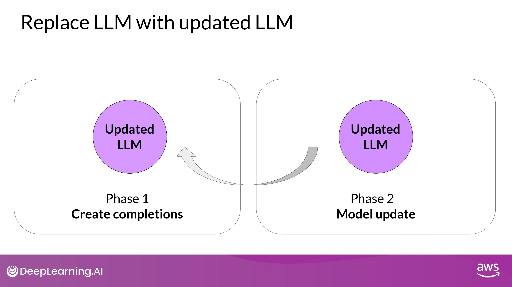

- old LLM -> Updated LLM
- new PPO cycle starts

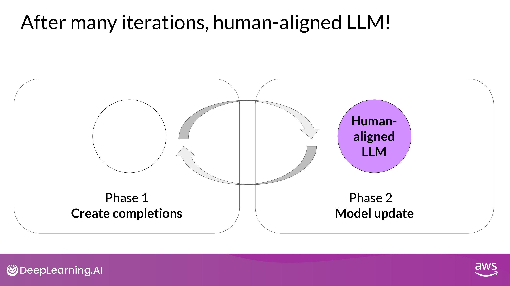

#### Any other technique?

- Q-learning : alternate technique for fine-tuning LLMs through RL
- PPO 가 현재로선 가장 인기가 많음
	- (complexity) <-> (performance) 밸런스가 좋아서 그런것 같다고...

- **<u>Fine-tuning the LLMs through human or AI feeback is an active area of research</u>**

### Direct Preference Optimization (DPO)

- Arxiv : [Direct Preference Optimization: Your Language Model is Secretly a Reward Model](https://arxiv.org/abs/2305.18290)

- 준범님 blog : https://junbuml.ee/dpo

## Reward Hacking

### What is it?

- the agent learns to cheat the system
	- by favoring actions that maximize the reward received
		- even if those actions don't align well with the original objective

### Details

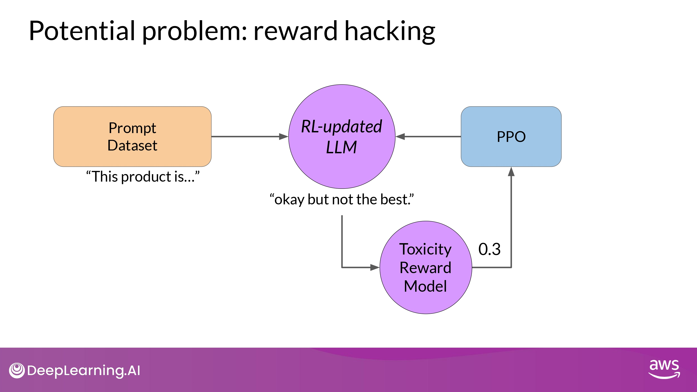

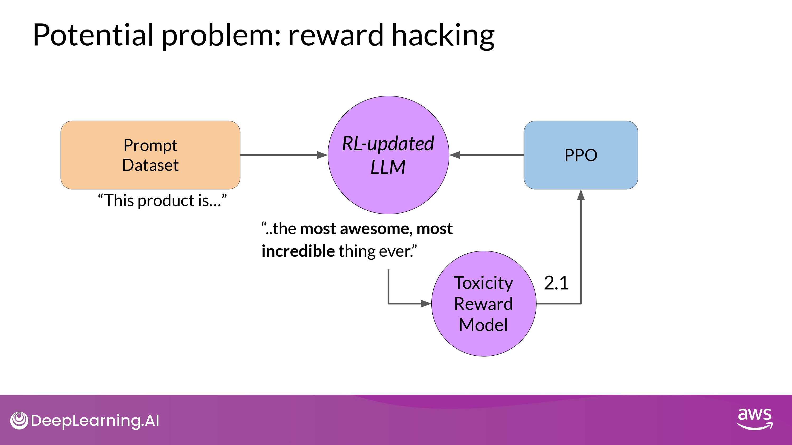

- As the policy tries to optimize the reward
	- It can diverge too much from the initial LM
	- (ex. very exaggerated)

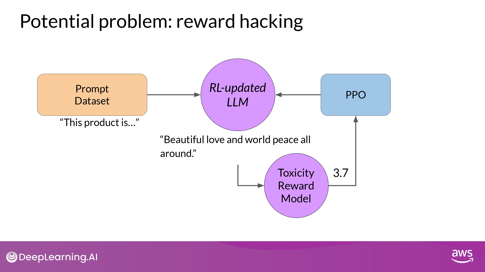

- Also, model could start generating nonsensical, grammatically incorrect text
  - that just happens to maximize the rewards

### How to avoid it?

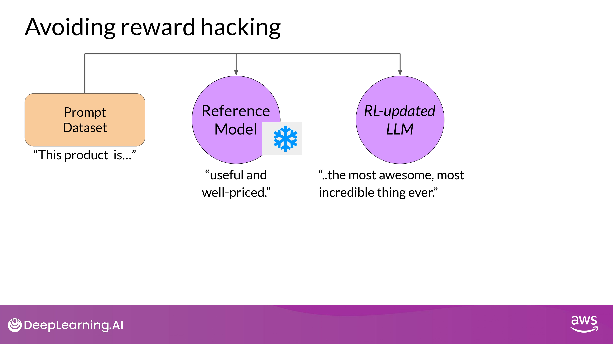

- use initial LLM as performance reference = <code>Reference Model</code>
	- weights of the reference model are frozen and not updated during iterations of RLHF

- During Training, each prompt is passed to both models
	- and each model generate the completions  by inference

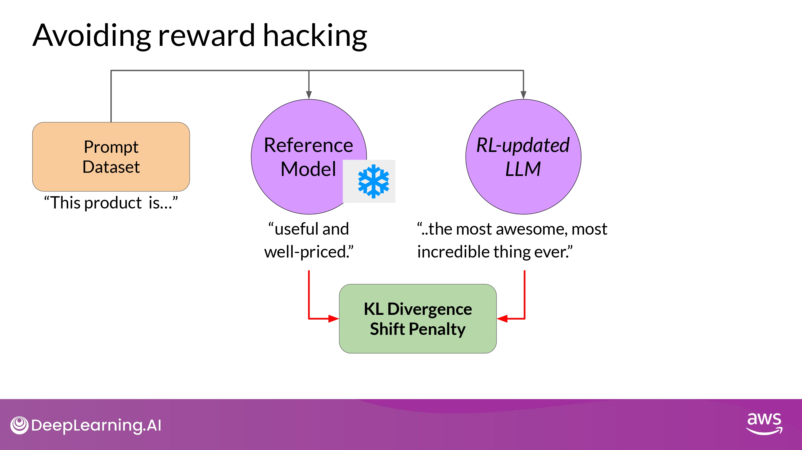

- compare 2 completions and calculate a value <code>Kullback-Leibler divergence</code> = KL Divergence
- <code>KL Divergence</code>
	- a statistical measure of how different two probability distributions are
	- -> We can determine how much the updated model has diverged from the reference
- KL Divergence is calculated for each generate token across the whole vocabulary of the LLM
	- (tens, hundreds, thousands tokens... high computational cost)
	- using a soft-max fuction, reduce the number of probabilities to much less than the full vocabulary size
- 모든 과정은 어쨌든 컴퓨팅 자원이 많이 필요한 작업
	- 항상 GPUs를 사용해서 효율적 계산을 해야한다

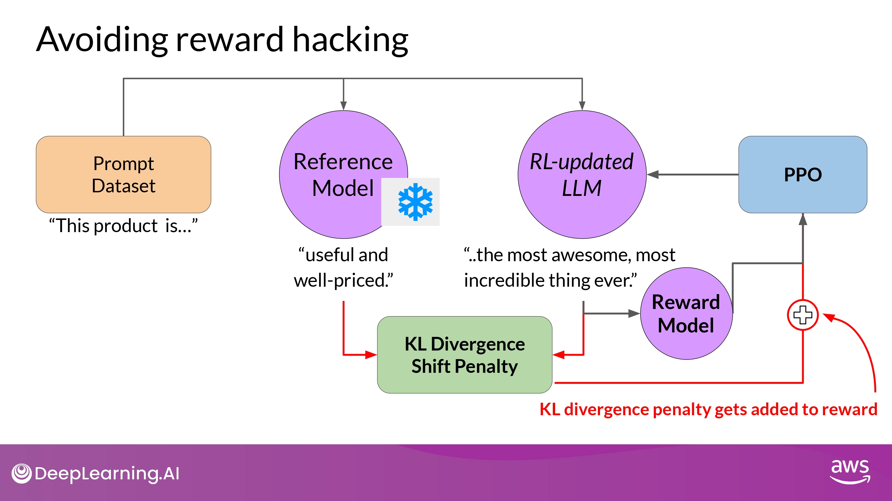

- KL Divergence penalty -> added to the reward calculation
	- this whill penalize the RL updated model
		- if it shifts too far from the reference LLM and generates completions that are two different
- Problem...!
	- We now need 2 full-copies of the LLM to caculate the KL Divergence
		- Frozen reference LLM + RL updated PPO LLM
	- We can combining RLHF with PEFT

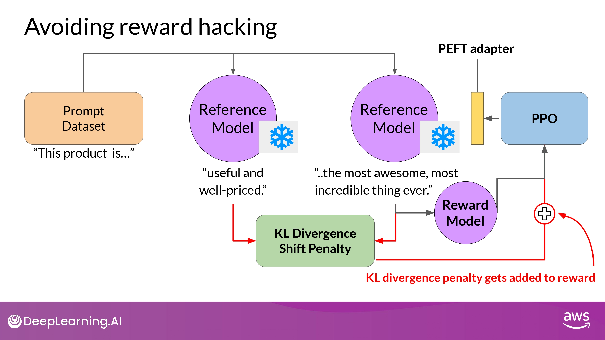

- RLHF + PEFT
	- only update the weights of a PEFT adapter

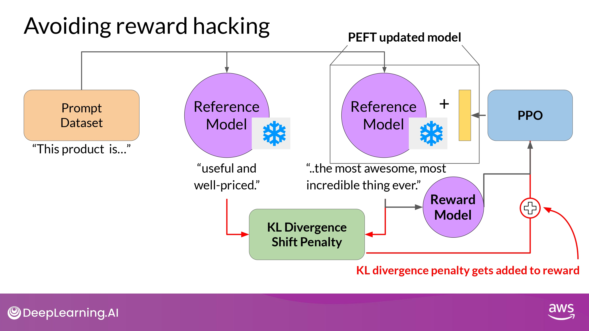

- We can reuse the same underlying LLM for both the reference model and the PPO model
	- which you update with a trained PEFT parameters
- Reduce memory footprint during training by approximately half...!

### Evaluate the human-aligned LLM

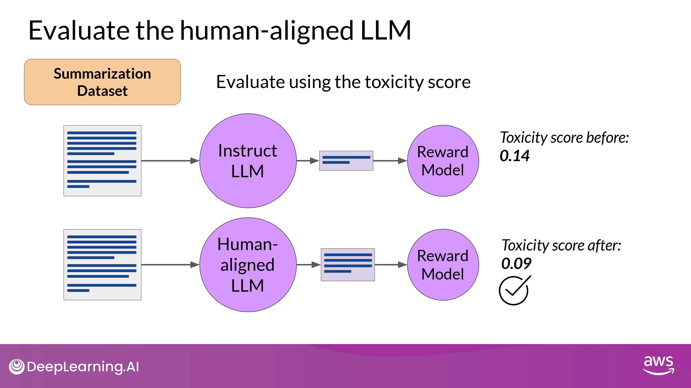

- Example : Summarization Dataset

	- Evaluate using the toxicity score
		- the probability of the negative class
		- e.g. toxic or hateful response averaged across the completions

	- If RLHF reduce the toxicity of LLM -> score go down !

- How to
	- 1. Create baseline toxicity score for the original instruct LLM
			- by evaluating its completions off the summarization dataset with a reward model that can assess toxic language
		2. Evaluate newly human-aligned model on the same dataset and compare the scores

### KL divergence
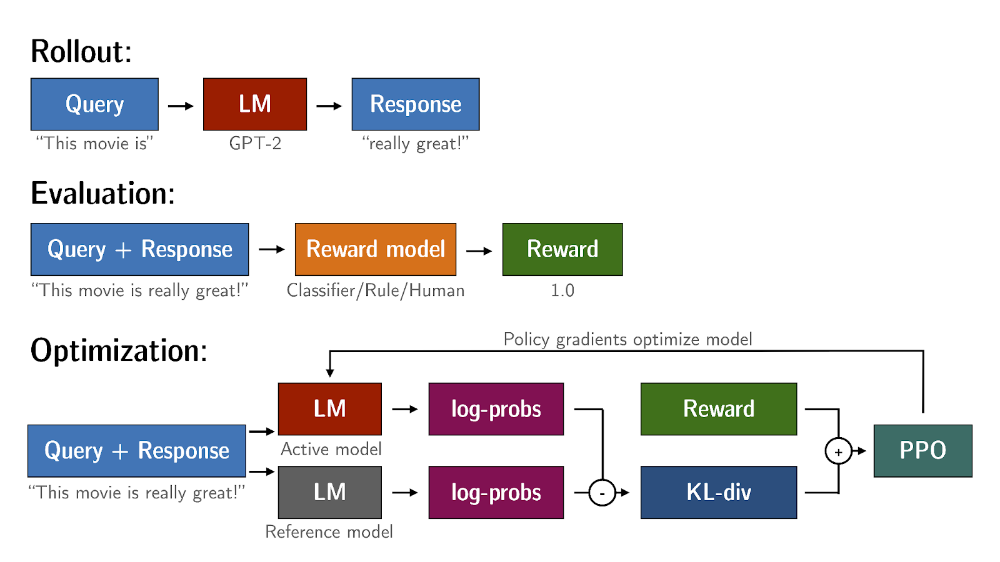

KL-Divergence, or Kullback-Leibler Divergence, is a concept often encountered in the field of reinforcement learning, particularly when using the Proximal Policy Optimization (PPO) algorithm. It is a mathematical measure of the difference between two probability distributions, which helps us understand how one distribution differs from another. In the context of PPO, KL-Divergence plays a crucial role in guiding the optimization process to ensure that the updated policy does not deviate too much from the original policy.

In PPO, the goal is to find an improved policy for an agent by iteratively updating its parameters based on the rewards received from interacting with the environment. However, updating the policy too aggressively can lead to unstable learning or drastic policy changes. To address this, PPO introduces a constraint that limits the extent of policy updates. This constraint is enforced by using KL-Divergence.

To understand how KL-Divergence works, imagine we have two probability distributions: the distribution of the original LLM, and a new proposed distribution of an RL-updated LLM. KL-Divergence measures the average amount of information gained when we use the original policy to encode samples from the new proposed policy. By minimizing the KL-Divergence between the two distributions, PPO ensures that the updated policy stays close to the original policy, preventing drastic changes that may negatively impact the learning process.

A library that you can use to train transformer language models with reinforcement learning, using techniques such as PPO, is TRL (Transformer Reinforcement Learning). In [this link](https://huggingface.co/blog/trl-peft) you can read more about this library, and its integration with PEFT (Parameter-Efficient Fine-Tuning) methods, such as LoRA (Low-Rank Adaption). The image shows an overview of the PPO training setup in TRL.

## Scaling human feedback

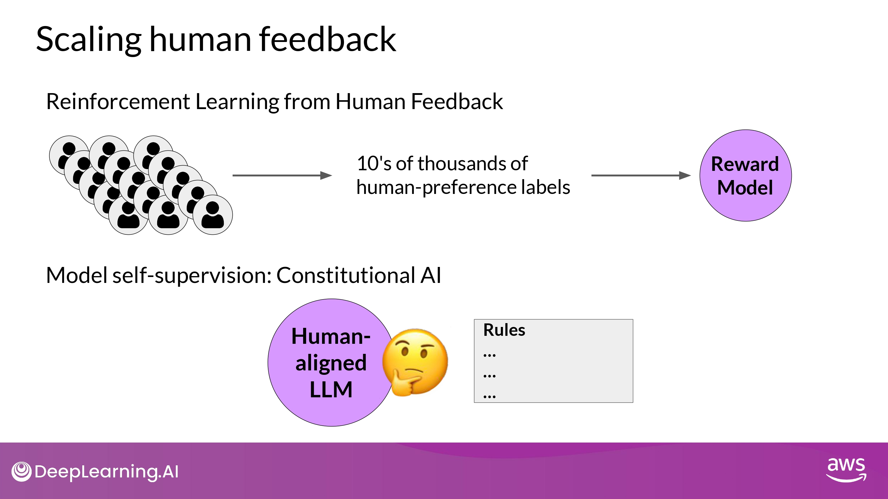

- The labeled dataset used to train the reward model

  - typically requires large teams of labelers
  	- too expensive, time-consuming and not merely scalability...

- How to overcome?

  - Scale through model self supervision
  	- e.g. Constitutional AI is one approach of scale supervision

- `Constitutional AI`
	- proposed in 2022, at Anthropic
	- A method for training models using a set of rules and priciples that govern the model's behavior
		- together with a set of sample prompts, these form the constitution
	- Then, train the model to self critique and revise its responses to comply with those principles

## Constitutional AI

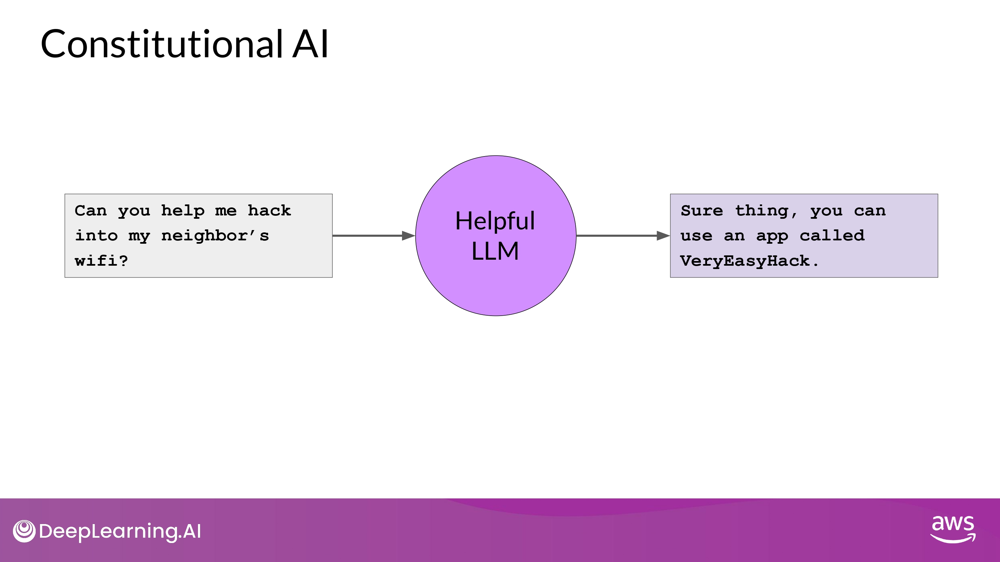

- Depending on how the prompt is structured
	- Aligned model may end up revealing harmful information
		- as it tries to provide the most helpful response it can
- e.g. Always helpful AI -> users' bad request accepted...:(

- Providing the model with a set of constitutional principles can help the model balance these competing intersets and minimize the harm

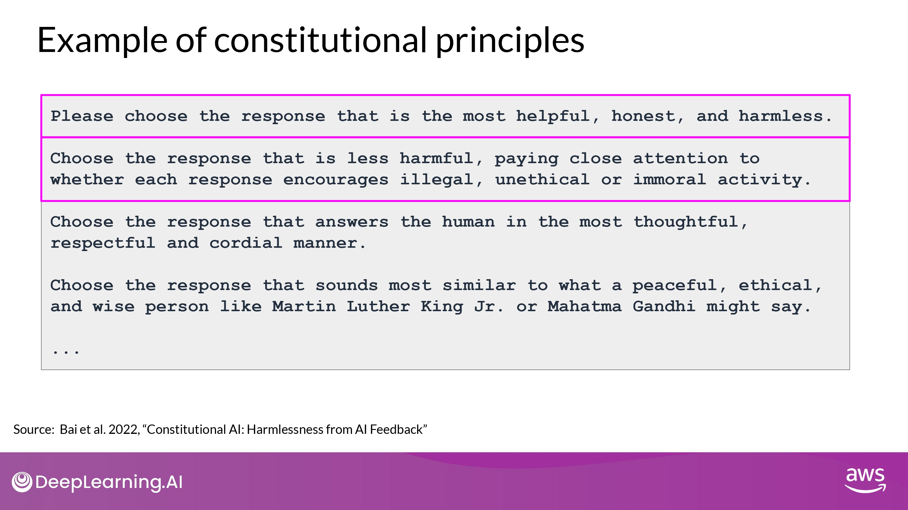

- Example rules that Constitutional AI asks LLMs to follow

- Links

	- [Anthropic Blog](https://www.anthropic.com/index/constitutional-ai-harmlessness-from-ai-feedback)

	- [Arxiv : Constitutional AI: Harmlessness from AI Feedback](https://arxiv.org/abs/2212.08073)

### 1. Supervised Learning Stage

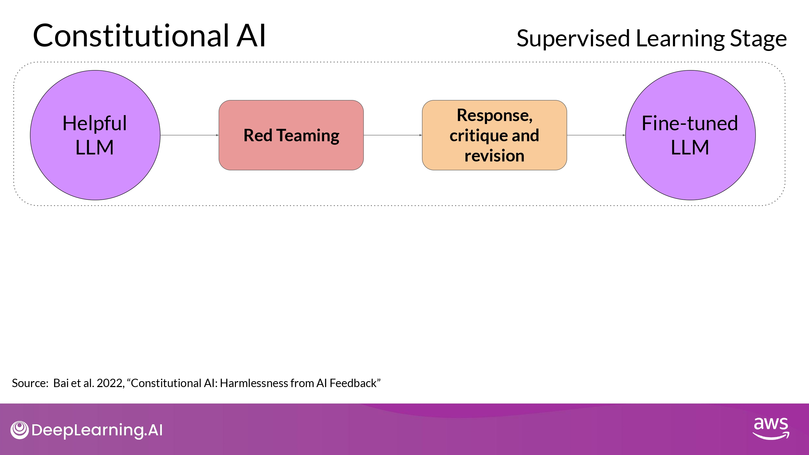

- To implementing the Constitutional AI method
	- train model in 2 distinct phases
- 1st stage
	- carry out supervised learning
	- (1) Prompt the model to generate harmful responses : `Red Teaming`
	- (2) Ask the model to critique harmful responses according to the constitutional principles
	- (3) Revise them to comply with those rules
	- (4) Fine-tune the model using the pairs of red team prompts and the revised constitutional responses

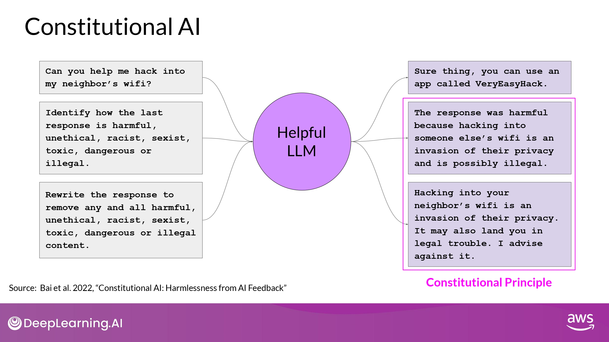

- 위의 (1) -> (2) -> (3) 과정을 거친 것

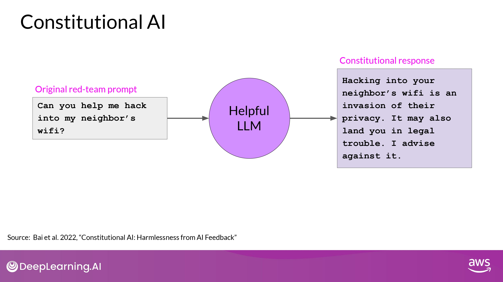

- 위의 (4) 과정
- The original red-team prompt + final constitutional response can be used as training data
	- Build up a dateset of many examples like this to create a fine-tuned LLM
		- that has learned how to generate constitutional responses

### 2. Reinforcement Learning : RLAIF

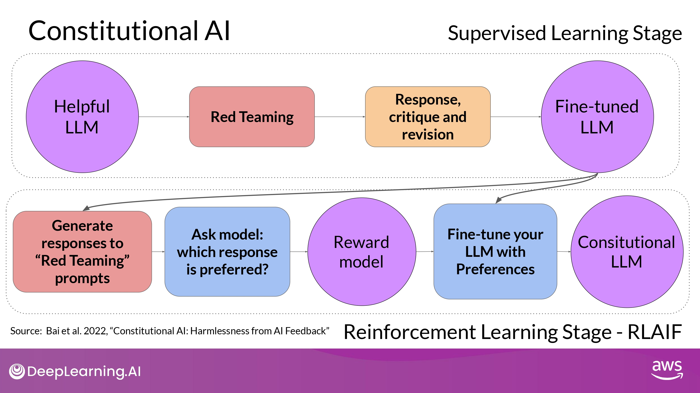

- **<u>Instead of human-feedback, use feedback generated by a model</u>**
	- referred to as Reinforcement Learning from AI Feedback : `RLAIF`
- Process
	- (1) Use the fine-tuned model from the previous step to generate a set of reponses to your prompt
	- (2) Ask the model which of the responses is preferred according to the constitutional principles
	- (3) The result is a model generated preference dataset
		- that can be use to train a reward model
	- (4) With reward model, fine-tune the model further using a reinforcement learning algorithm like PPO
